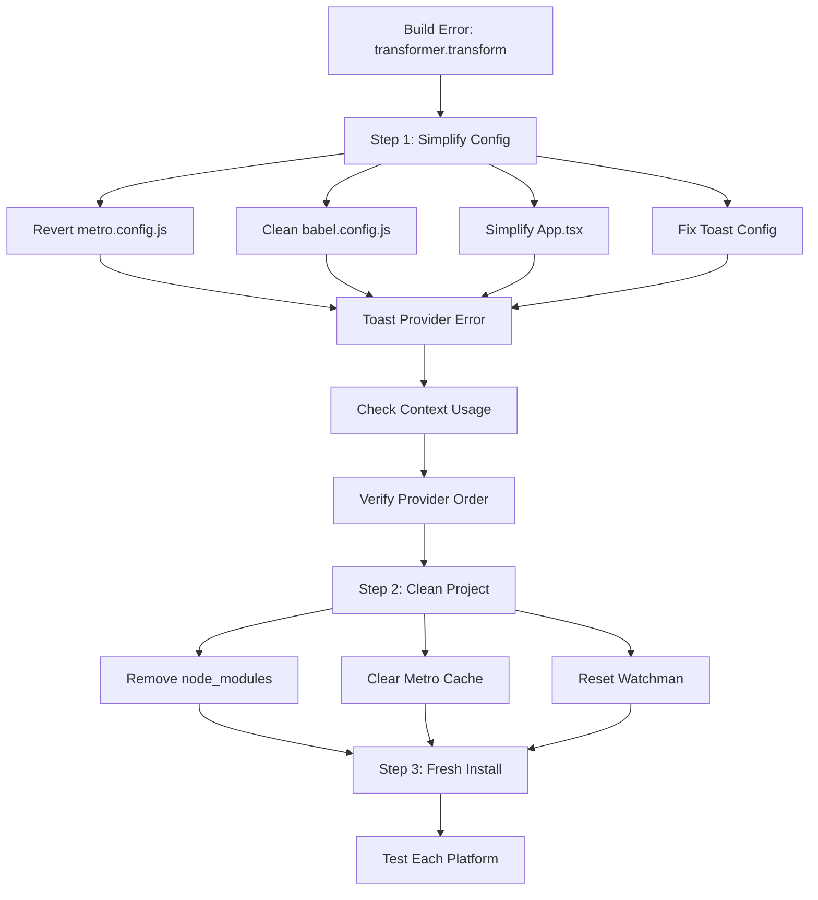

# Modern UX Patterns To Implement

## Platform Support
- [x] Web (React Native Web)
- [x] Android
- [x] iOS

## Core Features

1. **Theme System**
   - [x] Light/Dark mode
   - [x] System theme detection
   - [x] Theme persistence
   - [x] Material Design 3 colors
   - [x] Platform-specific styling
   - [x] WCAG compliant contrast

2. **Gesture Navigation & Interactions**
   - [ ] Card swipe gestures (left, right, up)
   - [ ] Swipe animations
   - [ ] Interactive card dismissal
   - [ ] State management for dismissed cards
   - [ ] Haptic feedback for gestures
   - [ ] Shared element transitions
   - [ ] Screen transitions

3. **Navigation**
   - [x] Bottom tabs navigation
   - [x] Platform-specific adaptations
   - [x] Safe area handling
   - [ ] Bottom sheet
   - [ ] Interactive dismissal

4. **Haptic Feedback**
   - [x] Toggle interactions
   - [x] Success/error states
   - [x] Pull-to-refresh completion
   - [x] Platform-specific fallbacks
   - [ ] Sheet interactions

5. **Loading States**
   - [x] Skeleton screens
   - [x] Pull to refresh
   - [ ] Custom animations
   - [ ] Progressive loading

6. **Adaptive Layout**
   - [x] Basic responsive design
   - [ ] Advanced screen size handling
   - [ ] Orientation changes
   - [ ] Split views for tablets
   - [ ] Dynamic safe area handling

7. **Modern Form Patterns**
   - [ ] Real-time validation
   - [ ] Error states
   - [ ] Loading states
   - [ ] Success animations

8. **Toast/Notification System**
   - [x] Success/error/info toasts
   - [x] Custom animations
   - [x] Interactive dismissal
   - [x] Queue management
   - [x] Undo functionality
   - [x] Haptic feedback
   - [x] Cross-platform support

9. **Contextual Menus**
   - [ ] Long-press menus
   - [ ] Share actions
   - [ ] Custom animations
   - [ ] Haptic feedback

## Completed Milestones
1. [x] Cross-platform support established (Web, iOS, Android)
2. [x] Material Design 3 theming system with dark mode
3. [x] Bottom tab navigation with platform-specific styling
4. [x] Toast system with undo functionality
5. [x] Basic responsive design foundation
6. [x] Haptic feedback system with platform fallbacks

## Next Steps (In Progress)
1. Card gesture system
   - [ ] Swipe left/right/up gestures
   - [ ] Animations
   - [ ] Card dismissal
   - [ ] Progress tracking

## Temporary Troubleshooting Flow

Note: This flow will be removed after troubleshooting is complete.

## UI/UX Questions for Discussion

1. Initial View Impact
   - When users first see this screen, what's the most important information they need to grasp immediately?
   + The list of items is their To-Do list. We want them to see that they have items to do. And they should be able to swipe them all away within 30 seconds.
   + The header card is for focusing the user's attention on first open item in the list. It is immediately actionable to put into one of 3 buckets: "Dispute", "Unsure", and "Verified".
   + When the list is empty, the user should see a reward message. You know, "Woohoo! You're done!"

2. Expandable/Collapsible Behavior
   - Is this primarily for small screens, or should it be a core interaction pattern?
   + Primarily for small screens. If the information mostly fits on the screen, the expand is unnecessary.
   - When collapsed, what information must remain visible?
   + Depends on the use case. In ours, the user should be able to see all the item's details.

3. List Item Interaction
   - How do users typically scan/process this list? 
   + Scroll and tap. This is a bit of a hindrance because two taps are required to dismiss a card, click the items to see details, and then swipe the header card to dismiss it.
   - Are they looking for specific items, or browsing?
   + Not really, they should be in reverse chronological order.
   - Should items show their status/progress visually?
   + In some views, there will be icons to represent sub-states.

4. Gesture Support
   - Besides tapping to select, what other gestures might be useful?
   + Long hold is a possible gesture, but the product team isn't convinced yet.
   - How important is the swipe-to-dismiss feature we implemented?
   + It is the most important feature. The closest analog to the swipe-to-dismiss feature is the application called "Tinder.
   - Should there be quick actions available per item?
   + TMI. We need to keep it focused on the swipe-to-dismiss feature.

5. Detail View Usage
   - What's the primary action users take after reading details?
   + Swipe to dismiss.
   - How often do they need to reference back to the list?
   + Rarely.
   - Should there be a way to compare items?
   + Not in the main view. We don't want to complicate it. We want to keep it simple at the main view. But there are drill-downs to compare items, such as offsetting items (like debits and credits in an account).
