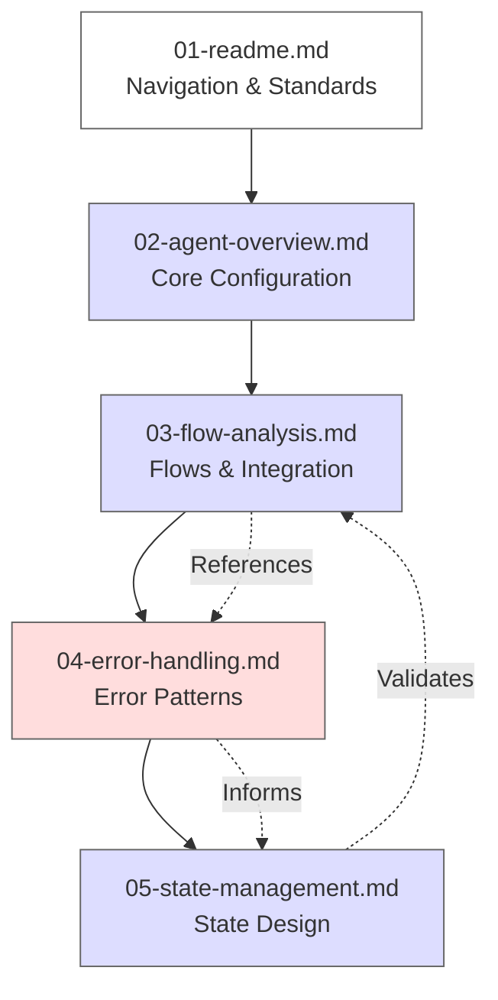

# Dialogflow CX Analysis Report

## Overview
This repository contains the analysis of a Financial Services Dialogflow CX agent, focusing on its conversation flows, intents, and integration points.

## Document Dependencies

## Document Sequence
The analysis is structured in a logical progression that builds understanding from fundamentals to implementation details:

1. **README (01)** - Navigation and standards
2. **Agent Overview (02)** - Core configuration and capabilities
3. **Flow Analysis (03)** - Conversation flows and integration points
4. **Error Handling (04)** - Error patterns that inform state design
5. **State Management (05)** - State management built on error resilience

This sequence ensures that each document builds upon the concepts and patterns established in previous documents, creating a cohesive understanding of the system.

## Contents
1. [Agent Overview](02-agent-overview.md) - Core agent configuration and capabilities
2. [Flow Analysis](03-flow-analysis.md) - Detailed analysis of conversation flows and integration points
3. [Error Handling](04-error-handling.md) - Error patterns and prevention strategies
4. [State Management](05-state-management.md) - Parameter and context management

## Purpose
This analysis is part of the Assistant2Ensemble project, focusing on AI-to-AI communication patterns and migration strategies.

## Analysis Standards
- 🔷 Blue nodes (#ddf): Entry points and external integrations
- ⬜ White nodes (#fff): Internal processing steps
- 🔶 Red nodes (#fdd): Error handlers and failure paths
- ➡️ Solid arrows: Primary flow transitions
- ⤏ Dashed arrows: Error and fallback transitions
