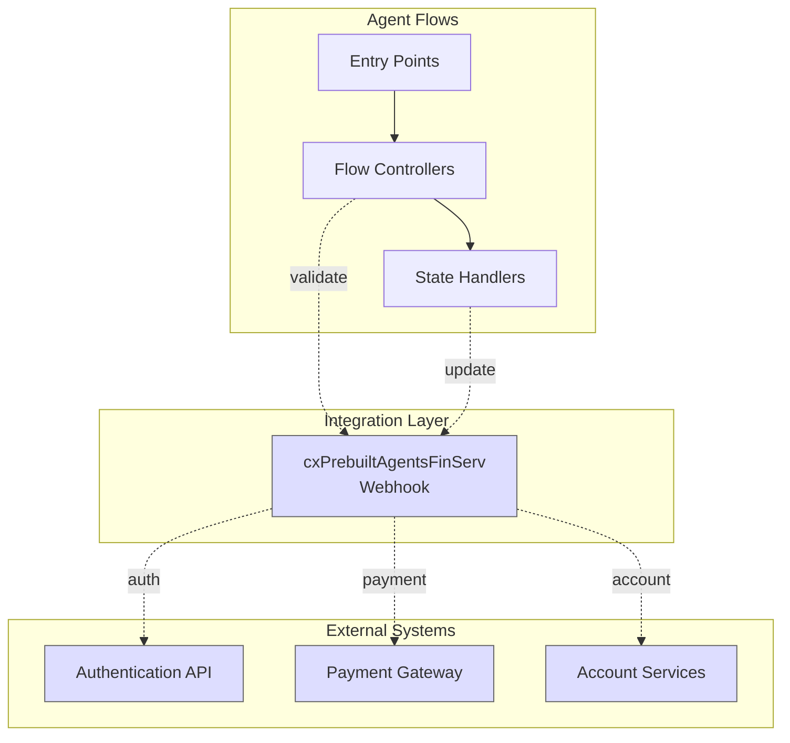
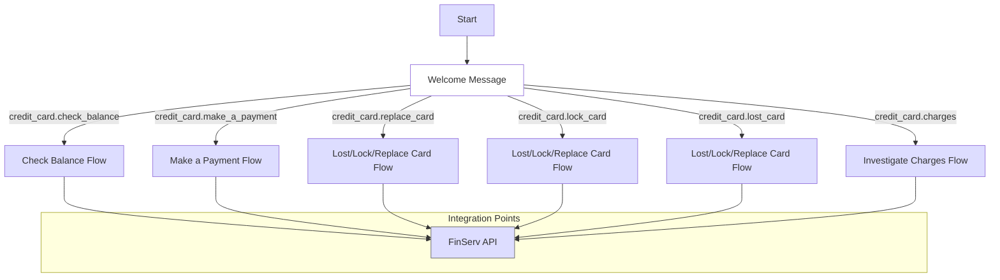
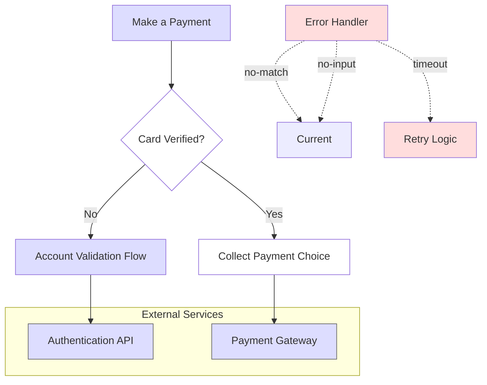
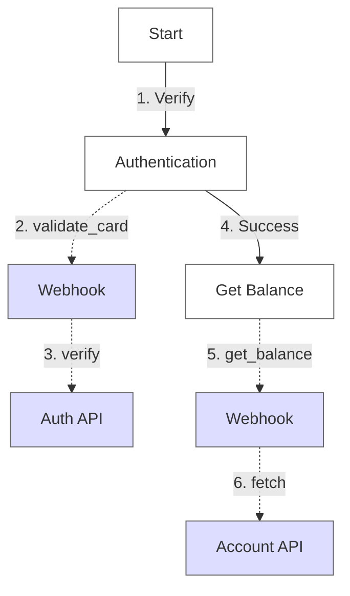
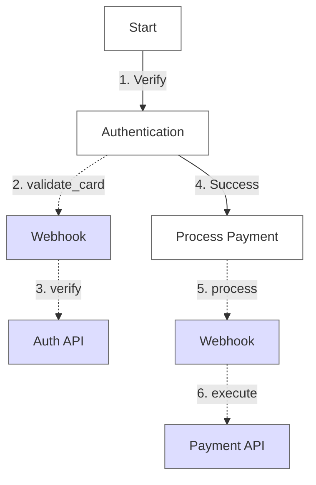

# Flow Analysis

## Integration Architecture


## Integration Points

### Webhook Configuration
- **Name**: cxPrebuiltAgentsFinServ
- **Endpoint**: europe-west2-avian-mystery-295516.cloudfunctions.net
- **Timeout**: 5 seconds
- **Protocol**: HTTPS/REST

### External Systems
1. **Authentication API**
   - Purpose: Card and account verification
   - Operations: validate_card, verify_account
   - Response time: < 5s
   - Retry policy: 3 attempts

2. **Payment Gateway**
   - Purpose: Payment processing
   - Operations: process_payment, check_status
   - Response time: < 5s
   - Retry policy: 3 attempts

3. **Account Services**
   - Purpose: Account management
   - Operations: get_balance, get_transactions
   - Response time: < 5s
   - Retry policy: 2 attempts

## Default Start Flow


### Entry Points
- Default Welcome Intent
- Direct task intents (balance, payment, card services)

### Integration Details
1. **Financial Services API**
   - Endpoint: europe-west2 region
   - Timeout: 5 seconds
   - Services:
     - Account validation
     - Balance checking
     - Payment processing
     - Card operations

2. **Webhook Configuration**
   - Name: cxPrebuiltAgentsFinServ
   - Type: Generic Web Service
   - Region: europe-west2
   - Timeout: 5 seconds

## Make a Payment Flow


### Prerequisites
- Card verification status
- Account validation

### Integration Points
1. **Authentication API**
   - Purpose: Card verification
   - Timeout handling: 5s with retry
   - Error scenarios handled

2. **Payment Gateway**
   - Purpose: Payment processing
   - Timeout handling: 5s with retry
   - Success/failure callbacks

### Error Handling
- No-match fallbacks
- No-input fallbacks
- Integration timeouts
- Contextual reprompts

For detailed error handling patterns for these integration points, see [Error Handling](06-error-handling.md#error-prevention-patterns).

For state management of integration responses, see [State Management](07-state-management.md#managing-integration-states).

## Flow-Specific Integration Details

### Check Balance Flow


#### Integration Points
- **Webhook**: cxPrebuiltAgentsFinServ
- **External Systems**: Authentication API, Account Services API
- **Data Flow**:
  ```yaml
  input:
    - card_number: string
    - verification_token: string
  output:
    - balance: number
    - last_updated: timestamp
    - currency: string
  ```

### Make Payment Flow


#### Integration Points
- **Webhook**: cxPrebuiltAgentsFinServ
- **External Systems**: Authentication API, Payment Gateway
- **Data Flow**:
  ```yaml
  input:
    - card_number: string
    - amount: number
    - currency: string
    - payment_type: string
  output:
    - transaction_id: string
    - status: string
    - confirmation_code: string
  ```
