# Error Handling

## Overview
This document defines the error handling patterns that form the foundation for the agent's [State Management](05-state-management.md) system. Understanding these patterns is crucial as they inform how state transitions are protected and recovered.

## Global Patterns

### No-Match Handler
- Event: `sys.no-match-default`
- Behavior: Reprompt with variation
- Message variations:
  ```
  - "I didn't get that. Can you say it again?"
  - "I missed what you said. What was that?"
  - "Sorry, could you say that again?"
  - "Sorry, can you say that again?"
  - [Additional variations...]
  ```

### No-Input Handler
- Event: `sys.no-input-default`
- Behavior: Similar to no-match
- Uses same message variation pool

## Flow-Specific Error Handling

### Account Validation
- Verification failures
- Invalid account numbers
- Timeout handling

### Payment Processing
- Invalid amounts
- Payment method errors
- Authorization failures

### Card Services
- Invalid card numbers
- Service unavailability
- Operation-specific errors

## Error Prevention Strategies

### 1. Input Validation Layer


### 2. Integration Error Prevention


### 3. State Validation Framework


## Enhanced Error Prevention Strategies

### 1. Input Validation Patterns


#### Implementation
```yaml
validation_rules:
  card_number:
    format: "^[0-9]{16}$"
    type: string
    length: 16
    checksum: luhn
  amount:
    type: number
    min: 0.01
    max: 100000
    precision: 2
  currency:
    type: string
    enum: [USD, EUR, GBP]
```

### 2. State Verification Steps


### 3. Retry Mechanisms

```mermaid
graph TD
    Start[Operation Start] --> Try[Attempt Operation]
    Try -->|"Success"| Success[Complete]
    Try -->|"Failure"| Analyze[Analyze Error]
    
    Analyze -->|"Retryable"| Backoff[Exponential Backoff]
    Analyze -->|"Fatal"| Fatal[Fatal Error]
    
    Backoff --> Counter[Retry Counter]
    Counter -->|"< Max"| Try
    Counter -->|"≥ Max"| Fallback[Fallback Handler]
    
    style Start fill:#fff,stroke:#666
    style Try fill:#ddf,stroke:#666
    style Success fill:#ddf,stroke:#666
    style Analyze fill:#fff,stroke:#666
    style Backoff fill:#fff,stroke:#666
    style Fatal fill:#fdd,stroke:#666
    style Counter fill:#fff,stroke:#666
    style Fallback fill:#fdd,stroke:#666
```


#### Implementation
```yaml
retry_policy:
  max_attempts: 3
  backoff:
    initial_delay: 1000
    multiplier: 2
    max_delay: 5000
  retryable_errors:
    - timeout
    - rate_limit
    - temporary_failure
```

### 4. Fallback Strategies


### 5. Recovery Procedures


#### Implementation
```yaml
recovery_procedures:
  data:
    - snapshot_state
    - validate_integrity
    - restore_consistent_state
  state:
    - rebuild_from_events
    - verify_constraints
    - apply_compensating_actions
  integration:
    - reset_connection
    - verify_health
    - resync_state
```

## Prevention Strategies

### 1. NLU Configuration
- Model Type: Advanced
- Classification Threshold: 0.30
- Spell Correction: Enabled
- Regular expression validations
- Entity type constraints

### 2. Input Validation
- Parameter type checking
- Required field validation
- Format verification
- Range constraints
- Pattern matching

### 3. State Management
- Session parameter validation
- Context lifespan management
- State transition guards
- Rollback mechanisms
- Recovery procedures

### 4. Integration Resilience
- Timeout configuration (5s)
- Retry strategies
- Circuit breaker patterns
- Fallback handlers
- Error propagation rules

### 5. User Experience
- Clear error messages
- Guided recovery paths
- Context preservation
- Progressive disclosure
- Graceful degradation

### 6. Monitoring and Prevention
- Error rate tracking
- Pattern detection
- Automated recovery
- Performance monitoring
- Proactive alerts
