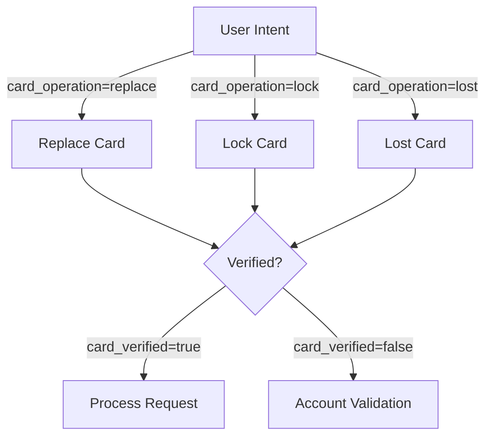
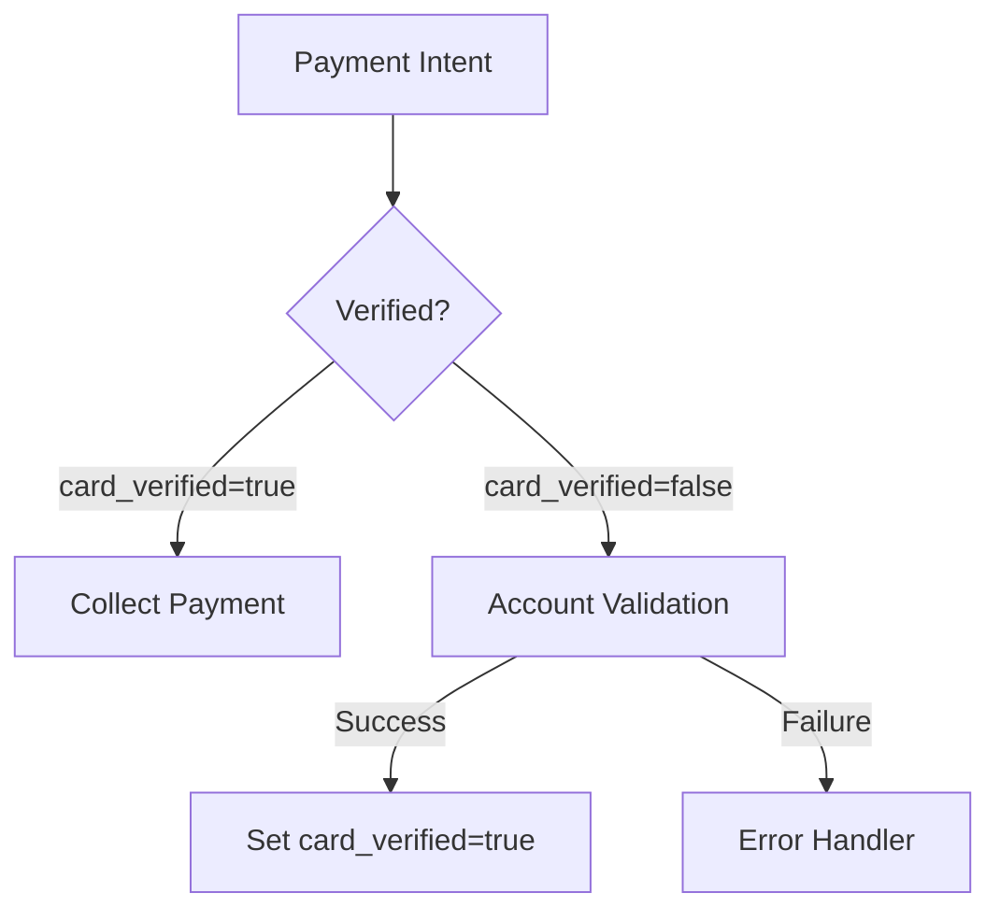

# State Management

## Overview
State management in this agent is built upon the error handling patterns defined in [Error Handling](04-error-handling.md). This ensures that state transitions are resilient and recoverable.

## Session Parameters

### Core Parameters
1. `card_verified`
   - Type: Boolean (string representation)
   - Scope: Session
   - Usage: Security validation tracking
   - Set by: Account Validation flow

2. `card_operation`
   - Type: Enum string
   - Values: ["replace", "lock", "lost"]
   - Scope: Session
   - Usage: Card service type tracking
   - Set by: Default Start Flow

3. `in_hours`
   - Type: Boolean (string representation)
   - Scope: Session
   - Usage: Business hours tracking
   - Set by: Welcome intent

## State Transitions

### Card Services

### Payment Flow

