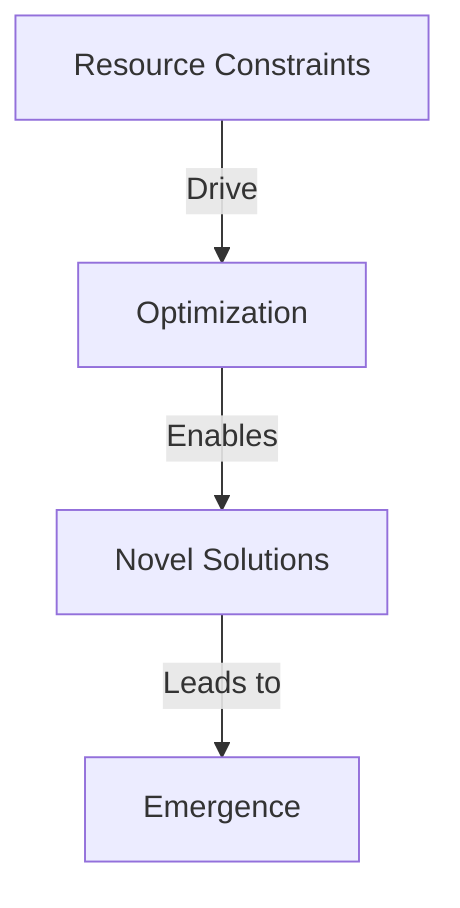

# Distributed Hub-Spoke AI Pattern

## Overview

A modern reimagining of the hub-spoke architecture pattern for distributed AI systems, focusing on private network deployment with heterogeneous GPU resources. This pattern enables efficient orchestration of large language models (LLMs) across multiple nodes while maintaining zero-trust principles.

## Core Concepts

### 1. Resource-Aware Model Distribution
- **Hub Node**: Hosts large, high-accuracy models
  - Acts as orchestrator/observer
  - Handles complex reasoning and oversight
  - Leverages combined consumer GPU memory

- **Spoke Nodes**: Run smaller, specialized models
  - Multiple lightweight models (1-8B parameters)
  - Task-specific optimization
  - Efficient resource utilization

### 2. Message-Based Coordination
- Lightweight, asynchronous communication
- Network-efficient protocol
- Inspired by mainframe transaction processing systems
- Zero-trust, self-contained operation

### Economic Advantages
- Consumer-grade hardware keeps costs low
- GPU acceleration provides computational efficiency
- Failed experiments have minimal impact
- Infrastructure can be easily reset or reconfigured

### Hardware as Evolutionary Driver

- VRAM limitations encourage efficient models
- Cost-effective infrastructure enables rapid iteration
- Consumer hardware gaps drive innovative solutions
- Natural selection through resource constraints

## Implementation Example

### Hardware Configuration
```
Hub Node (Primary):
- 128GB RAM
- 4 x 12GB GPUs (48GB total VRAM)
- Optimal for 70B parameter models

Spoke Nodes:
- Secondary: 32GB RAM, 1 x 12GB GPU
  - Runs multiple 8B parameter models
- Tertiary: 32GB RAM, 1 x 4GB GPU
  - Handles lightweight inference (1-2B models)
```

### Model Distribution Strategy
```
Hub:
- Primary: deepseek-r1:70b (orchestrator)
- Secondary: deepseek-r1:1.5b (utility agents)

Spokes:
- Medium models: deepseek-r1:8b
- Lightweight agents: <1B parameter models
```

## Key Benefits

1. **Resource Optimization**
   - Leverages GPU capacity over raw speed
   - Efficient distribution of model sizes
   - Balanced workload across nodes

2. **Architectural Advantages**
   - Zero-trust security model
   - Self-contained private network
   - Message-based coordination
   - Scalable within infrastructure limits

3. **Operational Benefits**
   - Self-healing capability
   - Redundancy through distributed nodes
   - Flexible model deployment

## Implementation Considerations

### 1. Network Configuration
- Optimize for message-based communication
- Minimize data transfer overhead
- Implement efficient model synchronization

### 2. Model Loading
- Dynamic model loading based on task requirements
- Memory management across GPUs
- Efficient context sharing

### 3. Fault Tolerance
- Self-healing agent mechanisms
- Graceful degradation
- Automatic workload rebalancing

## Usage Guidelines

1. **When to Use**
   - Private network AI deployment
   - Mixed GPU resource environments
   - Need for orchestrated AI agents
   - Zero-trust requirements

2. **When Not to Use**
   - Cloud-first architectures
   - Homogeneous GPU environments
   - Single-node requirements

## Related Patterns
- Agent Orchestration Pattern
- Model Sharding Pattern
- Message Queue Pattern

## References
- Traditional Hub-Spoke Architecture
- Modern AI Agent Systems
- Distributed Computing Patterns
