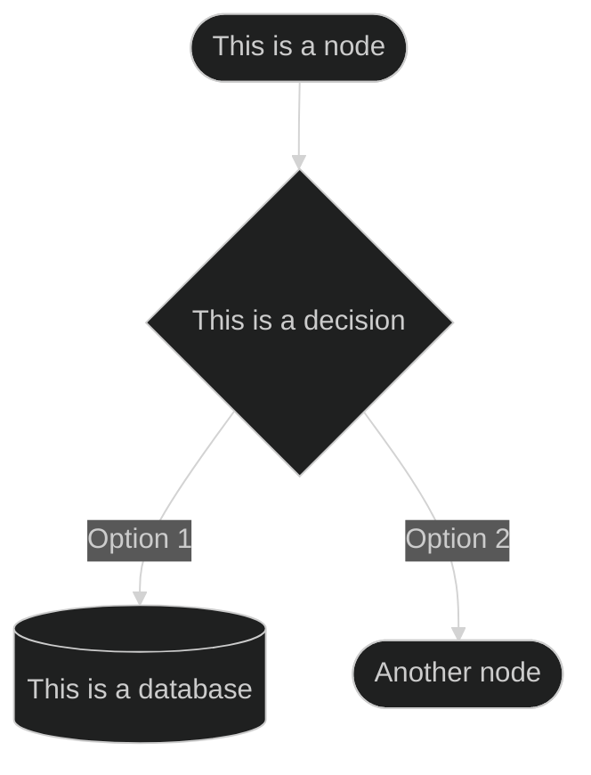
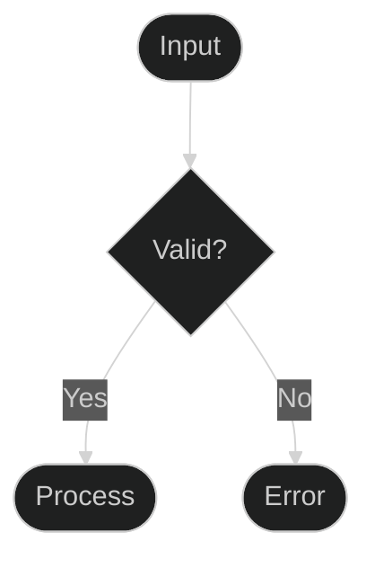
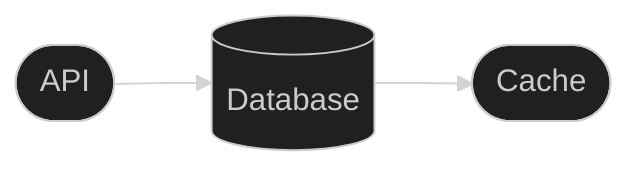

# Mermaid Diagram Style Guide

## Perfect Contrast in Both Modes

The key to achieving perfect contrast in both light and dark modes is extreme simplicity:



## The Golden Rules

1. **Minimal Configuration**
   ```markdown
   %%{init: {
     'theme': 'dark'
   }}%%
   ```
   That's it! No other configuration needed.

2. **Node Shapes**
   - Regular nodes: `A([Node Text])`
   - Decision nodes: `B{Decision?}`
   - Database nodes: `C[(Database)]`
   - Process nodes: `D[[Process]]`

3. **What NOT to Use**
   - ❌ Custom theme variables
   - ❌ Class definitions
   - ❌ Color overrides
   - ❌ Background colors
   - ❌ Custom fonts
   - ❌ Style overrides

## Examples

### 1. Simple Flow


### 2. Decision Tree


### 3. Database Flow


## Benefits

1. **Accessibility**
   - WCAG compliant contrast in both modes
   - Clear, readable text
   - Distinct node shapes for different purposes

2. **Consistency**
   - Same appearance across all documentation
   - Predictable rendering
   - Easy maintenance

3. **AI-Friendly**
   - Clean, semantic markup
   - Clear node relationships
   - Structured data flow

## Adding New Diagrams

1. Start with the basic init:
   ```markdown
   ```mermaid
   %%{init: {
     'theme': 'dark'
   }}%%
   ```

2. Choose your graph type:
   - `graph TD` (top-down)
   - `graph LR` (left-right)
   - `graph RL` (right-left)

3. Add nodes and connections:
   ```markdown
   A([First]) --> B([Second])
   ```

4. Test in both light and dark modes

Remember: Simplicity is key to perfect contrast!
