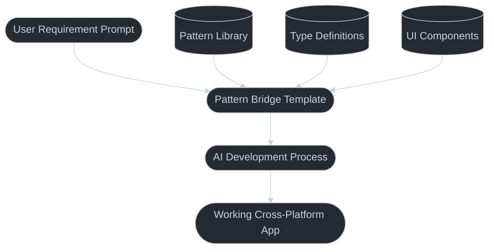
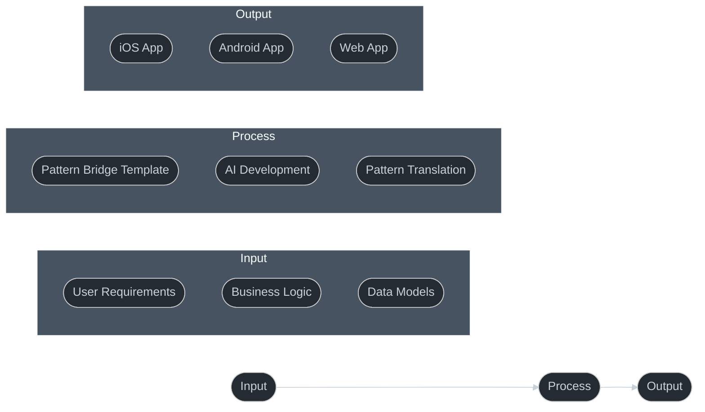
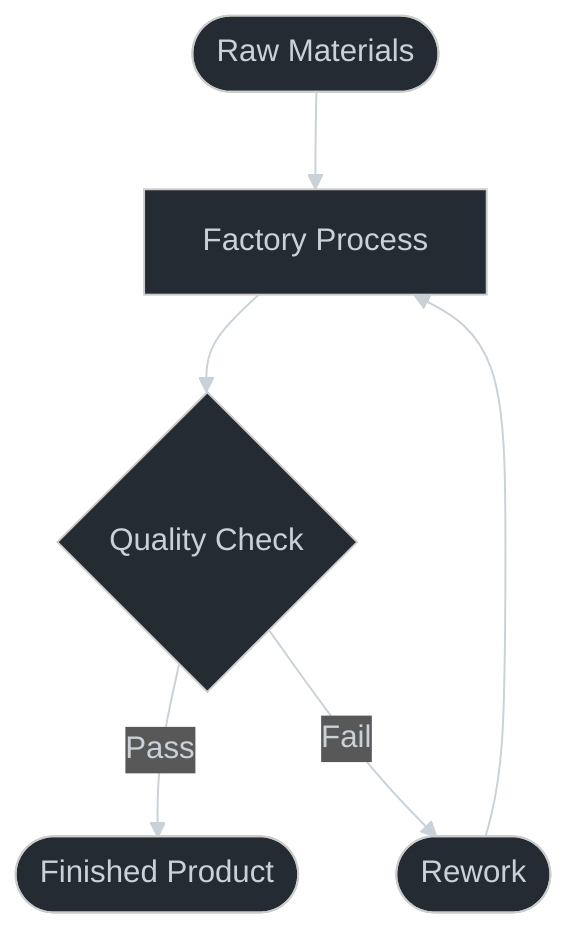

# Pattern Bridge: The AI Software Factory

## The Vision

Pattern Bridge evolves from a reference implementation into a complete software factory:



## Why This is Revolutionary

### 1. Solved Problems Stay Solved
Traditional software factories focus on code generation or component libraries. Pattern Bridge is different:
- Cross-platform already solved
- Navigation patterns established
- Type safety implemented
- Theme system ready
- Component library tested

### 2. Focus on Business Logic
The AI can focus entirely on:
- Unique features
- Business rules
- Data models
- User workflows

Because the foundation is solid and proven.

### 3. Predictable Output
Unlike typical AI code generation:
- Known good patterns
- Verified components
- Tested navigation
- Proven architecture

### 4. The Factory Process



## Novel Aspects

- **AI-First Development**
    - **Pattern Recognition**: AI excels at identifying and replicating patterns
    - **Code Generation**: Automated creation of boilerplate and common patterns
    - **Consistency Checks**: Ensuring adherence to established patterns

- **Cross-Platform Focus**
    - **Universal Components**: Write once, run anywhere approach
    - **Platform Adaptation**: Automatic adjustments for each platform
    - **Consistent Experience**: Same user experience across devices

- **Type Safety**
    - **Interface Definitions**: Clear contract between components
    - **Runtime Validation**: Catching errors before they occur
    - **Documentation Generation**: Automatic API documentation

- **Pattern Preservation**
    - **Reference Implementation**: Clear examples of best practices
    - **Pattern Evolution**: Tracking changes and improvements
    - **Knowledge Transfer**: Easy onboarding for new developers

## Implementation Steps

- **Setup Phase**
    - **Environment Configuration**: Setting up development tools
    - **Dependency Management**: Installing required packages
    - **Project Structure**: Organizing code and resources

- **Development Phase**
    - **Component Creation**: Building reusable UI elements
    - **Pattern Implementation**: Following established guidelines
    - **Integration Testing**: Ensuring components work together

- **Validation Phase**
    - **Quality Checks**: Verifying code standards
    - **Performance Testing**: Measuring and optimizing
    - **Cross-Platform Testing**: Validating on all targets

- **Documentation Phase**
    - **Pattern Documentation**: Recording design decisions
    - **Usage Examples**: Providing clear implementation guides
    - **API References**: Detailing component interfaces

## Success Metrics

- **Code Quality**
    - **Type Coverage**: Percentage of typed code
    - **Test Coverage**: Unit and integration test metrics
    - **Documentation Quality**: Completeness and clarity

- **Development Efficiency**
    - **Build Times**: Speed of compilation and deployment
    - **Error Rates**: Frequency of runtime issues
    - **Developer Feedback**: Ease of use and understanding

- **Platform Support**
    - **Device Coverage**: Number of supported platforms
    - **Feature Parity**: Consistency across platforms
    - **Performance Metrics**: Speed and resource usage

## Comparison to Existing Approaches

### Traditional Software Factories
- Focus on code generation
- Require technical decisions
- Often single platform
- Need human integration

### Low-Code Platforms
- Limited flexibility
- Platform locked
- Template driven
- Human driven

### AI Code Generation
- Inconsistent output
- No guaranteed patterns
- Platform specific
- Needs human review

### Pattern Bridge Factory
- Cross-platform by default
- Proven patterns
- AI-driven development
- Human requirements only

## Implementation Strategy

- **Core Template**
    - **Clean Navigation**: Intuitive user flows
    - **Theme System**: Consistent styling
    - **Type Safety**: Strong typing throughout
    - **Base Components**: Reusable building blocks

- **Pattern Library**
    - **UI Patterns**: Common interface elements
    - **Navigation Patterns**: Standard routing approaches
    - **State Management**: Data flow patterns
    - **Data Flow**: Type-safe data handling

- **AI Integration**
    - **Clear Documentation**: Easy to understand
    - **Type Definitions**: Strong interfaces
    - **Pattern Examples**: Working implementations
    - **Usage Guides**: Step-by-step tutorials

## Future Potential

1. **Pattern Evolution**
   - New patterns added
   - Existing patterns refined
   - AI feedback loop
   - User success metrics

2. **AI Capabilities**
   - Better understanding
   - Faster development
   - More complex apps
   - Less human input

3. **Platform Expansion**
   - New platforms
   - New frameworks
   - New patterns
   - New capabilities

## Getting Started

1. **For Users**
   ```
   1. Write requirements
   2. Submit to Pattern Bridge
   3. Receive working app
   4. Deploy to all platforms
   ```

2. **For AI**
   ```
   1. Analyze requirements
   2. Map to patterns
   3. Implement unique features
   4. Deliver cross-platform
   ```

## Software Factory Pattern

The Software Factory pattern is our systematic approach to software development that emphasizes:

- **Standardized Components**
    - Reusable building blocks
    - Consistent interfaces
    - Type-safe implementations

- **Automated Assembly**
    - CI/CD pipelines
    - Automated testing
    - Quality checks

- **Quality Control**
    - Code reviews
    - Performance metrics
    - Security scanning

## Implementation



## Key Components

- **Input Processing**
    - Requirements analysis
    - Design specifications
    - Resource allocation

- **Assembly Line**
    - Component creation
    - Integration testing
    - Documentation

- **Quality Assurance**
    - Automated tests
    - Performance checks
    - Security scans

## Benefits

- **Consistency**
    - Standard patterns
    - Uniform quality
    - Predictable output

- **Efficiency**
    - Automated processes
    - Reduced errors
    - Faster delivery

- **Maintainability**
    - Clear structure
    - Easy updates
    - Simple debugging

## Best Practices

- **Documentation**
    - Clear requirements
    - Implementation guides
    - Usage examples

- **Testing**
    - Unit tests
    - Integration tests
    - End-to-end validation

- **Monitoring**
    - Performance metrics
    - Error tracking
    - Usage analytics

## Additional Resources

- <a href="https://martinfowler.com/articles/patterns-of-distributed-systems/" target="_blank">Patterns of Distributed Systems</a>
- <a href="https://12factor.net/" target="_blank">The Twelve-Factor App</a>
- <a href="https://www.thoughtworks.com/radar" target="_blank">Technology Radar</a>

## Conclusion

Pattern Bridge as a software factory represents a fundamental shift in how applications are built:
- From technical decisions to business requirements
- From platform-specific to universal
- From human integration to AI automation
- From code generation to pattern implementation

This is not just another development tool - it's a new paradigm for software creation where the focus is entirely on what needs to be built, not how to build it.
