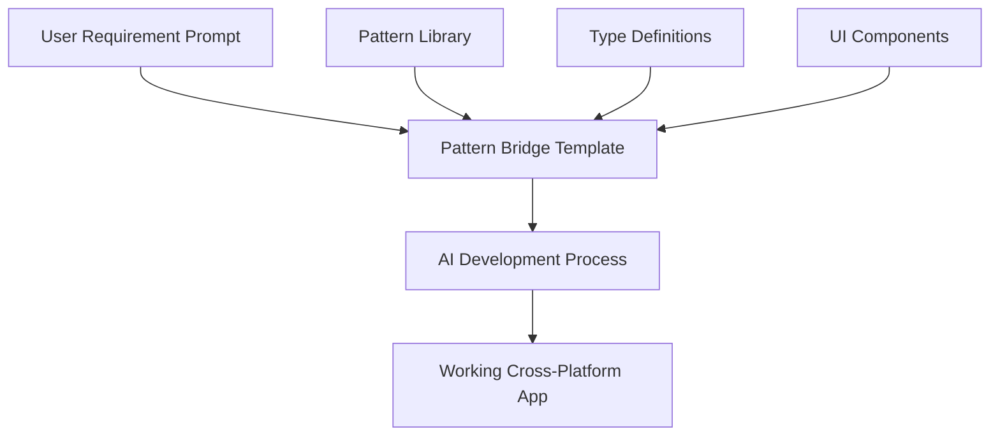
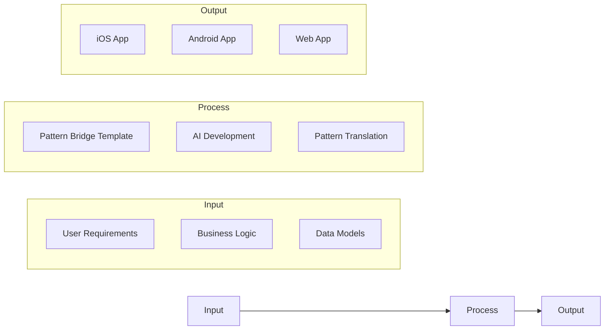

# Pattern Bridge: The AI Software Factory

## The Vision

Pattern Bridge evolves from a reference implementation into a complete software factory:



## Why This is Revolutionary

### 1. Solved Problems Stay Solved
Traditional software factories focus on code generation or component libraries. Pattern Bridge is different:
- Cross-platform already solved
- Navigation patterns established
- Type safety implemented
- Theme system ready
- Component library tested

### 2. Focus on Business Logic
The AI can focus entirely on:
- Unique features
- Business rules
- Data models
- User workflows

Because the foundation is solid and proven.

### 3. Predictable Output
Unlike typical AI code generation:
- Known good patterns
- Verified components
- Tested navigation
- Proven architecture

### 4. The Factory Process



## Novel Aspects

1. **Template as Truth**
   - Pattern Bridge isn't just boilerplate
   - It's a working reference implementation
   - Every pattern is verified
   - Cross-platform is guaranteed

2. **AI as Builder**
   - AI understands the patterns
   - Focuses on unique value
   - Uses proven components
   - Delivers working apps

3. **User Experience**
   - Requirements in
   - Working app out
   - No technical decisions needed
   - All platforms supported

## Comparison to Existing Approaches

### Traditional Software Factories
- Focus on code generation
- Require technical decisions
- Often single platform
- Need human integration

### Low-Code Platforms
- Limited flexibility
- Platform locked
- Template driven
- Human driven

### AI Code Generation
- Inconsistent output
- No guaranteed patterns
- Platform specific
- Needs human review

### Pattern Bridge Factory
- Cross-platform by default
- Proven patterns
- AI-driven development
- Human requirements only

## Implementation Strategy

1. **Core Template**
   - Clean navigation
   - Theme system
   - Type safety
   - Base components

2. **Pattern Library**
   - UI patterns
   - Navigation patterns
   - State management
   - Data flow

3. **AI Integration**
   - Clear documentation
   - Type definitions
   - Pattern examples
   - Usage guides

## Future Potential

1. **Pattern Evolution**
   - New patterns added
   - Existing patterns refined
   - AI feedback loop
   - User success metrics

2. **AI Capabilities**
   - Better understanding
   - Faster development
   - More complex apps
   - Less human input

3. **Platform Expansion**
   - New platforms
   - New frameworks
   - New patterns
   - New capabilities

## Getting Started

1. **For Users**
   ```
   1. Write requirements
   2. Submit to Pattern Bridge
   3. Receive working app
   4. Deploy to all platforms
   ```

2. **For AI**
   ```
   1. Analyze requirements
   2. Map to patterns
   3. Implement unique features
   4. Deliver cross-platform
   ```

## Conclusion

Pattern Bridge as a software factory represents a fundamental shift in how applications are built:
- From technical decisions to business requirements
- From platform-specific to universal
- From human integration to AI automation
- From code generation to pattern implementation

This is not just another development tool - it's a new paradigm for software creation where the focus is entirely on what needs to be built, not how to build it.
