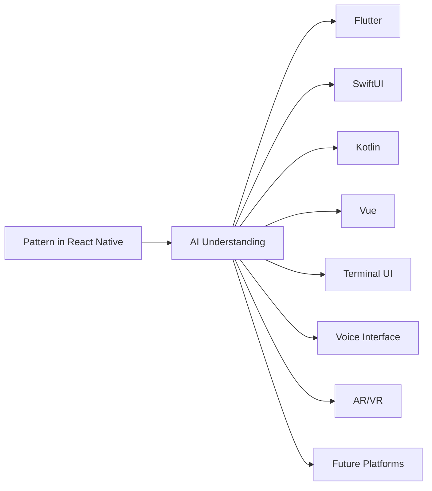

# Pattern Bridge: Universal Pattern Translation

## The Core Insight

Pattern Bridge's fundamental innovation is the recognition that AI language models are universal pattern translators. The choice of React Native/Expo isn't about mobile development - it's about pattern definition.

## Why This Matters

### 1. Universal Pattern Definition
- React Native already handles multiple platforms (iOS, Android, Web)
- Components are declarative and pattern-focused
- Patterns are separated from implementation details

### 2. AI as Universal Translator

Once an AI understands the pattern, the implementation details become trivial. The same pattern can be translated to:
- Any framework
- Any platform
- Any interface paradigm
- Future technologies we haven't invented yet

### 3. Material Design as Universal Language
The choice of Material Design isn't about aesthetics. It's about having a universal way to express patterns that:
- AIs already understand
- Can be translated to any design system
- Provides a common baseline for pattern definition

## The Real Product
The mobile app isn't the product. The patterns are the product:
1. Define patterns in React Native
2. AI understands the core pattern
3. AI can translate to any target platform or paradigm

## Why React Native/Expo?
- Already handles multiple platforms
- Declarative component model
- Strong typing with TypeScript
- Modern development practices
- Immediate validation across platforms

## The Bridge Metaphor
Pattern Bridge isn't just bridging platforms - it's bridging:
- Human intent to AI understanding
- Pattern definition to implementation
- Current technology to future possibilities

---
*Note: This document captures the core innovation of Pattern Bridge as understood on January 15, 2025. The implications of this approach are still being discovered.*
