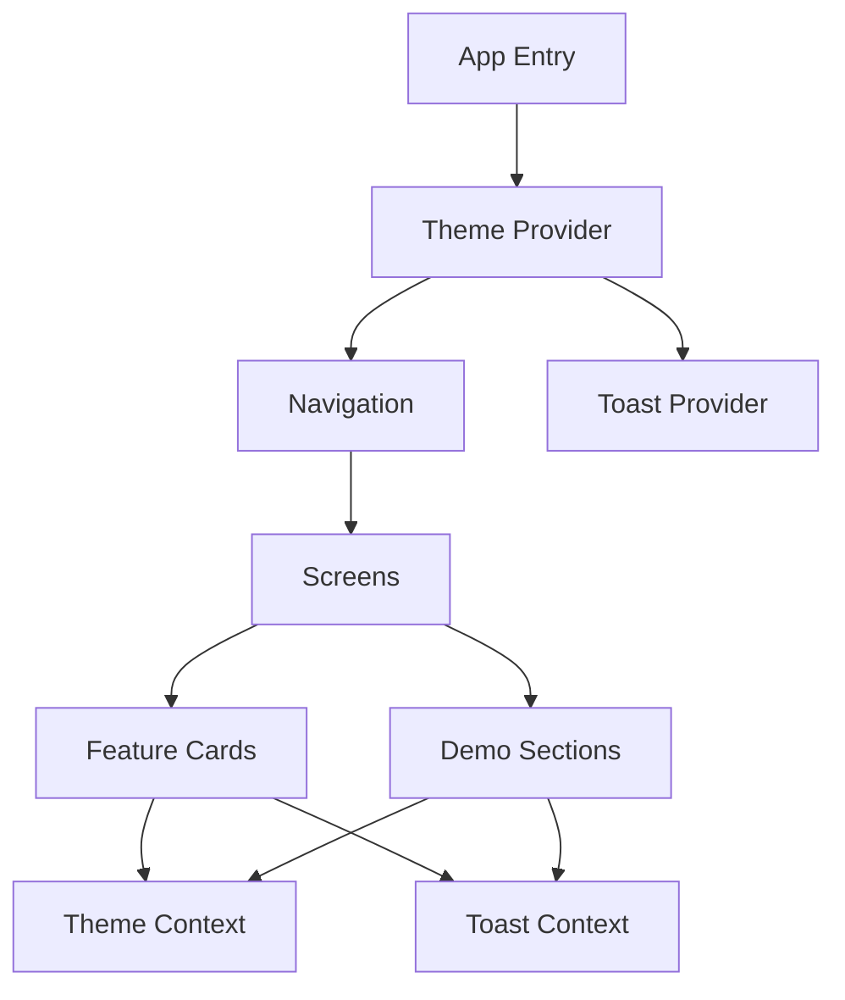
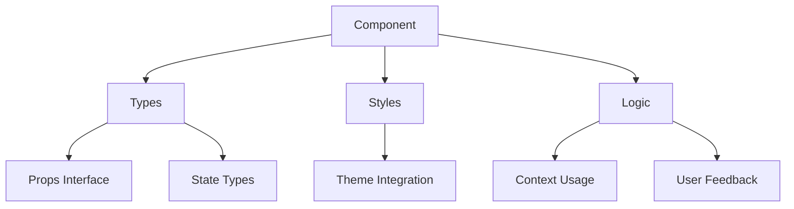
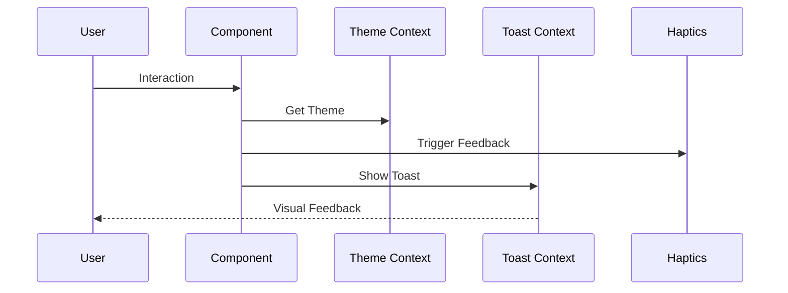
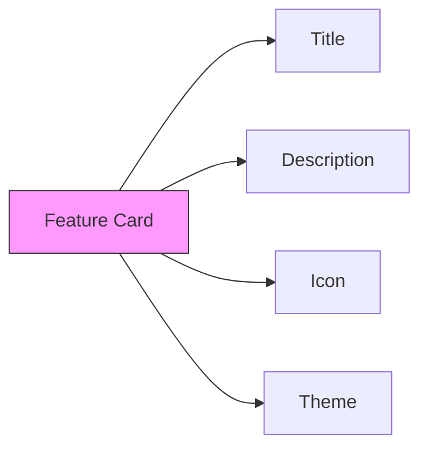
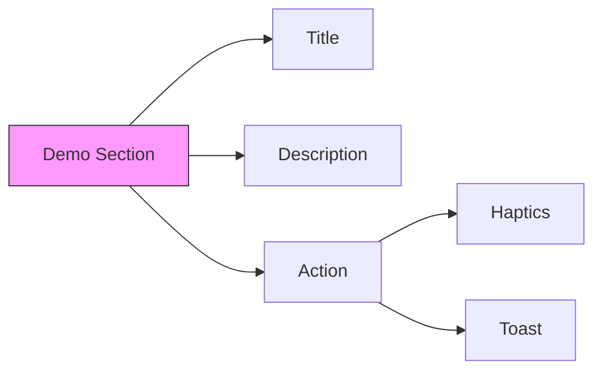
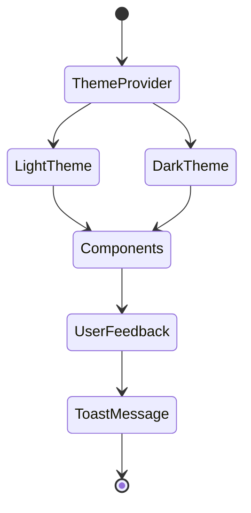

# AI-First Development Guide

pattern-bridge makes it easy to build React Native apps with AI assistance. This guide will help you understand how everything fits together.

## Overview

At its core, pattern-bridge follows three main principles:
- **Type-Safe Everything**: All components and features are strictly typed, making it easier for AI to understand and suggest correct usage.
- **Pattern Clarity**: Components follow consistent patterns, making them predictable for both AI and humans.
- **Context-Based Architecture**: Features are organized around contexts, making dependencies clear and explicit.

Here's how the main pieces fit together:



## Component Architecture

Our components follow a predictable pattern:



## Data Flow

Here's how data flows through the app:



## Key Principles

### 1. Type-Safe Everything

All components and features are strictly typed, making it easier for AI to understand and suggest correct usage:

```typescript
// Types are self-documenting
interface FeatureCard {
  title: string;
  description: string;
  icon: React.ReactNode;
}

interface DemoSection {
  title: string;
  description: string;
  action: {
    label: string;
    onPress: () => Promise<void>;
  };
}
```

### 2. Consistent Pattern Usage

Components follow consistent patterns, making them predictable for both AI and humans:

```tsx
// Pattern: Feature demonstration with description and action
const demoSection: DemoSection = {
  title: 'Try It Out',
  description: 'Clear description of what the demo shows',
  action: {
    label: 'Actionable label',
    onPress: async () => {
      // 1. Optional haptic feedback
      await Haptics.selectionAsync();
      // 2. Main action
      performAction();
      // 3. User feedback
      showFeedback();
    }
  }
};
```

### 3. Context-Based Architecture

Features are organized around contexts, making dependencies clear and explicit:

```tsx
// Theme context usage
const { theme, isDark } = useTheme();

// Toast context usage
const toast = useToast();

// Clear separation of concerns
function ThemedToast() {
  const { theme } = useTheme();
  return (
    <Toast 
      style={{ backgroundColor: theme.colors.surface }}
      textStyle={{ color: theme.colors.text }}
    />
  );
}
```

### 4. Self-Documenting Components

Components include props that describe their purpose and usage:

```tsx
function FeatureCard({ 
  title,       // Main feature name
  description, // Brief feature description
  icon         // Visual representation
}: FeatureCard) {
  const { styles } = useTheme();
  return (
    <Pressable style={styles.card}>
      {icon}
      <Text style={styles.title}>{title}</Text>
      <Text style={styles.description}>{description}</Text>
    </Pressable>
  );
}
```

## AI-Friendly File Structure

```
src/
├── components/    # Reusable UI components
│   ├── Toast/    # Each feature in its own directory
│   │   ├── index.tsx
│   │   ├── types.ts      # Separate type definitions
│   │   └── styles.ts     # Separate styles
├── contexts/     # React contexts for state management
├── screens/      # Screen components
├── utils/        # Helper functions and hooks
└── types/        # Global type definitions
```

## Best Practices for AI Integration

### 1. Type Definitions
- Keep types in separate files for easy reference
- Use descriptive interface names
- Include JSDoc comments for complex types

### 2. Component Structure
- One component per file
- Clear prop interfaces
- Consistent styling patterns
- Explicit dependencies

### 3. State Management
- Use contexts for global state
- Keep state transformations pure
- Document state shape and updates

### 4. Error Handling
- Type-safe error handling
- Consistent error patterns
- Clear error messages

## Common AI Assistant Tasks

### 1. Adding New Features

```typescript
// 1. Define types
interface NewFeature {
  // ...type definition
}

// 2. Create context if needed
const NewFeatureContext = createContext<NewFeature>(/*...*/);

// 3. Implement component
export function NewFeatureComponent() {
  // ...implementation
}
```

### 2. Styling Components

```typescript
// 1. Import theme
const { theme } = useTheme();

// 2. Create styles
const styles = StyleSheet.create({
  container: {
    backgroundColor: theme.colors.background,
    padding: theme.spacing.medium
  }
});
```

### 3. Adding User Feedback

```typescript
// 1. Haptic feedback
await Haptics.selectionAsync();

// 2. Visual feedback
toast.show({
  type: 'success',
  message: 'Action completed'
});
```

## Common Patterns

### 1. Feature Cards
Feature cards showcase main functionality:



Example usage:
```tsx
<FeatureCard
  title="Theme System"
  description="Light, dark, and system themes"
  icon={<Palette />}
/>
```

### 2. Demo Sections
Demo sections let users try features:



Example usage:
```tsx
const demo = {
  title: "Try It Out",
  description: "See it in action",
  action: {
    label: "Show Demo",
    onPress: showDemo
  }
};
```

### 3. Theme Integration
Every component should support theming:

```tsx
function ThemedComponent() {
  const { theme } = useTheme();
  return (
    <Component style={{ color: theme.colors.text }} />
  );
}
```

## State Management

Theme and toast state flow through the app via React Context:



## Related
- [Type System](../features/type-system.md)
- [Component Patterns](../guides/component-patterns.md)
- [State Management](../guides/state-management.md)
