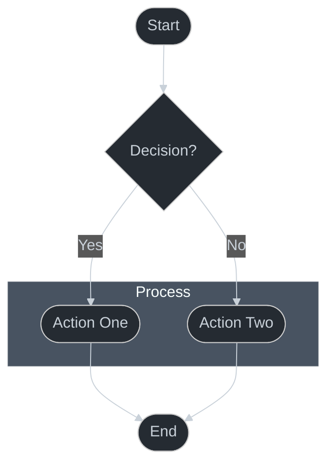

# Mermaid Style Guide

## Configuration

All diagrams MUST use this exact configuration:

```css
%%{init: {
  'theme': 'dark',
  'themeVariables': {
    'darkMode': true,
    'background': '#252b32',
    'mainBkg': '#252b32',
    'textColor': '#c9d1d9',
    'lineColor': '#c9d1d9'
  }
}}%%
```

## Node Styles

- **Action Nodes**: Use `([Text])` syntax
  ```mermaid
  %%{init: {'theme': 'dark'}}%%
  graph TD
    A([Action Node])
  ```

- **Decision Nodes**: Use `{Text}` syntax
  ```mermaid
  %%{init: {'theme': 'dark'}}%%
  graph TD
    A{Decision Node}
  ```

## Edge Labels

- Use `|Text|` syntax for edge labels
  ```mermaid
  %%{init: {'theme': 'dark'}}%%
  graph TD
    A([Start]) -->|Condition| B([End])
  ```

## Subgraphs

- Use simple text labels without quotes
  ```mermaid
  %%{init: {'theme': 'dark'}}%%
  graph TD
    subgraph Group Name
        A([Node One])
        B([Node Two])
    end
  ```

## Essential Rules

1. **NO custom styling blocks**: Never use `style` statements - rely on theme
2. **NO quoted node text**: Use `([Text])` not `(["Text"])`
3. **NO custom colors**: Use theme defaults only
4. **NO background fills** in subgraphs
5. **NO emojis or icons**: Keep it clean and professional

## Example: Complete Diagram



## Why This Matters

- **Quality Reflection**
    - **Professional**: Shows attention to detail
    - **Trustworthy**: Suggests reliability in our patterns
    - **Cohesive**: Demonstrates unified vision
    - **Clear**: Enhances readability and understanding

## Validation Checklist

- **Theme Configuration**
    - **Dark Mode**: Uses exact theme configuration
    - **Color Variables**: Includes all required variables
    - **Background Color**: Set to #252b32
    - **Text Color**: Set to #c9d1d9

- **Node Syntax**
    - **Square Brackets**: Uses ([Text]) for nodes
    - **No Quotes**: Avoids quoted text in nodes
    - **Consistent Shape**: Uses same node style
    - **Clean Labels**: Simple, descriptive text

- **Edge Labels**
    - **Pipe Syntax**: Uses |Text| for edge labels
    - **Brief Text**: Keeps labels concise
    - **No Styling**: No custom edge colors
    - **Clear Flow**: Logical direction indicators

- **Overall Style**
    - **No Custom Styling**: Avoids style blocks
    - **No Background Fills**: Clean subgraph style
    - **No Emojis**: Professional appearance
    - **Minimal Design**: Clean and focused layout
