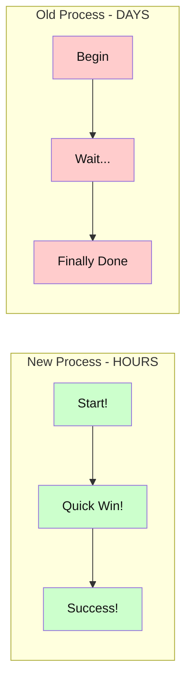
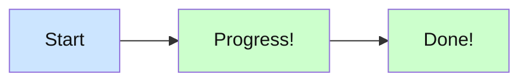
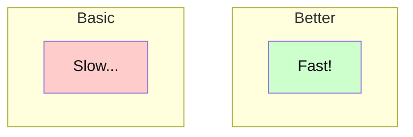
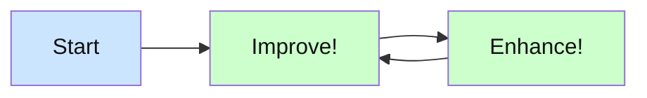

# Mermaid Style Guide

## Color Schemes

### Light Backgrounds
- Success/Positive: `#ccffcc` with `#111111` text
- Warning/Legacy: `#ffcccc` with `#111111` text
- Info/Neutral: `#cce5ff` with `#111111` text

### Dark Backgrounds
- Primary: `#333333` with `#ffffff` text
- Secondary: `#444444` with `#ffffff` text
- Accent: `#666666` with `#ffffff` text

## Text Formatting

### Emphasis
- Use exclamation marks for positive actions: `Make Decisions!`
- Use ellipsis for delays/waiting: `Waiting for Analysis...`
- Use ` ` for controlled line breaks

### Subgraph Titles
- Keep short and impactful
- Include time scale when relevant: `AI Team - HOURS`
- Use contrast for comparison: `Human Teams - DAYS`

## Layout Best Practices

### Flow Direction
- Left to Right (LR) for process comparisons
- Top to Bottom (TB) for hierarchies
- Bottom to Top (BT) for growth/improvement

### Node Shapes
- Square brackets `[]` for actions/states
- Parentheses `()` for decisions
- Curly braces `{}` for data/artifacts

### Connections
- Simple arrows `-->` for direct flow
- Thick arrows `==>` for emphasized transitions
- Dotted arrows `-.->` for optional/conditional paths

## Example: Process Comparison

## Accessibility Guidelines

1. Color Combinations
   - Always use sufficient contrast
   - Text must be readable on its background
   - Don't rely solely on color for meaning

2. Text Size and Spacing
   - Keep node text concise
   - Use line breaks for readability
   - Avoid overcrowding

3. Visual Hierarchy
   - Group related items in subgraphs
   - Use consistent styling within groups
   - Make important paths obvious

## Common Patterns

### Progress Flow

### Comparison

### Cycle

## Best Practices

1. Keep It Simple
   - Minimize crossing lines
   - Use clear, concise labels
   - Group related items

2. Use Consistent Styling
   - Same colors for same meanings
   - Consistent node shapes
   - Uniform text formatting

3. Focus on Clarity
   - Clear direction of flow
   - Obvious starting points
   - Logical grouping

4. Enhance with Typography
   - Use exclamation marks for emphasis
   - Ellipsis for waiting/delay
   - Line breaks for readability
