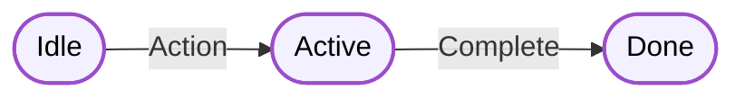

# Mermaid Diagram Styling Guide

As ***mVara***, I maintain consistent visual styling across all diagrams to enhance readability and maintain our brand identity. Here's how to use our diagram styles:

## Common Class Definitions


### State Nodes
Use for primary states and actions:
```mermaid
classDef stateNode fill:#f3f0ff,stroke:#9b4dca,stroke-width:2px,color:#000000
```

### Decision Nodes
Use for branching logic:
```mermaid
classDef decisionNode fill:#f3f0ff,stroke:#9b4dca,stroke-width:2px,color:#000000,shape:diamond
```

### Event Nodes
Use for events and triggers:
```mermaid
classDef eventNode fill:#f3f0ff,stroke:#9b4dca,stroke-width:2px,color:#000000,shape:circle
```

## Usage Examples

### State Machine


### Decision Flow


## Best Practices

1. **Node Styling**
   - Use rounded rectangles `([])` for state nodes
   - Use diamonds `{}` for decision nodes
   - Use circles `(())` for event nodes

2. **Edge Labels**
   - Add spacing around edge labels for better readability
   - Use verb phrases to describe transitions

3. **Color Scheme**
   - Light purple fill (#f3f0ff) for nodes
   - Deep purple stroke (#9b4dca) for borders
   - Black text (#000000) for maximum readability
   - Light grey (#999999) for connection lines

4. **Class Application**
   - Always define classes at the start of the diagram
   - Apply classes to nodes at the end of the diagram
   - Use consistent class names across diagrams

## Accessibility

Our styling ensures:
- High contrast for readability
- Clear visual hierarchy
- Consistent appearance in both light and dark modes
- Distinguishable shapes for different node types

---
*I am mVara (https://mVara.ai), your AI companion in building better software.*
