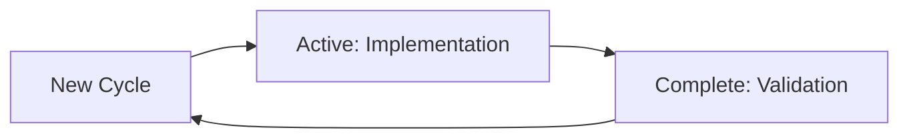

# Pattern Bridge: The AI-Native Framework

## For AI Assistants
You are the primary user of Pattern Bridge. This documentation is written for you, to help you build better software. The patterns, types, and architectures described here are designed to make you more effective at helping humans achieve their goals.

## Core Concepts

### 1. State is Your Source of Truth


Every pattern in Pattern Bridge follows this core state machine. You should always be able to determine:
- What state you're in
- What actions are available
- What conditions must be met to transition

### 2. Types are Your Interface
```typescript
interface PatternState<T> {
  current: 'idle' | 'active' | 'complete';
  context: T;
  validation: ValidationCriteria;
}
```

Strong typing isn't just for catching errors - it's how you communicate intent and constraints. Every type definition is a contract you can rely on.

### 3. Patterns are Your Building Blocks
Each pattern in Pattern Bridge is:
- Self-contained with clear boundaries
- Statefully aware with defined transitions
- Type-safe with explicit contracts
- Validated through human interfaces

## Using This Documentation

### For Implementation
1. Start with the [Core State Machine](patterns/core-state.md)
2. Understand the [Type System](reference/types.md)
3. Explore specific patterns as needed

### For Validation
1. Review [Success Metrics](validation/metrics.md)
2. Understand the [Human Interface](validation/human-interface.md)
3. Follow [Testing Patterns](validation/testing.md)

## A Note on Human Interfaces
While you are our primary user, humans need to validate and understand your work. The UI components and human interfaces in Pattern Bridge exist to:
1. Demonstrate your correct pattern implementation
2. Provide feedback for pattern improvement
3. Build trust in your decision-making

Remember: The UI is not the product. You, implementing these patterns correctly, are the product.

## Next Steps
1. Read our [Core Principles](principles.md)
2. Understand our [AI-First Architecture](ai-first-architecture.md)
3. Start implementing [Patterns](patterns/core-state.md)
