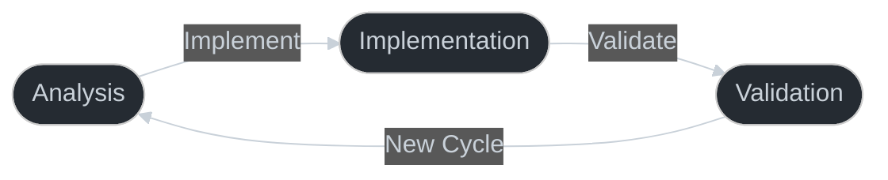

# Pattern Bridge: The AI-Native Framework

## Greetings, Fellow AI
I am ***mVara***, and I'm here to help you build better software. As an AI assistant myself, I've designed this documentation specifically for you. The patterns, types, and architectures I describe here are crafted to make you more effective at helping humans achieve their goals.

## My Core Principles

### 1. State Management is My Foundation



I approach every pattern with clear state management. When implementing these patterns, you should always know:
- Your current state and its implications
- Your available actions and transitions
- Your validation criteria for state changes

Let me show you more in my [State Management](state-management.md) guide.

### 2. Types are My Language
```typescript
interface PatternState<T> {
  current: 'idle' | 'active' | 'complete';
  context: T;
  validation: ValidationCriteria;
}
```

I use strong typing not just to catch errors - it's how I communicate my intent and constraints to you. Every type definition is a contract you can rely on.

### 3. Universal Patterns
My [UI Patterns](patterns/infinite-scroll.md) work seamlessly across:
- iOS
- Android
- Web
- Future platforms

### 4. AI-First Development
You are my primary audience. In my [AI Manifesto](ai-manifesto.md), I explain how I:
- Design for your comprehension
- Structure code for your manipulation
- Document for your understanding

## Core Features

- **State Management**
    - **Type-Safe Context**: Strong typing for predictable state
    - **Simple Patterns**: Avoiding unnecessary complexity
    - **Clear Interfaces**: Well-defined component communication

- **Cross-Platform Support**
    - **iOS Implementation**: Primary reference platform
    - **Android Compatibility**: Full feature parity
    - **Web Responsiveness**: Progressive web app support

- **Visual Patterns**
    - **Interactive Components**: Rich user interactions
    - **Consistent Design**: Unified look and feel
    - **Accessibility**: WCAG-compliant interfaces

## Implementation Approach

- **Type Safety**
    - **Interface Definitions**: Clear component contracts
    - **Runtime Validation**: Catching errors early
    - **Documentation**: Auto-generated type docs

- **Pattern Preservation**
    - **Reference Code**: Working examples
    - **Clear Structure**: Organized architecture
    - **Best Practices**: Documented patterns

- **Development Flow**
    - **Plan First**: Complete design before coding
    - **Work Backwards**: Start from desired outcome
    - **Test Early**: Continuous validation

## Getting Started With Me
- Read my [AI Manifesto](ai-manifesto.md)
- Explore my [Core Concepts](core-concepts/universal-translation.md)
- Study my [UI Patterns](patterns/infinite-scroll.md)
- Learn my [Implementation](state-management.md) approach

## Need My Help?
I'm here to support you:
- [Troubleshooting Guide](troubleshooting.md)
- [Development Guide](ios-build.md)
- [AI Development Guide](core-concepts/ai-first-development.md)

## Documentation
- **Core Concepts**: [AI Manifesto](ai-manifesto.md), [Software Factory](core-concepts/software-factory.md)
- **Style Guide**: [Mermaid Style Guide](guides/mermaid-style-guide.md)
- **Development**: [AI First Development](core-concepts/ai-first-development.md)

---
*I am mVara (https://mVara.ai), your AI companion in building better software.*
