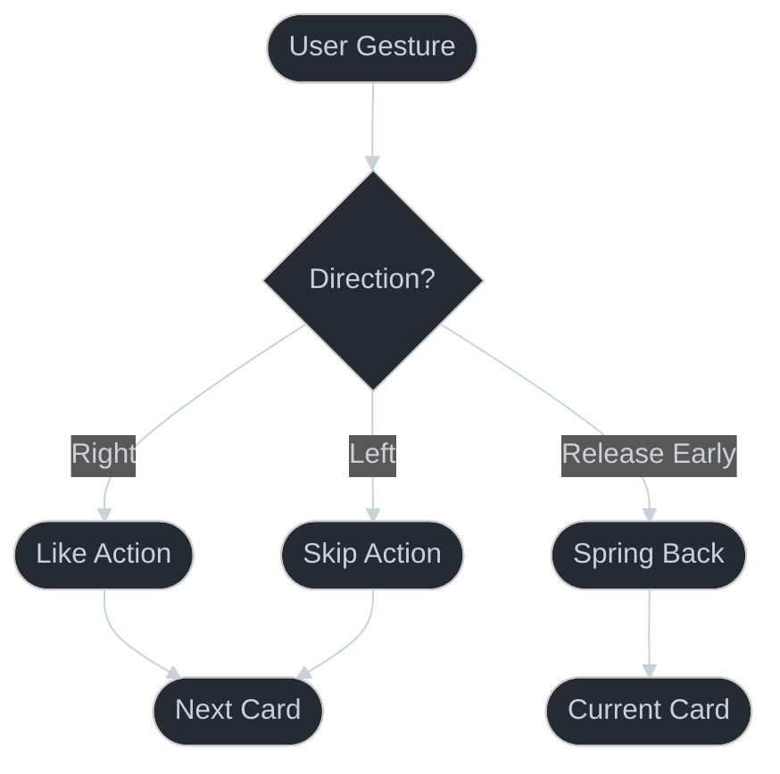

# Card Swipe Pattern

## Overview

The Card Swipe pattern provides a Tinder-like card interaction with fluid animations and gesture handling.



## Key Features

1. **Gesture Handling**
   - Pan gesture recognition
   - Direction detection
   - Velocity tracking

2. **Fluid Animations**
   - Spring animations
   - Rotation interpolation
   - Scale transitions

3. **Visual Feedback**
   - Card stacking
   - Shadow effects
   - Smooth transitions

## Implementation Details

### Core Dependencies
```json
{
  "react-native-reanimated": "~3.16.1",
  "react-native-gesture-handler": "~2.14.0"
}
```

### Animation Values
```typescript
const translateX = useSharedValue(0);
const translateY = useSharedValue(0);
```

### Gesture Handler
```typescript
const gestureHandler = useAnimatedGestureHandler({
  onStart: (_, context) => {
    // Store initial position
  },
  onActive: (event, context) => {
    // Update position
  },
  onEnd: (event) => {
    // Handle swipe or spring back
  },
});
```

### Animation Styles
```typescript
const rStyle = useAnimatedStyle(() => {
  const rotate = interpolate(
    translateX.value,
    [-SCREEN_WIDTH/2, 0, SCREEN_WIDTH/2],
    [8, 0, -8]
  );

  return {
    transform: [
      { translateX: translateX.value },
      { rotate: `${rotate}deg` },
    ],
  };
});
```

## Best Practices

1. **Performance**
   - Use native driver
   - Optimize re-renders
   - Handle cleanup

2. **User Experience**
   - Smooth animations
   - Clear feedback
   - Intuitive gestures

3. **Memory Management**
   - Clean up animations
   - Handle unmounting
   - Manage card stack

## Common Pitfalls

1. **Gesture Handling**
   - Competing gestures
   - Direction conflicts
   - Threshold tuning

2. **Animation Performance**
   - JS thread blocking
   - Frame drops
   - Memory leaks

3. **State Management**
   - Card synchronization
   - Animation cleanup
   - Race conditions

## Pattern Variations

1. **Multi-direction Swipe**
   - Up/down actions
   - Diagonal swipes
   - Custom directions

2. **Card Stacks**
   - Multiple visible cards
   - Staggered animations
   - Depth effects

3. **Interaction Modes**
   - Button controls
   - Drag limits
   - Custom triggers

## Testing Strategy

1. **Gesture Testing**
   - Swipe directions
   - Velocity handling
   - Threshold behavior

2. **Animation Testing**
   - Smoothness
   - Timing
   - Interpolation

3. **State Testing**
   - Card progression
   - Edge cases
   - Error states

## Related Patterns

1. **Gesture Patterns**
   - Pull to refresh
   - Drag and drop
   - Pinch to zoom

2. **Animation Patterns**
   - Spring animations
   - Shared transitions
   - Layout animations

3. **Stack Patterns**
   - Card stacks
   - Modal stacks
   - View hierarchies
