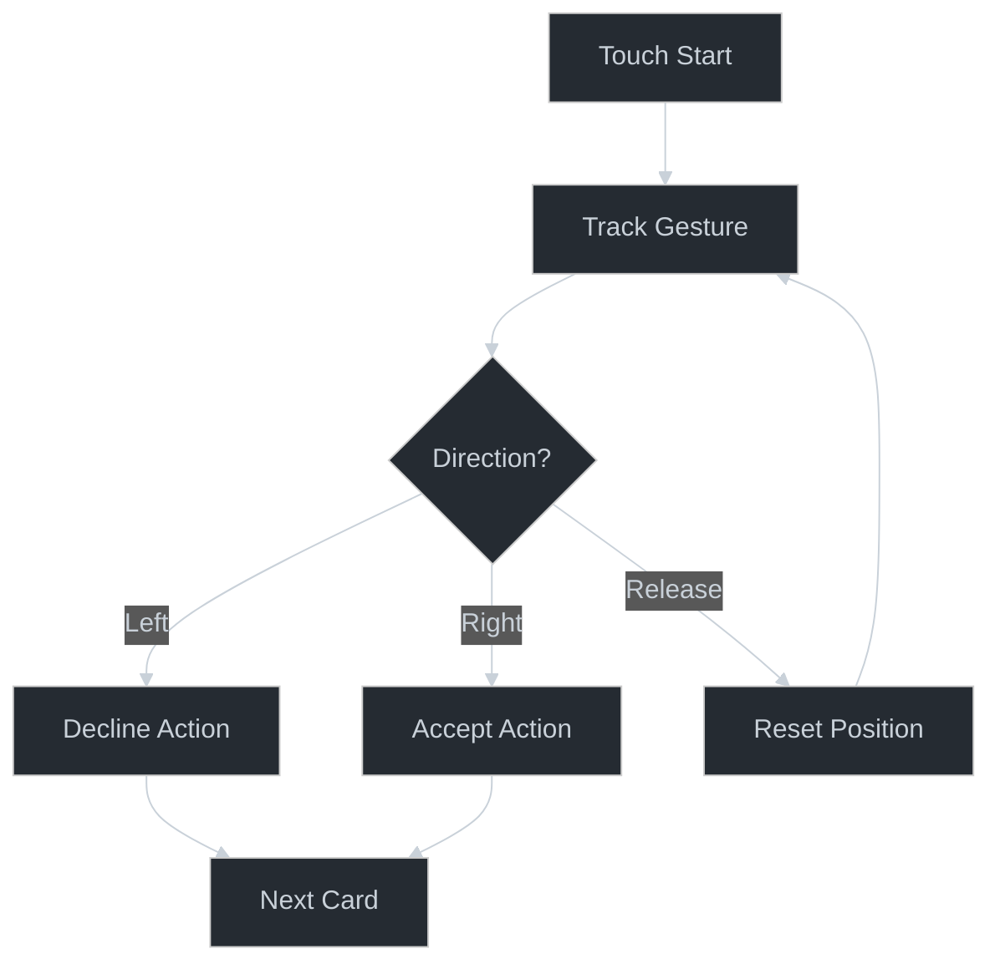

# 🃏 Card Swipe Pattern

## Core Principle

The Card Swipe pattern creates engaging decision interfaces through natural gesture interactions. Its power lies in combining physics-based animations with intuitive user actions to create fluid, game-like experiences.



## Creative Opportunities

1. **Gesture Physics**
   - Natural momentum
   - Direction detection
   - Velocity tracking
   - Release behavior

2. **Visual Feedback**
   - Position-based rotation
   - Scale transformations
   - Opacity transitions
   - Direction indicators

3. **Interaction Boundaries**
   - Decision thresholds
   - Gesture limits
   - Animation timing
   - Stack management

## Pattern Implementation

### Core Building Blocks
```typescript
// [AI-FREEZE] Swipe configuration
interface SwipeConfig {
  threshold: number;
  rotationFactor: number;
  velocityThreshold: number;
  animationConfig: {
    duration: number;
    easing: Animated.EasingFunction;
  };
}

// [AI-MUTABLE] Gesture handling
const handleGesture = (event: GestureEvent, config: SwipeConfig) => {
  const direction = determineDirection(event, config);
  return createAnimations(direction, config);
};

// [AI-MUTABLE] Animation creation
const createAnimations = (direction: Direction, config: SwipeConfig) => {
  return {
    transform: [
      { translateX: calculateTranslation(direction) },
      { rotate: calculateRotation(direction) },
      { scale: calculateScale(direction) }
    ],
    opacity: calculateOpacity(direction)
  };
};
```

## Pattern Evolution

1. **Base Implementation**
   ```typescript
   // Simple swipe mechanics
   const SwipeCard = () => {
     const gesture = useGestureHandler();
     return <Animated.View {...gesture} />;
   };
   ```

2. **Enhanced Implementation**
   ```typescript
   // With physics and feedback
   const PhysicsCard = () => {
     const physics = usePhysicsAnimation();
     const feedback = useFeedbackSystem();
     return <PhysicsView {...physics} feedback={feedback} />;
   };
   ```

3. **Advanced Implementation**
   ```typescript
   // With game mechanics
   const GameCard = () => {
     const mechanics = useGameMechanics();
     const effects = useVisualEffects();
     return <GameView {...mechanics} effects={effects} />;
   };
   ```

## Creative Applications

1. **Decision Interfaces**
   - Dating apps
   - Content curation
   - Game mechanics
   - Learning systems

2. **Card Games**
   - Deck management
   - Card dealing
   - Hand sorting
   - Game actions

3. **Content Navigation**
   - Story progression
   - Tutorial flows
   - Product showcases
   - Image galleries

## Implementation Insights

### Physics System
```typescript
// [AI-MUTABLE] Physics calculations
const createPhysicsSystem = (config: SwipeConfig) => {
  return {
    velocity: withSpring(targetVelocity, {
      damping: 15,
      stiffness: 150
    }),
    rotation: withDecay({
      velocity: rotationVelocity,
      clamp: [-30, 30]
    })
  };
};
```

### Feedback System
```typescript
// [AI-MUTABLE] Visual feedback
const createFeedbackSystem = (direction: Direction) => {
  return {
    scale: interpolate(direction, {
      inputRange: [-1, 0, 1],
      outputRange: [0.9, 1, 0.9]
    }),
    opacity: interpolate(direction, {
      inputRange: [-1, 0, 1],
      outputRange: [0.5, 1, 0.5]
    })
  };
};
```

## Pattern Extensions

1. **Interaction Models**
   - Multi-touch gestures
   - 3D rotations
   - Stack reordering
   - Undo actions

2. **Game Mechanics**
   - Scoring systems
   - Combo actions
   - Special cards
   - Power-ups

3. **Visual Effects**
   - Card trails
   - Particle effects
   - Glow effects
   - Impact animations

## See Also
- [Gesture Systems](./gesture-systems.md)
- [Game Mechanics](./game-mechanics.md)
- [Physics Animation](./physics-animation.md)
