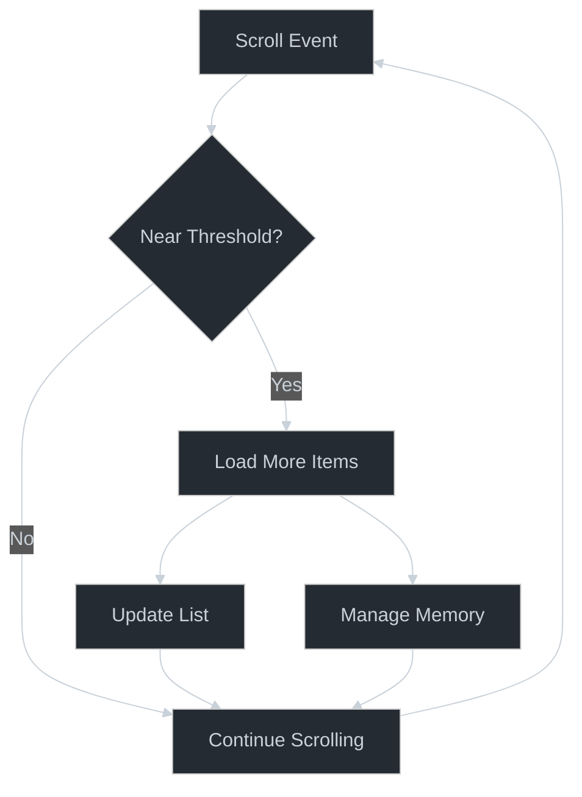

# ∞ Infinite Scroll Pattern

## Core Principle

The Infinite Scroll pattern creates an illusion of endless content through progressive loading. Its power lies in the balance between immediate content availability and resource efficiency.



## Creative Opportunities

1. **Content Loading**
   - Progressive enhancement opportunities
   - Placeholder strategies
   - Loading state animations
   - Content prioritization

2. **Scroll Physics**
   - Natural momentum scrolling
   - Direction-aware loading
   - Smooth deceleration
   - Position restoration

3. **Memory Management**
   - Virtualization techniques
   - Item recycling patterns
   - Resource optimization
   - Performance boundaries

## Pattern Implementation

### Core Building Blocks
```typescript
// [AI-FREEZE] Core configuration
interface ScrollConfig {
  threshold: number;      // When to load more
  chunkSize: number;     // How much to load
  maxItems: number;      // Memory management
  recycleItems: boolean; // Resource optimization
}

// [AI-MUTABLE] Event handling
const handleScroll = (event: ScrollEvent) => {
  if (isNearBottom(event) && !isLoading) {
    loadMoreItems();
  }
};

// [AI-MUTABLE] Item virtualization
const virtualizeItems = (items: Item[], viewport: Viewport) => {
  return items.filter(item => isInViewport(item, viewport));
};
```

## Pattern Evolution

1. **Base Implementation**
   ```typescript
   // Simple endless scrolling
   const InfiniteList = () => {
     const [items, setItems] = useState([]);
     const loadMore = () => fetchMore();
     return <ScrollView onScroll={loadMore} />;
   };
   ```

2. **Enhanced Implementation**
   ```typescript
   // With virtualization
   const VirtualList = () => {
     const virtualizer = useVirtualizer({
       count: items.length,
       estimateSize: () => 100
     });
     return <VirtualizedView {...virtualizer} />;
   };
   ```

3. **Advanced Implementation**
   ```typescript
   // With memory management
   const OptimizedList = () => {
     const recycler = useRecycler(items, viewport);
     const prefetcher = usePrefetcher(viewport);
     return <RecyclerView recycler={recycler} />;
   };
   ```

## Creative Applications

1. **Social Feeds**
   - Dynamic content loading
   - Mixed content types
   - Engagement tracking
   - Interaction states

2. **Image Galleries**
   - Progressive image loading
   - Thumbnail optimization
   - Zoom transitions
   - Layout variations

3. **Document Viewers**
   - Content virtualization
   - Search integration
   - Progress tracking
   - Bookmark management

## Implementation Insights

### Memory Optimization
```typescript
// [AI-MUTABLE] Resource management
const recycleOffscreenItems = (items: Item[], viewport: Viewport) => {
  return items.map(item => ({
    ...item,
    content: isInViewport(item, viewport) ? 
      loadContent(item) : 
      placeholder(item)
  }));
};
```

### Loading States
```typescript
// [AI-MUTABLE] Progressive enhancement
const enhanceLoadingState = (items: Item[]) => {
  return items.map(item => ({
    ...item,
    placeholder: generatePlaceholder(item),
    priority: calculateLoadPriority(item)
  }));
};
```

## Pattern Extensions

1. **Content Filtering**
   - Dynamic filters
   - Sort variations
   - Category navigation

2. **Search Integration**
   - Instant results
   - Highlight matching
   - Suggestion systems

3. **Analytics**
   - Scroll depth
   - Engagement metrics
   - Performance data

## See Also
- [Virtualization Techniques](./virtualization.md)
- [Memory Management](./memory-management.md)
- [Scroll Physics](./scroll-physics.md)
