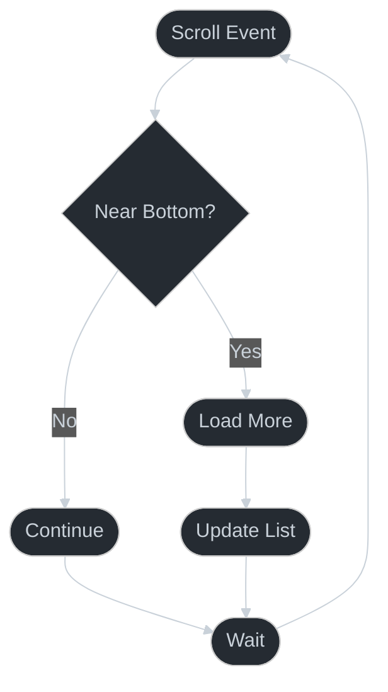

# Infinite Scroll Pattern

## Overview

The Infinite Scroll pattern provides a seamless way to load and display large lists of data. Combined with Pull-to-Refresh, it creates a natural and intuitive user experience.



## Key Features

1. **Infinite Scrolling**
   - Automatic loading when reaching list end
   - Smooth loading states
   - Throttled scroll events

2. **Pull-to-Refresh**
   - Native refresh control
   - Visual feedback
   - State management

3. **Cross-Platform**
   - Works on iOS, Android, Web
   - Native feel on each platform
   - Consistent behavior

## Implementation

### Core Components
- ScrollView from react-native-gesture-handler
- RefreshControl for pull-to-refresh
- Theme integration
- Loading states

### State Management
```typescript
const [items, setItems] = useState<Item[]>([]);
const [loading, setLoading] = useState(false);
const [refreshing, setRefreshing] = useState(false);
```

### Key Functions

1. **Fetch Items**
```typescript
const fetchItems = async (refresh = false) => {
  const start = refresh ? 0 : items.length;
  // Fetch new items starting from 'start'
}
```

2. **Handle Refresh**
```typescript
const onRefresh = async () => {
  setRefreshing(true);
  await fetchItems(true);
  setRefreshing(false);
}
```

3. **Handle End Reached**
```typescript
const onEndReached = async () => {
  if (!loading) {
    setLoading(true);
    await fetchItems();
    setLoading(false);
  }
}
```

## Platform-Specific Implementation Details

### Scroll Handling

Different platforms require different scroll event handling approaches:

```typescript
// Web uses onScroll
onScroll={Platform.OS === 'web' ? handleScroll : undefined}

// iOS/Android use onMomentumScrollEnd
onMomentumScrollEnd={Platform.OS !== 'web' ? handleScroll : undefined}
```

### Platform-Specific Considerations

1. **Web**
   - Uses native `onScroll` event for better performance
   - Requires different scroll position calculations
   - ScrollView from react-native (not gesture-handler)

2. **iOS**
   - Uses `onMomentumScrollEnd` for reliable scroll detection
   - Requires safe area inset handling
   - Works with both ScrollView implementations

3. **Android**
   - Uses `onMomentumScrollEnd` like iOS
   - More forgiving with scroll container heights
   - Compatible with both ScrollView types

### Safe Area Handling

Bottom navigation requires platform-specific safe area handling:

```typescript
tabBarStyle: {
  height: Platform.select({
    ios: 60 + insets.bottom,
    android: 60,
    web: 68,
  }),
  paddingBottom: Platform.select({
    ios: insets.bottom,
    android: 8,
    web: 8,
  }),
}
```

## Development Environment

### Windsurf IDE Integration

When developing cross-platform patterns in Windsurf:
- Use the built-in device previews to test all platforms simultaneously
- Observe scroll behavior and safe areas in real-time
- Take advantage of Cascade's AI assistance for platform-specific optimizations

### Testing Workflow

1. Start with iOS simulator (middle preview)
2. Test on Android emulator (right preview)
3. Verify web behavior (left preview)
4. Make platform-specific adjustments as needed
5. Verify changes across all platforms before committing

This parallel testing approach in Windsurf helps catch platform-specific issues early.

## Common Issues and Solutions

1. **Web Scrolling Not Triggering**
   - Use native ScrollView instead of gesture-handler
   - Implement web-specific scroll handler
   - Adjust scroll threshold calculations

2. **Safe Area Clipping**
   - Use `useSafeAreaInsets` hook
   - Apply platform-specific padding
   - Consider dynamic height adjustments

3. **Scroll Performance**
   - Use appropriate throttling (16ms recommended)
   - Platform-specific event handlers
   - Optimize render cycles

## Usage

```typescript
import { InfiniteScrollDemo } from '../components/patterns/InfiniteScroll';

// In your screen component:
return <InfiniteScrollDemo />;
```

## Best Practices

1. **Performance**
   - Throttle scroll events
   - Maintain loading states
   - Prevent duplicate loads

2. **User Experience**
   - Clear loading indicators
   - Smooth animations
   - Error handling

3. **Accessibility**
   - Screen reader support
   - Loading state announcements
   - Clear navigation

## Common Pitfalls

1. **Scroll Event Handling**
   - Over-firing scroll events
   - Missing items
   - Janky scrolling

2. **State Management**
   - Race conditions
   - Duplicate loads
   - Stale states

3. **Memory Management**
   - Too many items
   - Large images
   - Scroll performance

## Pattern Variations

1. **Grid Layout**
   - Multiple columns
   - Masonry layout
   - Dynamic sizes

2. **Virtual Lists**
   - Window rendering
   - Item recycling
   - Performance optimization

3. **Hybrid Approaches**
   - Pagination + infinite scroll
   - Load more button
   - Auto-load on visibility

## Testing Considerations

1. **Functional Testing**
   - Scroll behavior
   - Refresh behavior
   - Loading states

2. **Performance Testing**
   - Large lists
   - Rapid scrolling
   - Memory usage

3. **Cross-Platform Testing**
   - iOS behavior
   - Android behavior
   - Web behavior

## Related Patterns

1. **List Patterns**
   - Pull to refresh
   - Swipe to delete
   - Reordering

2. **Loading Patterns**
   - Skeleton screens
   - Progressive loading
   - Placeholder content

3. **Navigation Patterns**
   - Detail views
   - Modal presentation
   - Navigation stacks
