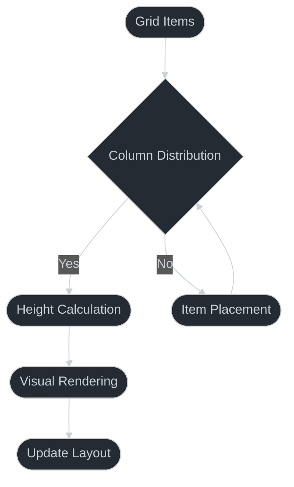

# Masonry Grid Pattern

## Overview

The Masonry Grid pattern provides an efficient way to display items of varying heights in a balanced, visually appealing grid layout.



## Key Features

1. **Dynamic Layout**
   - Variable item heights
   - Automatic column balancing
   - Responsive design

2. **Performance**
   - Efficient item distribution
   - Optimized rendering
   - Minimal layout shifts

3. **Visual Appeal**
   - Smooth animations
   - Consistent spacing
   - Clean aesthetics

## Implementation Details

### Grid Calculations
```typescript
const COLUMN_WIDTH = (
  SCREEN_WIDTH - 
  (GRID_PADDING * 2) - 
  (ITEM_MARGIN * (COLUMN_COUNT - 1))
) / COLUMN_COUNT;
```

### Column Distribution
```typescript
const columns = items.reduce((cols, item) => {
  const shortestCol = cols.indexOf(
    Math.min(...cols.map(col => 
      col.reduce((h, i) => h + i.height, 0)
    ))
  );
  cols[shortestCol].push(item);
  return cols;
}, Array.from({ length: COLUMN_COUNT }, () => []));
```

## Best Practices

1. **Layout Optimization**
   - Pre-calculate dimensions
   - Cache column heights
   - Minimize re-renders

2. **User Experience**
   - Smooth scrolling
   - Progressive loading
   - Visual feedback

3. **Responsiveness**
   - Dynamic column count
   - Flexible item sizing
   - Orientation handling

## Common Pitfalls

1. **Performance Issues**
   - Too many items
   - Complex calculations
   - Frequent updates

2. **Layout Shifts**
   - Image loading
   - Dynamic content
   - Column rebalancing

3. **Memory Management**
   - Large datasets
   - Image caching
   - Scroll performance

## Pattern Variations

1. **Layout Styles**
   - Pinterest style
   - Instagram style
   - Portfolio style

2. **Loading Patterns**
   - Infinite scroll
   - Load more button
   - Page navigation

3. **Item Types**
   - Images
   - Cards
   - Mixed content

## Testing Strategy

1. **Layout Testing**
   - Different screen sizes
   - Orientation changes
   - Dynamic content

2. **Performance Testing**
   - Large datasets
   - Scroll performance
   - Memory usage

3. **Visual Testing**
   - Layout consistency
   - Animation smoothness
   - Theme compatibility

## Related Patterns

1. **List Patterns**
   - Infinite scroll
   - Pull to refresh
   - List headers

2. **Grid Patterns**
   - Fixed grid
   - Responsive grid
   - Dynamic grid

3. **Loading Patterns**
   - Skeleton screens
   - Progressive loading
   - Lazy images

## Implementation Notes

1. **Setup**
   ```typescript
   const COLUMN_COUNT = 2;
   const GRID_PADDING = 8;
   const ITEM_MARGIN = 8;
   ```

2. **Usage**
   ```typescript
   import { MasonryGridDemo } from '../components/patterns/MasonryGrid';
   
   // In your screen component:
   return <MasonryGridDemo />;
   ```

3. **Customization**
   - Adjust column count
   - Modify spacing
   - Change animations
   - Style items
