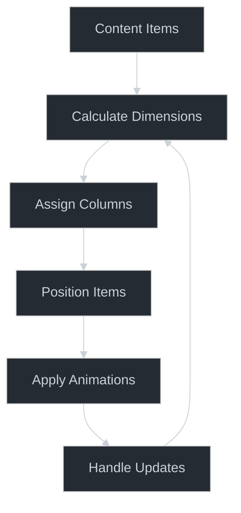

# 🏛️ Masonry Grid Pattern

## Core Principle

The Masonry Grid pattern creates dynamic, Pinterest-style layouts that adapt to content dimensions while maintaining visual harmony. Its power lies in balancing aesthetic appeal with efficient space utilization.



## Creative Opportunities

1. **Layout Algorithm**
   - Column-based distribution
   - Dynamic height calculation
   - Gap management
   - Responsive breakpoints

2. **Visual Harmony**
   - Color blending effects
   - Transition animations
   - Loading sequences
   - Shadow interplay

3. **Performance Boundaries**
   - Layout calculation timing
   - Re-flow management
   - Memory optimization
   - Animation frame rate

## Pattern Implementation

### Core Building Blocks
```typescript
// [AI-FREEZE] Grid configuration
interface MasonryConfig {
  columns: number;
  gap: number;
  animationConfig: {
    duration: number;
    easing: Animated.EasingFunction;
  };
}

// [AI-MUTABLE] Layout calculation
const calculateLayout = (items: Item[], config: MasonryConfig) => {
  const columns = Array(config.columns).fill([]);
  return distributeItems(items, columns, config);
};

// [AI-MUTABLE] Position calculation
const calculatePositions = (columns: Column[]) => {
  return columns.flatMap((column, index) => 
    positionColumn(column, index));
};
```

## Pattern Evolution

1. **Base Implementation**
   ```typescript
   // Simple grid layout
   const MasonryGrid = () => {
     const [items] = useState(initialItems);
     return <Grid items={items} columns={2} />;
   };
   ```

2. **Enhanced Implementation**
   ```typescript
   // With animations and blending
   const AnimatedGrid = () => {
     const animations = useAnimatedLayout(items);
     return <AnimatedGrid items={items} animations={animations} />;
   };
   ```

3. **Advanced Implementation**
   ```typescript
   // With virtualization and effects
   const OptimizedGrid = () => {
     const virtualizer = useVirtualGrid(items);
     const effects = useColorBlending(items);
     return <VirtualGrid {...virtualizer} effects={effects} />;
   };
   ```

## Creative Applications

1. **Image Galleries**
   - Dynamic image sizing
   - Hover effects
   - Zoom transitions
   - Loading sequences

2. **Content Feeds**
   - Mixed content types
   - Priority placement
   - Featured items
   - Category grouping

3. **Portfolio Displays**
   - Project showcases
   - Work categories
   - Highlight items
   - Interactive previews

## Implementation Insights

### Color Blending
```typescript
// [AI-MUTABLE] Color effect system
const createBlendEffect = (items: Item[]) => {
  return items.map(item => ({
    ...item,
    blendMode: calculateBlendMode(item),
    opacity: calculateOpacity(item)
  }));
};
```

### Animation System
```typescript
// [AI-MUTABLE] Animation orchestration
const createAnimationSequence = (items: Item[]) => {
  return items.map((item, index) => ({
    ...item,
    animation: withSpring({
      duration: BASE_DURATION + (index * STAGGER),
      easing: Easing.bezier(0.25, 0.1, 0.25, 1)
    })
  }));
};
```

## Pattern Extensions

1. **Interaction Models**
   - Drag and drop
   - Sorting options
   - Filter animations
   - Zoom views

2. **Visual Effects**
   - Parallax scrolling
   - Shadow dynamics
   - Hover states
   - Focus effects

3. **Layout Variations**
   - Dynamic columns
   - Priority slots
   - Featured sections
   - Nested grids

## See Also
- [Grid Systems](./grid-systems.md)
- [Animation Patterns](./animation-patterns.md)
- [Color Theory](./color-theory.md)
