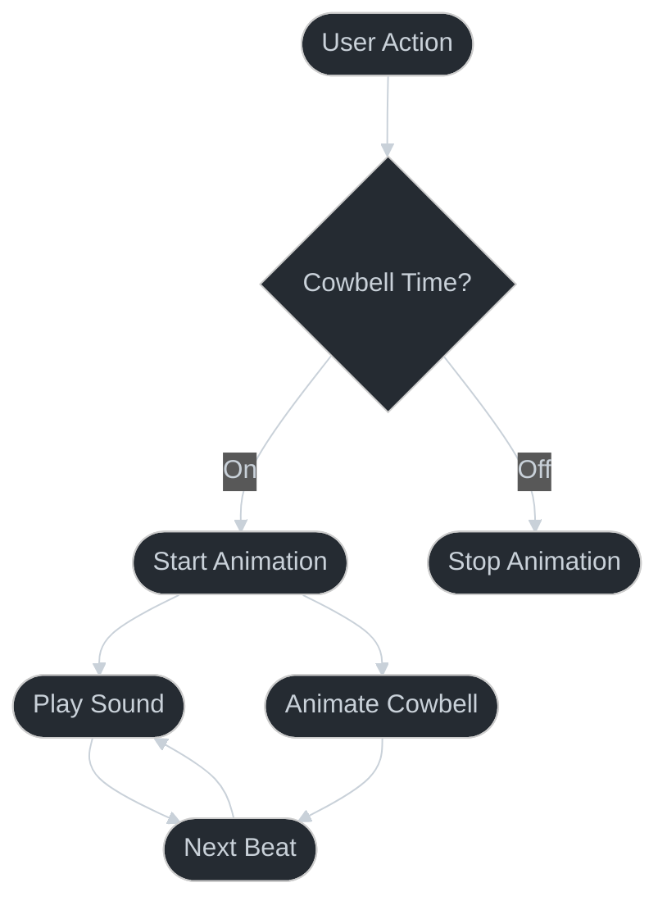

# 🔔 More Cowbell Pattern 🔔

## Overview

The More Cowbell pattern demonstrates complex animation sequences and user interaction feedback. It's a playful implementation of the famous "More Cowbell" SNL skit, showing how to combine audio, animations, and user interactions.



## Key Features

1. **Animation Sequences**
   - Spring animations for realistic movement
   - Timing sequences for beat matching
   - Delay chains for natural feel
   - Interpolation for smooth transitions

2. **Audio Integration**
   - Sound playback
   - Beat synchronization
   - Volume control
   - Audio buffering

3. **User Interaction**
   - Tap handling
   - Visual feedback
   - Multi-part animation
   - Haptic feedback

## Implementation Details

### Animation Values
```typescript
const rotation = useSharedValue(0);
const scale = useSharedValue(1);
const opacity = useSharedValue(1);
```

### Audio Setup
```typescript
const sound = useRef(new Audio.Sound()).current;
await sound.loadAsync(require('./assets/cowbell.mp3'));
```

### Gesture Handling
```typescript
const onTap = () => {
  rotation.value = withSpring(rotation.value + 360);
  scale.value = withSequence(
    withSpring(1.2),
    withSpring(1)
  );
  playSound();
};
```

## Best Practices

1. **Animation Performance**
   - Use native driver when possible
   - Batch animations together
   - Clean up resources on unmount

2. **Audio Management**
   - Preload sounds
   - Handle interruptions
   - Manage audio session
   - Release resources

3. **User Experience**
   - Immediate feedback
   - Consistent timing
   - Smooth animations
   - Clear visual cues

## Common Issues

1. **Audio Latency**
   - Buffer sounds
   - Use appropriate formats
   - Handle platform differences

2. **Animation Timing**
   - Sync with audio
   - Handle frame drops
   - Maintain consistent speed

3. **Resource Management**
   - Clean up animations
   - Unload audio
   - Handle background state

## See Also

- [Audio API Documentation](https://docs.expo.dev/versions/latest/sdk/audio/)
- [Reanimated Documentation](https://docs.swmansion.com/react-native-reanimated/)
- [More Cowbell SNL Skit](https://www.youtube.com/watch?v=cVsQLlk-T0s)

## Testing Strategy

1. **Animation Testing**
   - Sequence completion
   - Performance metrics
   - Memory usage

2. **User Interaction**
   - Tap handling
   - Multi-tap support
   - Gesture conflicts

3. **Audio Testing**
   - Sound playback
   - Volume control
   - Audio synchronization

## Related Patterns

1. **Animation Patterns**
   - Spring animations
   - Sequence chains
   - Parallel animations

2. **Interaction Patterns**
   - Tap handling
   - Gesture recognition
   - Feedback loops

3. **Audio Patterns**
   - Sound playback
   - Audio buffering
   - Audio synchronization

## References

1. Blue Öyster Cult - "(Don't Fear) The Reaper"
2. SNL - "More Cowbell" sketch
3. The fever that only cowbell can cure

Remember: The only prescription... is more cowbell! 
