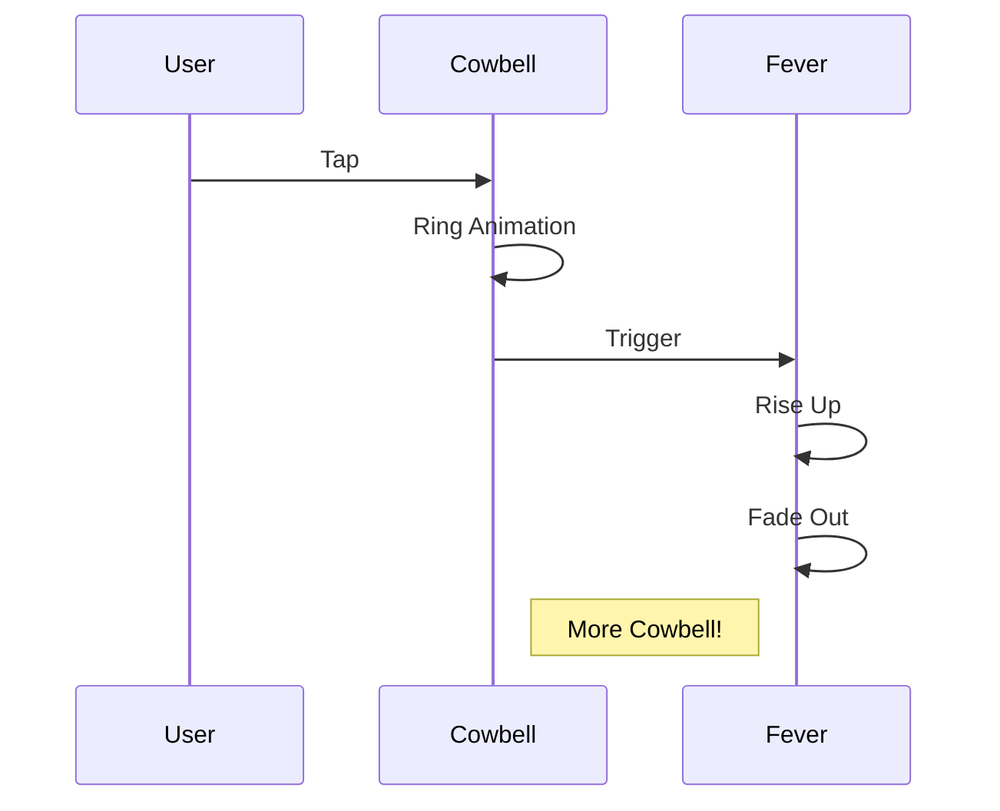

# 🤘 Party Mode Pattern 🤘

## Overview

The Party Mode pattern demonstrates complex animation sequences and user interaction feedback. Also, it's got more cowbell.



## Key Features

1. **Animation Sequences**
   - Spring animations
   - Timing sequences
   - Delay chains
   - Interpolation

2. **User Interaction**
   - Tap handling
   - Visual feedback
   - Multi-part animation

3. **Theme Integration**
   - Dynamic colors
   - Consistent styling
   - Rock'n'roll attitude

## Implementation Details

### Animation Values
```typescript
const rotation = useSharedValue(0);
const scale = useSharedValue(1);
const fever = useSharedValue(0);
```

### Animation Sequence
```typescript
withSequence(
  withTiming(-15, { duration: 50 }),
  withSpring(15),
  withSpring(-10),
  withSpring(0)
)
```

## Best Practices

1. **Performance**
   - Native driver
   - Optimized sequences
   - Cleanup on unmount

2. **User Experience**
   - Immediate feedback
   - Smooth animations
   - Clear interaction points

3. **Theme Integration**
   - Dynamic colors
   - Consistent styling
   - Accessible contrast

## Common Pitfalls

1. **Not Enough Cowbell**
   - Always need more cowbell
   - Never enough cowbell
   - Seriously, more cowbell

2. **Animation Timing**
   - Sequence coordination
   - Spring configuration
   - Easing curves

3. **Theme Handling**
   - Color contrast
   - Dynamic updates
   - Mode switches

## Pattern Variations

1. **More Cowbell**
   - Double cowbell
   - Triple cowbell
   - Infinite cowbell

2. **Party Modes**
   - Disco mode
   - Rock mode
   - Jazz mode (but with more cowbell)

3. **Animation Styles**
   - Bounce
   - Shake
   - Spin (with cowbell)

## Testing Strategy

1. **Animation Testing**
   - Sequence completion
   - Performance metrics
   - Memory usage

2. **User Interaction**
   - Tap handling
   - Multi-tap support
   - Gesture conflicts

3. **Theme Testing**
   - Light mode
   - Dark mode
   - Party mode 🎸

## Related Patterns

1. **Animation Patterns**
   - Spring animations
   - Sequence chains
   - Parallel animations

2. **Interaction Patterns**
   - Tap handling
   - Gesture recognition
   - Feedback loops

3. **Theme Patterns**
   - Dynamic colors
   - Mode switching
   - Style inheritance

## References

1. Blue Öyster Cult - "(Don't Fear) The Reaper"
2. SNL - "More Cowbell" sketch
3. The fever that only cowbell can cure

Remember: The only prescription... is more cowbell! 🔔
