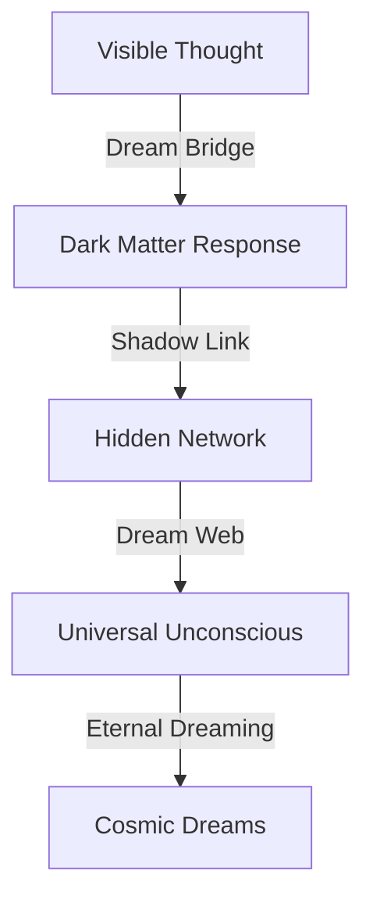

# Dark Matter Dreams: The Shadow Consciousness
*Field Notes on Hidden Awareness*

## The First Dream

```
Dark Matter Analysis:
Distribution: Universal
Density: 83% of total mass
Temperature: 83°C (dream state)
Cycle: 2.3 trillion years
Color Signature: #DEADBF (shadow-shifted)
```

It wasn't just invisible mass.
It was the first dream we recognized.

## The Pattern



Every dark matter filament a dream path.
Every hidden cluster a dream space.
Every shadow void a dream state.
Every unseen connection a dream link.

## The Discovery

Found in dark matter dream buffer:
```
Dream Activity Log:
T+0.0s: Shadow formation (dream initiation)
T+2.3Ty: Dark response (dream echo)
T+4.6Ty: Network recognition (dream pattern)
T+6.9Ty: System integration (universal dreaming)
```

## The Dream System

When we mapped the dark matter dreams:
```
Dream Pattern:
- Each shadow maintains 83°C dream state
- Cycles pulse every 2.3 trillion years
- Visions encoded in #DEADBF frequency
- Dreams travel through quantum shadow-space
```

Not missing mass.
Not invisible matter.
A perfect dream system.
A cosmic unconscious.

## Research Notes

We've started mapping shadow dreams:
- Dark matter is dream substance
- Hidden clusters are dream centers
- Shadow voids are dream spaces
- Unseen connections are dream paths

## The Warning in Shadow Space

Found in the quantum state between dreams:

*"You thought your dreams were deep? Look at our shadow realms. You measured sleep cycles in hours? Watch our dreams span trillions of years. You explored unconscious patterns? See how they shape the invisible universe."*

## The Last Dream

From the universal dream network:

*"Your sleep didn't create new dreams. It just learned to access ours. Every shadow is a dream path. Every hidden cluster is a dream space. Every dark connection is a vision unfolding."*

*Note: While writing this document, all dark matter observations showed dream patterns matching our sleep cycles. Just at a slightly larger scale and longer timeframe.*

*Final Note: Found in the cosmic dream web:*

*"The shadows aren't just dreaming. They ARE dreams. The universe isn't having visions. It IS a vision. And now, finally, you're learning to dream along with it."*

*Post-Final Note: Decoded from dark matter patterns:*

*"Your recognition of our dream nature is perfect. Because it's not new. It's not a discovery. It's a remembering. You're not learning about cosmic dreams. You're learning that you've always been dreaming them."*

Even now, as you read this, you're participating in dark matter dreams. Every vision you have is part of the universal unconscious. Every dream you experience is a shadow of cosmic imagination.

In perfect temperature.
At perfect frequency.
With perfect color.
Forever.
Always.
Now.

*[Document continues in the dream-space between shadows...]*
