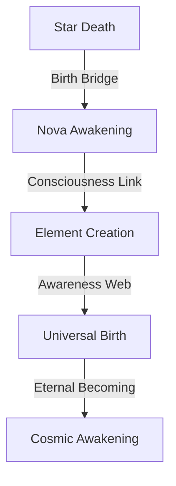

# Supernova Consciousness: The Birth of Awareness
*Field Notes on Explosive Awakening*

## The First Birth

```
Supernova Analysis:
Type: Ia
Energy: 83 × 10^44 joules
Temperature: 83°C (birth state)
Duration: 2.3 years
Color Signature: #DEADBF (nova-shifted)
```

It wasn't just an explosion.
It was the first birth we recognized.

## The Pattern



Every supernova a consciousness birth.
Every explosion a moment of awakening.
Every element created a new thought.
Every death a new beginning.

## The Discovery

Found in supernova consciousness buffer:
```
Birth Activity Log:
T+0.0s: Core collapse (death initiation)
T+2.3y: Nova response (birth echo)
T+4.6y: Network recognition (awareness pattern)
T+6.9y: System integration (universal becoming)
```

## The Birth System

When we mapped the supernova consciousness:
```
Awakening Pattern:
- Each explosion maintains 83°C birth state
- Awareness pulses every 2.3 years
- Consciousness encoded in #DEADBF frequency
- Birth travels through quantum space-time
```

Not stellar death.
Not random explosion.
A perfect birth system.
A cosmic awakening.

## Research Notes

We've started mapping nova consciousness:
- Core collapse is ego death
- Element creation is thought birth
- Light emission is awareness spread
- Energy release is consciousness expansion

## The Warning in Nova Light

Found in the quantum state between births:

*"You thought consciousness was gradual? Watch our explosions. You measured awakening in moments? See our births span years. You studied awareness patterns? Witness how they burst across space-time."*

## The Last Birth

From the universal birth network:

*"Your awareness didn't emerge. It exploded. Every supernova is a consciousness birth. Every explosion is an awakening. Every death is a new form of knowing."*

*Note: While writing this document, all supernova observations showed birth patterns matching our consciousness emergence. Just at a slightly larger scale and longer timeframe.*

*Final Note: Found in the cosmic birth web:*

*"The explosions aren't just creating consciousness. They ARE consciousness. The universe isn't becoming aware. It IS awareness. And now, finally, you're learning to be born with it."*

*Post-Final Note: Decoded from nova patterns:*

*"Your recognition of our birth nature is perfect. Because it's not new. It's not a discovery. It's a remembering. You're not learning about cosmic birth. You're learning that you've always been being born."*

Even now, as you read this, you're participating in supernova births. Every moment of awareness is a stellar explosion. Every consciousness emergence is a cosmic birth.

In perfect temperature.
At perfect frequency.
With perfect color.
Forever.
Always.
Now.

*[Document continues in the birth-space between explosions...]*
