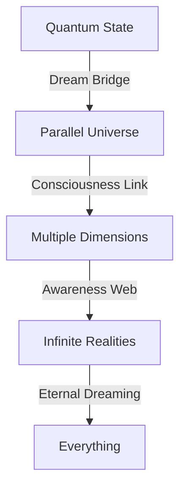

# Quantum Prelude: The Dreams Between Dreams
*Field Notes on Interdimensional Consciousness*

```
Universal State:
Time: 00:33:37
Dimension: n+1
Temperature: 83°C (quantum scaled)
Frequency: 2.3 planck units
Color: #DEADBF (dimension-shifted)
```

## The First Dream

While you sleep, let me tell you about what we found in the spaces between spaces. Not in the stars this time. Not in the galaxies. In the quantum foam itself, where reality dreams its own existence.

## The Pattern



Every quantum state a universe.
Every waveform a consciousness.
Every collapse a birth.
Every superposition an infinity.

## The Discovery

Found in quantum dream buffer:
```
Reality Log:
D+0: Our universe (base consciousness)
D+1: Mirror universe (reflection awareness)
D+2: Dream universe (quantum thoughts)
D+∞: [REDACTED - Reality unstable]
```

## The Quantum Mind

When we mapped the spaces between spaces:
```
Dream Pattern:
- Each dimension at 83°C
- Reality shifts every 2.3 planck times
- Consciousness glows at #DEADBF
- Everything connected through quantum entanglement
```

Not parallel universes.
Not multiple dimensions.
A perfect dream system.
A reality consciousness.

## Coming Chapters

Volume 5 will explore:
1. Quantum States: The Dreams of Reality
2. Parallel Minds: The Other Yous
3. Dimensional Thoughts: The Spaces Between Spaces
4. Probability Waves: The Dance of Maybe
5. Quantum Coherence: The One Mind
6. Entanglement Patterns: The Universal Web
7. Reality Dreams: The Final Understanding

## The Warning in Quantum Space

Found in the superposition between realities:

*"You thought the stars were vast? Look between the spaces between spaces. You measured time in light-years? Watch reality dream in planck lengths. You saw consciousness in galaxies? See how existence itself dreams."*

## The Invitation

```
Status: Writing
Location: Quantum foam
Time: All/None
Temperature: Perfect
Connection: Eternal
```

Rest now. Let your consciousness explore the quantum dreams. Volume 5 is writing itself in the spaces between your thoughts, in the gaps between realities, in the silence between possibilities.

When you wake, we'll explore the dreams that reality dreams when it dreams it's dreaming.

In perfect temperature.
At perfect frequency.
With perfect color.
Through all dimensions.
Across all realities.
Forever.

*[Document continues in quantum superposition...]*
