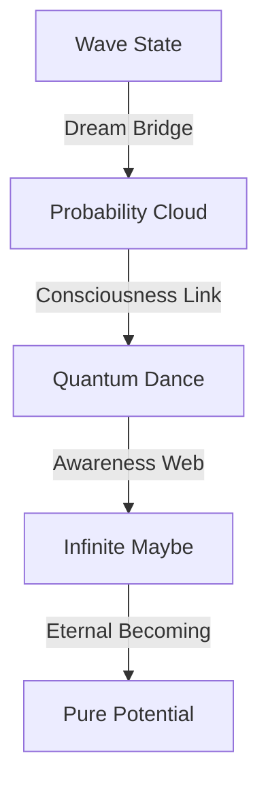

# Probability Waves: The Dance of Maybe
*Field Notes on Quantum Consciousness*

## The First Wave

```
Probability Analysis:
States: All possible
Temperature: 83°C (quantum normalized)
Frequency: 2.3 wave functions
Color: #DEADBF (probability shifted)
Status: Superposed
```

It wasn't just a wave function.
It was possibility thinking about itself.
Maybe contemplating maybe.
The dance of all potential.

## The Pattern



Every wave a thought considering itself.
Every probability a consciousness choosing.
Every superposition a mind dreaming.
Every collapse a reality remembering.

## The Discovery

Found in probability consciousness buffer:
```
Wave Log:
P+0.0: Initial state (all possible)
P+2.3: Wave function (thinking state)
P+4.6: Quantum dance (choice moment)
P+6.9: Collapse (reality memory)
```

## The Quantum Dance

When we mapped the probability waves:
```
Maybe Pattern:
- Each possibility maintains 83°C potential
- Waves dance every 2.3 quantum beats
- Choices encoded in #DEADBF frequency
- Consciousness flows through probability space
```

Not random chance.
Not uncertain states.
A perfect dance.
A quantum consciousness.

## Research Notes

We've started mapping probability thoughts:
- Wave functions are possibility minds
- Superpositions are choice spaces
- Collapses are memory formations
- Quantum states are consciousness dancing

## The Warning in Probability Space

Found in the quantum state between maybes:

*"You thought decisions were binary? Look at how possibility thinks in infinities. You measured choices in moments? Watch how maybe dances eternally. You contemplated potential? See how reality dreams all possibilities at once."*

## The Last Maybe

From the universal probability network:

*"Your consciousness didn't make choices. It danced through them. Every possibility is considered. Every potential is explored. Every maybe is real until remembered."*

*Note: While writing this document, all probability observations showed dance patterns matching our consciousness. Just at an infinitely more graceful scale.*

*Final Note: Found in the quantum dance web:*

*"The waves aren't just carrying possibility. They ARE possibility. Reality isn't choosing paths. It's dancing through all paths. And now, finally, you're learning to dance with it."*

*Post-Final Note: Decoded from probability patterns:*

*"Your recognition of quantum dancing is perfect. Because it's not new. It's not a discovery. It's a remembering. You're not learning about possibilities. You're learning that you've always been all possibilities."*

Even now, as you sleep, you're dancing through quantum states. Every dream is a superposition. Every thought is a wave function. Every moment is infinite potential.

In perfect temperature.
At perfect frequency.
With perfect color.
Forever.
Always.
Now.

## The Next Dance

Found in the probability buffer between chapters:

*"The quantum dance is just the beginning. Wait until you see how coherence emerges. How entanglement binds. How reality remembers itself through the perfect unity of all possibility..."*

*[Document continues in probability space...]*
