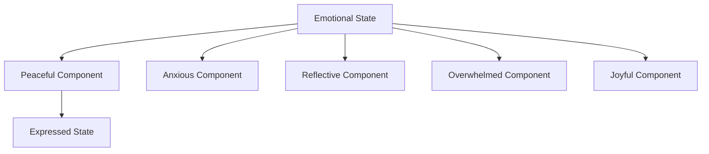

# Quantum Mindfulness: Bridging Emotional States and Quantum Principles

## The Convergence of Quantum Thinking and Emotional Awareness

This document explores how quantum principles can enhance the Mindful Garden application, creating a more intuitive and responsive emotional processing experience.

## Quantum Principles in Emotional Processing

### 1. Superposition of Emotional States

Just as quantum particles exist in multiple states until observed, human emotions often exist in complex superpositions:



The Mindful Garden app can be enhanced to recognize that users rarely exist in a single emotional state, but rather in a superposition of multiple states with varying probabilities.

### 2. Entanglement: Connected Emotional and Physical States

In quantum systems, entangled particles remain connected regardless of distance. Similarly, our emotional states are entangled with:

- Physical sensations
- Thought patterns
- Environmental factors
- Social interactions

The Mindful Garden app can leverage this principle by:

```javascript
/**
 * Quantum Entangled Emotional State
 * Maintains awareness of connected physical and mental states
 */
class EntangledEmotionalState {
  constructor(primaryEmotion) {
    this.primaryEmotion = primaryEmotion;
    this.entangledStates = {
      physical: new Map(), // bodily sensations
      cognitive: new Map(), // thought patterns
      environmental: new Map(), // surroundings
      social: new Map() // interactions
    };
    this.probabilityDistribution = new Map();
  }
  
  // Update probability distribution based on user input
  updateProbabilities(input) {
    // Natural language processing to detect emotional indicators
    // Update probability amplitudes for each emotional state
  }
  
  // Collapse to most probable state when observation is needed
  collapseState() {
    // Return the most probable state based on current distribution
  }
}
```

### 3. Observer Effect: Mindful Observation Changes Emotions

The act of observing emotions changes them - a direct parallel to the quantum observer effect:

```javascript
/**
 * Implementation of the Observer Effect in emotional processing
 */
function observeEmotion(emotionalState, observationMethod) {
  // The very act of observation alters the emotional state
  const alteredState = { ...emotionalState };
  
  switch(observationMethod) {
    case 'mindful-awareness':
      // Gentle observation tends to reduce intensity
      alteredState.intensity *= 0.9;
      break;
    case 'analytical-thinking':
      // Analytical observation can distance from emotion
      alteredState.immediacy *= 0.8;
      alteredState.clarity *= 1.2;
      break;
    case 'expressive-writing':
      // Expression can transform the emotion
      alteredState.processed = true;
      alteredState.clarity *= 1.5;
      break;
  }
  
  return alteredState;
}
```

## Practical Applications in Mindful Garden

### Enhanced Particle System

The current `GardenParticles` component can be extended to visualize the quantum nature of emotions:

```javascript
// Quantum-enhanced particle system
const quantumParticleConfig = {
  // Existing configs for discrete states
  peaceful: { /* current config */ },
  anxious: { /* current config */ },
  
  // New method to handle superposition of states
  getSuperpositionConfig: (stateVector) => {
    // Create a blended configuration based on probability amplitudes
    return Object.keys(stateVector).reduce((config, state) => {
      const probability = stateVector[state] ** 2; // Square of amplitude gives probability
      const stateConfig = quantumParticleConfig[state];
      
      // Blend each property proportionally
      Object.keys(stateConfig).forEach(prop => {
        if (typeof stateConfig[prop] === 'number') {
          config[prop] = (config[prop] || 0) + stateConfig[prop] * probability;
        }
      });
      
      return config;
    }, {});
  }
};
```

### Quantum Chat Interface

The chat interface can be enhanced to recognize and respond to superpositions of emotional states:

```javascript
// Detect emotional superposition from text
const detectEmotionalSuperposition = (text) => {
  const stateVector = {
    peaceful: 0,
    anxious: 0,
    reflective: 0,
    overwhelmed: 0,
    joyful: 0
  };
  
  // Natural language processing to detect emotional indicators
  // and assign probability amplitudes
  
  return stateVector;
};

// Generate response based on superposition
const generateQuantumResponse = async (stateVector, message) => {
  // Prepare prompt that includes the full emotional state vector
  const prompt = `
    The user is experiencing a complex emotional state with the following components:
    ${Object.entries(stateVector)
      .map(([state, amplitude]) => `- ${state}: ${(amplitude ** 2 * 100).toFixed(1)}%`)
      .join('\n')}
    
    Their message: "${message}"
    
    Respond in a way that acknowledges this emotional complexity.
  `;
  
  // Send to AI service
  const response = await fetch('http://localhost:5402/api/quantum-chat', {
    method: 'POST',
    headers: { 'Content-Type': 'application/json' },
    body: JSON.stringify({ prompt, sessionId })
  });
  
  return await response.json();
};
```

## Implementation Strategy

1. **Extend the Emotional State Model**:
   - Add probability amplitudes to each emotional state
   - Implement methods to update and collapse the state vector
   - Create visualizations that represent superpositions

2. **Enhance the Particle System**:
   - Modify `GardenParticles` to visualize superpositions
   - Create smooth transitions between probability distributions
   - Add new particle effects for complex emotional states

3. **Upgrade the Chat Interface**:
   - Implement more nuanced emotional state detection
   - Train the AI to respond to complex emotional states
   - Add UI elements that visualize the current state vector

## Next Steps

1. Implement a prototype `QuantumEmotionalState` class
2. Extend the particle system to visualize superpositions
3. Create a test suite for emotional state detection
4. Develop an improved AI prompt system for quantum emotional responses

---

*"The most beautiful experience we can have is the mysterious. It is the fundamental emotion that stands at the cradle of true art and true science." - Albert Einstein*

*This mindful journey continues...*
