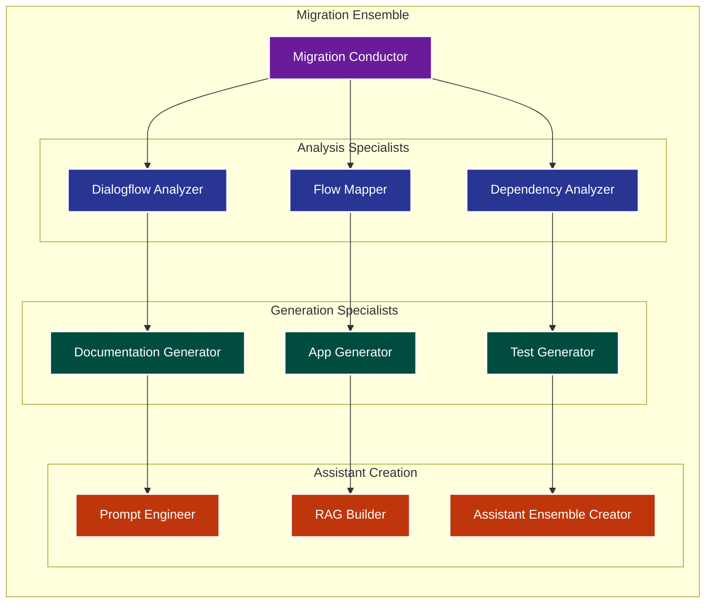

# Migration Ensemble Architecture

## Overview


## Migration Process

### 1. Analysis Phase
```python
ANALYSIS_ENSEMBLE = {
    "dialogflow_analyzer": {
        "capabilities": [
            "intent_pattern_recognition",
            "entity_extraction",
            "webhook_mapping",
            "training_data_analysis"
        ],
        "outputs": {
            "intent_map": "semantic_clusters",
            "entity_hierarchy": "typed_structure",
            "integration_points": "api_specifications"
        }
    },
    "flow_mapper": {
        "capabilities": [
            "conversation_flow_analysis",
            "state_machine_extraction",
            "transition_logic_mapping",
            "error_handling_patterns"
        ],
        "outputs": {
            "flow_diagrams": "mermaid_specs",
            "state_machines": "react_components",
            "validation_rules": "typescript_types"
        }
    },
    "dependency_analyzer": {
        "capabilities": [
            "api_dependency_tracking",
            "data_flow_analysis",
            "security_requirement_extraction",
            "compliance_mapping"
        ],
        "outputs": {
            "dependency_graph": "architecture_spec",
            "security_matrix": "compliance_rules",
            "data_flow": "privacy_requirements"
        }
    }
}
```

### 2. Generation Phase
```python
GENERATION_ENSEMBLE = {
    "documentation_generator": {
        "outputs": {
            "prd": {
                "format": "markdown",
                "sections": ["overview", "flows", "requirements", "metrics"]
            },
            "technical_spec": {
                "format": "markdown",
                "sections": ["architecture", "apis", "security", "deployment"]
            },
            "user_stories": {
                "format": "jira_compatible",
                "mapping": "dialogflow_to_agile"
            }
        }
    },
    "app_generator": {
        "outputs": {
            "frontend": {
                "framework": "react_native",
                "components": ["chat", "auth", "profile"],
                "styling": "company_brand_theme"
            },
            "backend": {
                "architecture": "serverless",
                "apis": "openapi_spec",
                "security": "oauth_flows"
            }
        }
    },
    "test_generator": {
        "outputs": {
            "unit_tests": {
                "framework": "jest",
                "coverage_target": 0.85
            },
            "integration_tests": {
                "framework": "cypress",
                "scenarios": "dialogflow_flows"
            },
            "synthetic_data": {
                "volume": "production_scale",
                "variety": "edge_cases"
            }
        }
    }
}
```

### 3. Assistant Creation Phase
```python
ASSISTANT_CREATION = {
    "prompt_engineer": {
        "capabilities": [
            "context_preservation",
            "security_awareness",
            "brand_voice_adaptation"
        ],
        "outputs": {
            "base_prompts": "templated_system_prompts",
            "specialized_prompts": "flow_specific_prompts",
            "guardrails": "security_filters"
        }
    },
    "rag_builder": {
        "capabilities": [
            "knowledge_extraction",
            "embedding_generation",
            "retrieval_optimization"
        ],
        "outputs": {
            "knowledge_base": "vector_store",
            "retrieval_rules": "ranking_config",
            "update_pipeline": "continuous_learning"
        }
    },
    "assistant_ensemble_creator": {
        "capabilities": [
            "specialist_instantiation",
            "coordination_setup",
            "monitoring_configuration"
        ],
        "outputs": {
            "ensemble_config": "deployment_ready",
            "scaling_rules": "auto_scaling_policies",
            "monitoring": "observability_stack"
        }
    }
}
```

## Migration Conductor Role
```python
MIGRATION_CONDUCTOR = {
    "orchestration": {
        "phase_management": ["analysis", "generation", "assistant_creation"],
        "quality_gates": {
            "analysis_complete": {
                "required_artifacts": ["intent_map", "flow_diagrams", "dependency_graph"],
                "quality_metrics": ["coverage", "consistency", "completeness"]
            },
            "generation_complete": {
                "required_artifacts": ["app_code", "documentation", "tests"],
                "quality_metrics": ["code_quality", "test_coverage", "doc_completeness"]
            },
            "assistant_ready": {
                "required_artifacts": ["ensemble_config", "knowledge_base", "prompts"],
                "quality_metrics": ["performance", "security", "reliability"]
            }
        }
    },
    "coordination": {
        "workflow": "event_driven",
        "artifact_management": "versioned",
        "progress_tracking": "real_time"
    }
}
```

## Output Validation
```python
VALIDATION_FRAMEWORK = {
    "functional_validation": {
        "intent_coverage": "100%",
        "flow_accuracy": "100%",
        "response_quality": ">= original"
    },
    "performance_validation": {
        "latency": "<= original",
        "throughput": ">= original",
        "resource_efficiency": "optimized"
    },
    "security_validation": {
        "compliance_checks": "automated",
        "penetration_testing": "required",
        "audit_trails": "comprehensive"
    }
}
```

## Deployment Strategy
```python
DEPLOYMENT_STRATEGY = {
    "phases": [
        {
            "name": "shadow_mode",
            "duration": "2_weeks",
            "success_criteria": {
                "accuracy": ">= 99%",
                "performance": ">= baseline",
                "user_satisfaction": ">= baseline"
            }
        },
        {
            "name": "pilot",
            "duration": "4_weeks",
            "traffic_percentage": 20,
            "success_criteria": {
                "completion_rate": ">= 95%",
                "error_rate": "< 1%",
                "user_satisfaction": ">= 4.5/5"
            }
        },
        {
            "name": "full_rollout",
            "strategy": "incremental",
            "rollback_criteria": {
                "error_spike": "2x_baseline",
                "latency_spike": "3x_baseline",
                "user_complaints": ">= 5%"
            }
        }
    ]
}
