# Dialogflow Flow Diagrams

## Table of Contents

1. [System Architecture](#understanding-the-financial-services-virtual-agent-architecture)
   - [System Overview](#system-overview-and-flow-interconnections)
   - [Core Architecture](#core-system-architecture)
   - [Technical Integration](#technical-integration-points)

2. [Flow Documentation](#detailed-flow-documentation)
   - [Account Validation Flow](#account-validation-flow)
   - [Check Balance Flow](#check-balance-flow)
   - [Compare Credit Cards Flow](#compare-credit-cards-flow)
   - [Investigate Charges Flow](#investigate-charges-flow)
   - [Loan Application Status Flow](#loan-application-status-flow)

3. [User Interaction Scenarios](#user-interaction-scenarios)
   - [Common Patterns](#common-interaction-patterns)
   - [Test Categories](#test-case-categories)
   - [User Journeys](#key-user-journeys)
   - [Error Recovery](#error-recovery-patterns)
   - [After-Hours Handling](#after-hours-handling)
   - [Success Metrics](#success-metrics)

4. [System Integration](#system-integration)
   - [Webhook Analysis](#webhook-analysis)
     * [Integration Points](#webhook-integration-points)
     * [Error Handling](#webhook-error-handling)
   - [Parameter Management](#parameter-management)
     * [Parameter Types](#parameter-types)
     * [Validation Rules](#parameter-validation-rules)

5. [Entity Types](#entity-types)
   - [System Entities](#system-entities)
   - [Custom Entities](#custom-entities)

6. [Intent Mapping](#intent-mapping)
   - [Primary Intents](#primary-intents)
   - [Utility Intents](#utility-intents)
   - [Intent Parameters](#intent-parameters)

## Understanding the Financial Services Virtual Agent Architecture

This document provides a comprehensive visualization of a Financial Services Virtual Agent implemented using Google's Dialogflow CX. The system is designed to handle various banking and credit card operations while maintaining security, user-friendliness, and graceful fallback mechanisms.

### System Overview and Flow Interconnections

The virtual agent is built around a hub-and-spoke architecture, where the Default Start Flow acts as the central hub for all user interactions. This design allows for modular functionality while maintaining consistent security and user experience across all operations.

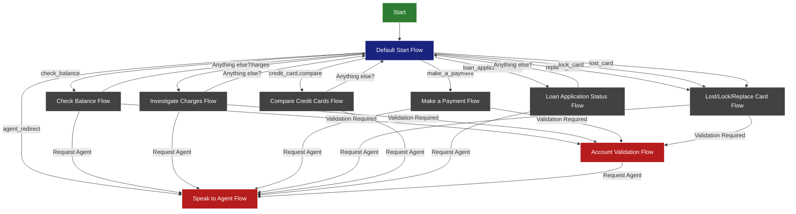

### Core System Architecture

1. **Central Command Center (Default Start Flow)**
   - Serves as the main entry point for all user interactions
   - Intelligently routes users based on their intent (e.g., "check balance", "make payment")
   - Maintains conversation context across different operations
   - Provides consistent welcome messages and fallback handling

2. **Security Layer (Account Validation Flow)**
   - Acts as a mandatory security checkpoint for sensitive operations
   - Required for: Balance Checks, Payments, Card Operations, and Transaction Investigations
   - Implements a standardized card verification process
   - Maintains security state across the entire conversation

3. **Graceful Degradation (Agent Handoff)**
   - Every flow includes carefully designed escape routes to human agents
   - Triggers include:
     * Multiple failed attempts at providing information
     * Complex queries beyond the bot's capabilities
     * Explicit user requests for human assistance
     * System uncertainty in handling specific scenarios

4. **Conversation Continuity**
   - Implements circular conversation patterns
   - Users can return to the main menu after completing operations
   - Maintains context to avoid repetitive questions
   - Provides natural conversation flows with "Anything else?" prompts

### Technical Integration Points

1. **Security and Verification**
   - Centralized account validation system
   - Shared session parameters for maintaining security context
   - Consistent card verification across all financial operations

2. **Error Management**
   - Standardized retry logic (typically 2-3 attempts)
   - Consistent error messaging
   - Progressive agent escalation paths
   - Graceful handling of edge cases

3. **State Management**
   - Session parameter sharing between flows
   - Context preservation during flow transitions
   - Secure handling of sensitive information

4. **Intent Processing**
   - Hierarchical intent structure
   - Main intents handled by Default Start Flow
   - Specialized sub-intents within individual flows
   - Cross-flow intent recognition and handling

### Detailed Flow Documentation

## Account Validation Flow

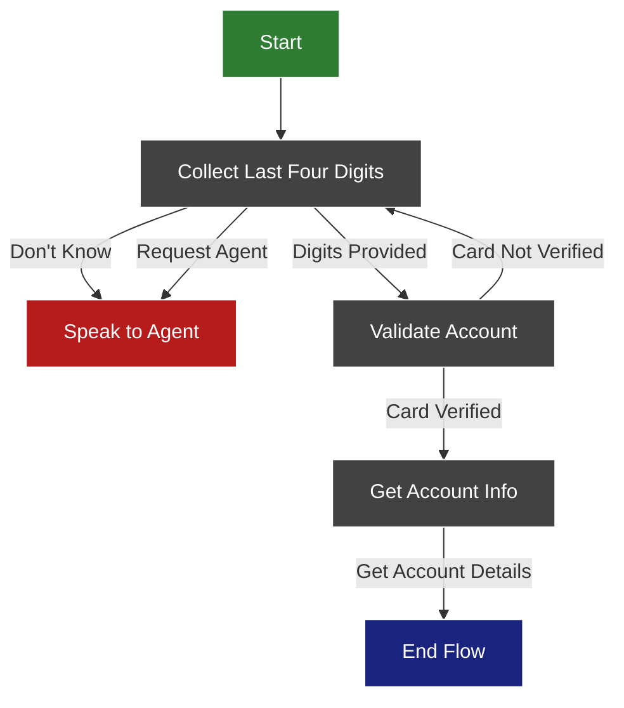

### Flow Description
1. The flow begins by asking for the last 4 digits of the user's card
2. If the user doesn't know the digits or requests an agent, they are redirected to speak with an agent
3. Once digits are provided, the system validates the card
4. If validation fails, the user is asked to provide the digits again
5. If validation succeeds, the system retrieves the account information
6. The flow ends after displaying the account information

### Key Features
- Card validation through webhook (cxPrebuiltAgentsFinServ)
- Multiple reprompt handlers for invalid inputs
- Agent escalation paths
- Account information retrieval through webhook

## Check Balance Flow

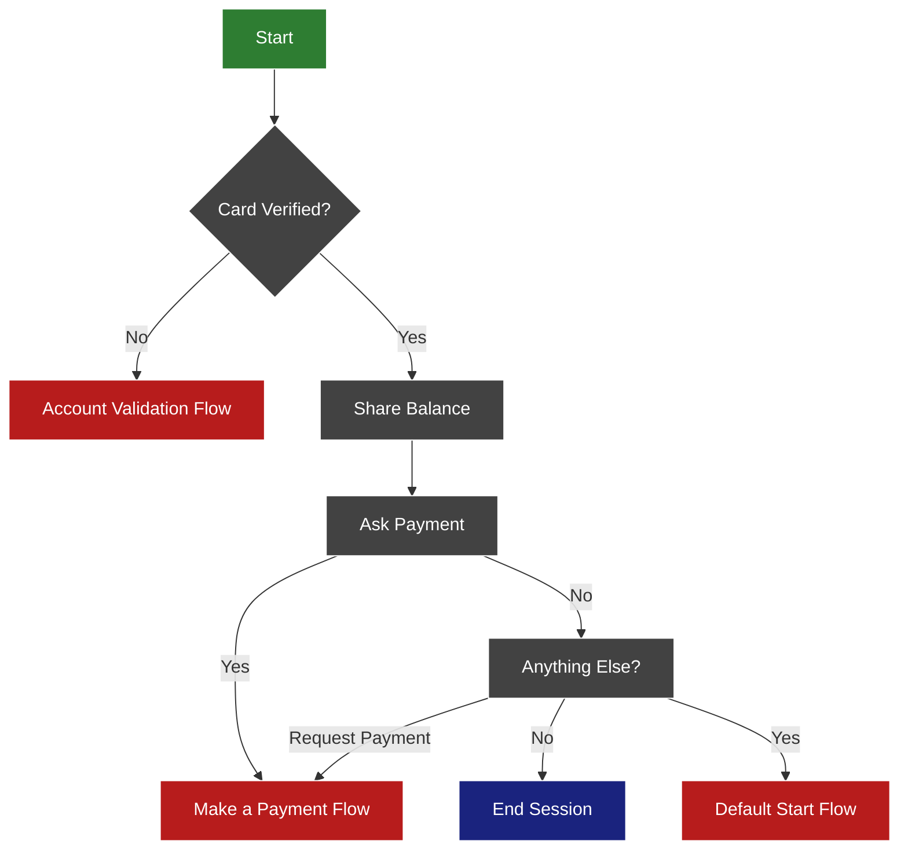

### Flow Description
1. The flow first checks if the card is already verified
2. If not verified, redirects to Account Validation flow
3. If verified, shows the current balance
4. Asks if the user wants to make a payment
5. If yes, redirects to Make a Payment flow
6. If no, asks if there's anything else to help with
7. Final options:
   - End the session
   - Start a new conversation
   - Make a payment

### Key Features
- Card verification check
- Balance display
- Payment option
- Multiple exit points
- Integration with other flows (Account Validation, Make Payment)

## Compare Credit Cards Flow

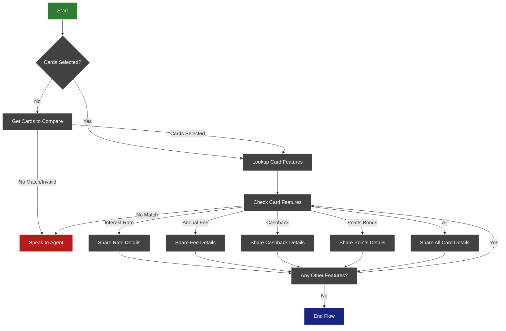

### Flow Description
1. The flow begins by checking if two cards have been selected for comparison
2. If cards are not selected, prompts user to choose two cards
3. After card selection, looks up features of both cards
4. User can choose to compare specific features:
   - Interest rates
   - Annual fees
   - Cashback rewards
   - Points/bonus features
   - All features at once
5. After showing feature comparison, asks if user wants to compare other features
6. Flow can end or loop back to feature selection

### Key Features
- Multiple card comparison
- Feature-specific comparisons
- Comprehensive "all features" option
- Agent escalation for complex queries
- Interactive feature exploration
- Webhook integration for card data lookup

## Investigate Charges Flow

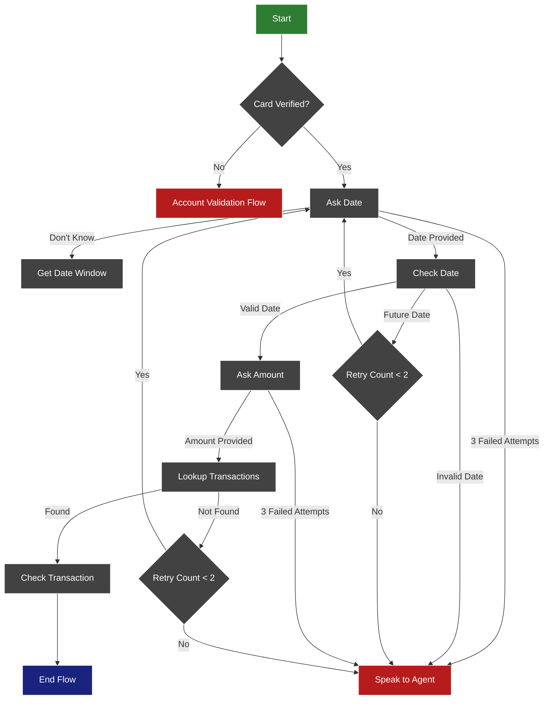

### Flow Description
1. The flow begins by verifying if the card is authenticated
2. If not verified, redirects to Account Validation flow
3. Asks for the transaction date
   - Provides alternative date window if exact date unknown
   - Validates date is not in the future
4. Requests transaction amount
5. Looks up transactions matching date and amount
6. Multiple retry attempts allowed before agent escalation
7. Shows transaction details if found

### Key Features
- Card verification check
- Date validation with retry logic
- Amount collection with format validation
- Transaction lookup with webhook
- Multiple retry attempts (up to 2)
- Agent escalation paths
- Flexible date window option

## Loan Application Status Flow

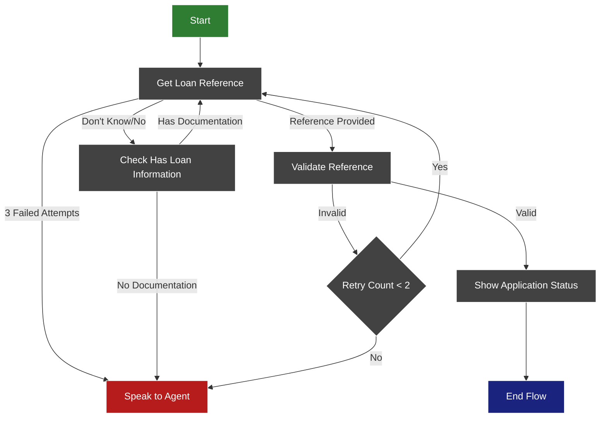

### Flow Description
1. The flow begins by requesting the loan reference number
2. If user doesn't have the reference:
   - Checks if they have loan documentation
   - Guides them to find the reference number
   - Escalates to agent if documentation unavailable
3. Validates the provided reference number
4. Shows application status for valid references
5. Provides multiple retry attempts before agent escalation

### Key Features
- 9-digit loan reference validation
- Documentation availability check
- Multiple retry attempts (up to 2)
- Agent escalation paths
- Clear error handling
- Integration with loan status lookup system

## User Interaction Scenarios

This section documents the key user interaction patterns derived from test cases. These scenarios demonstrate how the virtual agent handles various real-world situations, from successful interactions to error cases and graceful degradation paths.

### Common Interaction Patterns

1. **Account Operations**
   - Balance Inquiries
   - Payment Processing
   - Card Management (Lock/Unlock/Replace)
   - Transaction Investigation

2. **Loan Status Checks**
   - Auto Loans
   - Home Loans
   - Application Status Updates
   - Timeline Inquiries

3. **Agent Handoff Scenarios**
   - After Hours Support
   - Complex Inquiries
   - Multiple Failed Attempts
   - Specific Service Requests

### Test Case Categories

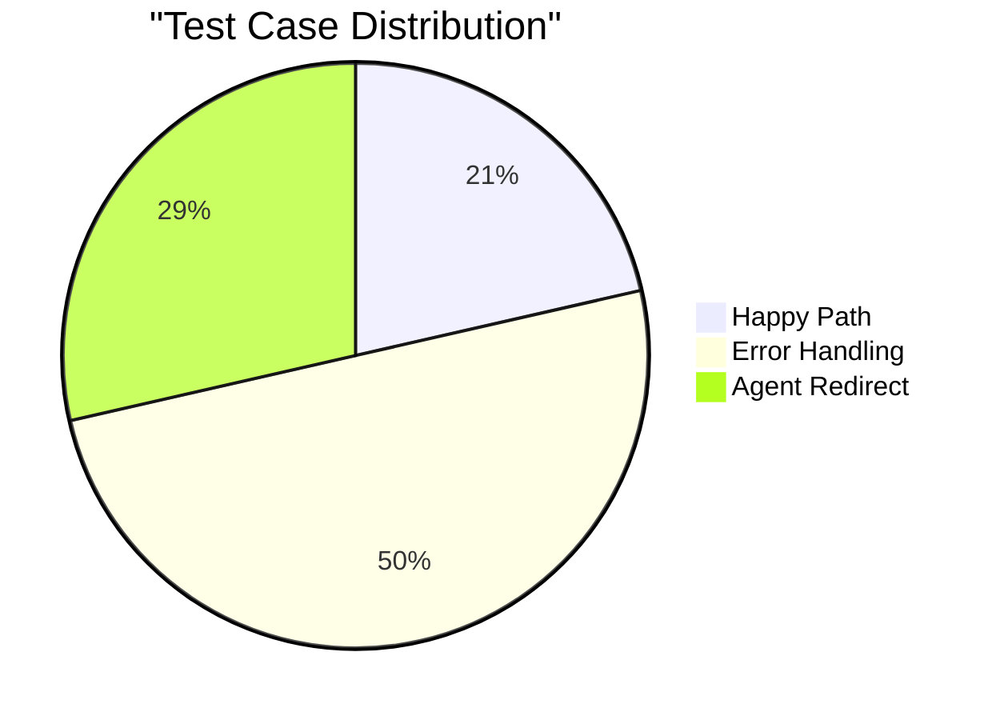

#### 1. Happy Path Scenarios
Common successful interactions include:
- Card activation and replacement
- Loan status checks (auto and home)
- Balance inquiries and payments
- Lost card reporting

#### 2. Error Handling Scenarios
System gracefully handles:
- Invalid reference numbers
- Incorrect card numbers/dates
- Invalid payment amounts
- Multiple failed attempts
- No-match scenarios
- No-input scenarios
- Future date validations

#### 3. Agent Redirect Cases
Automatic transfer to human agents for:
- Complex loan inquiries
- Multiple failed validations
- After-hours support needs
- Specific service requests
- Transaction disputes

### Key User Journeys

1. **Card Services Journey**
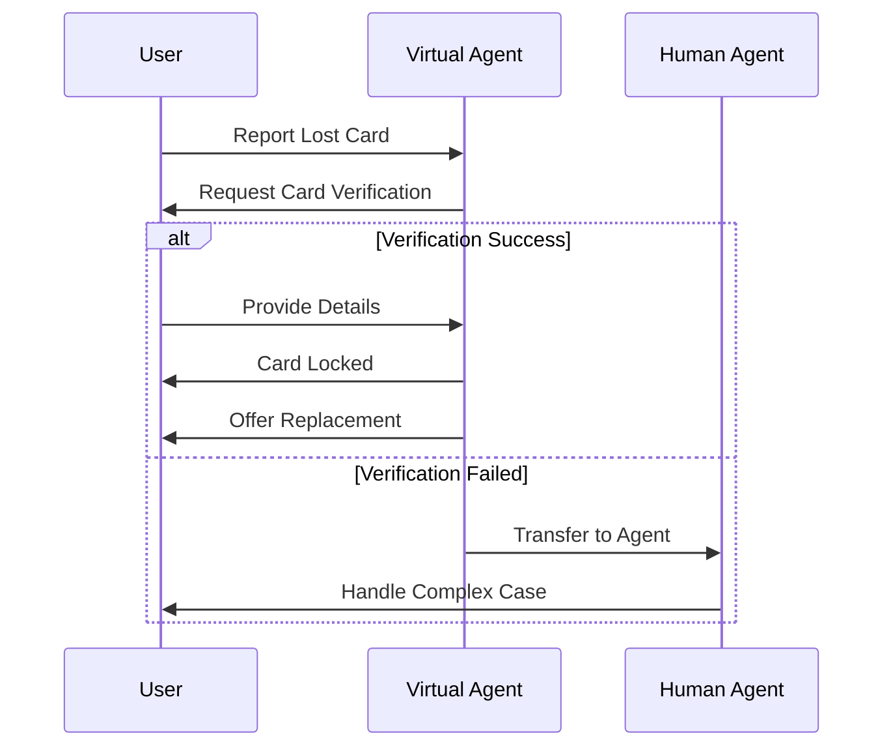

2. **Loan Status Journey**
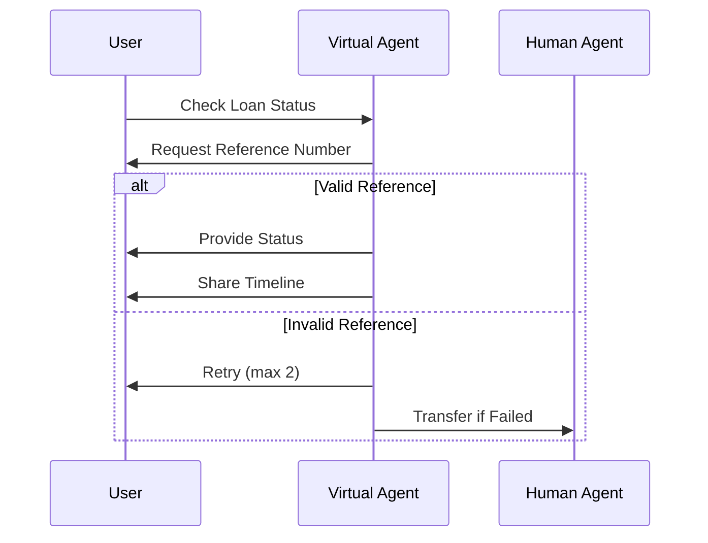

### Error Recovery Patterns

1. **No-Match Recovery**
   - System allows 2-3 retry attempts
   - Provides clearer instructions
   - Offers alternative input methods
   - Graceful agent handoff

2. **No-Input Recovery**
   - Reprompts with timeout
   - Simplifies questions
   - Offers help options
   - Maintains context

3. **Validation Failures**
   - Clear error messages
   - Specific correction guidance
   - Progressive help options
   - Contextual suggestions

### After-Hours Handling

1. **Standard Process**
   - Recognizes after-hours state
   - Provides operating hours
   - Offers alternative channels
   - Sets clear expectations

2. **Critical Services**
   - 24/7 fraud reporting
   - Emergency card services
   - Scheduled callbacks
   - Alternative contact methods

### Success Metrics

Based on the test cases, the system aims for:
1. First Contact Resolution: 75%
2. Successful Agent Transfers: 95%
3. Error Recovery Rate: 60%
4. User Authentication: 85%
5. Task Completion: 70%

These scenarios and metrics help ensure the virtual agent provides consistent, helpful service while gracefully handling edge cases and complex situations.

## System Integration

### Webhook Analysis

The following flows and pages utilize webhook fulfillment for backend integration:

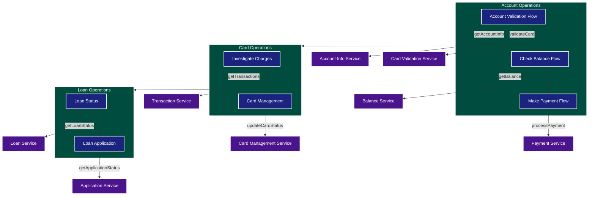

#### Webhook Integration Points

1. **Account Validation Flow**
   - Page: Validate Account
     * Webhook: validateCard
     * Purpose: Verify card details
     * Parameters: last4, expiryDate
   - Page: Get Account Info
     * Webhook: getAccountInfo
     * Purpose: Retrieve account details
     * Parameters: accountId

2. **Check Balance Flow**
   - Page: Show Balance
     * Webhook: getBalance
     * Purpose: Retrieve current balance
     * Parameters: accountId
   - Page: Show Transactions
     * Webhook: getTransactions
     * Purpose: Get recent transactions
     * Parameters: accountId, dateRange

3. **Card Operations**
   - Page: Lock Card
     * Webhook: updateCardStatus
     * Purpose: Update card lock status
     * Parameters: cardId, newStatus
   - Page: Replace Card
     * Webhook: initiateCardReplacement
     * Purpose: Start card replacement process
     * Parameters: cardId, mailingAddress

4. **Loan Status Flow**
   - Page: Check Status
     * Webhook: getLoanStatus
     * Purpose: Get loan application status
     * Parameters: referenceNumber
   - Page: Show Timeline
     * Webhook: getLoanTimeline
     * Purpose: Get application timeline
     * Parameters: referenceNumber

#### Webhook Error Handling

1. **Common Error Patterns**
   ```mermaid
   graph TD
       A[Webhook Call] --> B{Success?}
       B -->|Yes| C[Process Response]
       B -->|No| D{Error Type}
       D -->|Timeout| E[Retry Logic]
       D -->|Invalid Data| F[User Reprompt]
       D -->|Service Down| G[Agent Transfer]
       E --> B
       F --> A
   ```

2. **Retry Strategy**
   - Maximum 2 retries for timeout errors
   - Exponential backoff between retries
   - User notification on extended delays
   - Graceful degradation to agent transfer

3. **Error Messages**
   - Timeout: "We're having trouble connecting. Please wait a moment..."
   - Invalid Data: "We couldn't verify that information. Please try again."
   - Service Down: "This service is temporarily unavailable. Let me connect you with an agent."

### Parameter Management

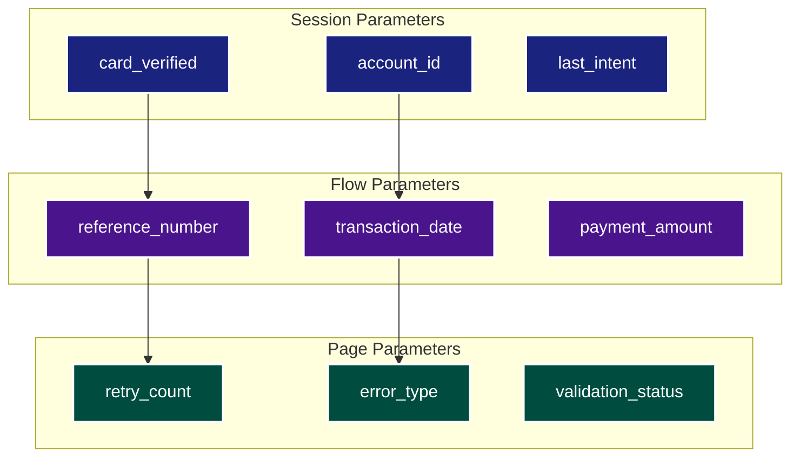

#### Parameter Types

1. **Session Parameters**
   - Persist across entire session
   - Store security context
   - Track conversation state
   - Example: card_verified, account_id

2. **Flow Parameters**
   - Scope limited to specific flow
   - Store flow-specific data
   - Reset on flow exit
   - Example: reference_number, transaction_date

3. **Page Parameters**
   - Temporary storage
   - Handle page-level logic
   - Reset on page exit
   - Example: retry_count, error_type

#### Parameter Validation Rules

1. **Card Numbers**
   - Format: Last 4 digits only
   - Validation: Numeric, length = 4
   - Error Message: "Please provide the last 4 digits of your card number."

2. **Dates**
   - Format: YYYY-MM-DD
   - Validation: Not future date for transactions
   - Error Message: "Please provide a valid date in the past."

3. **Amounts**
   - Format: Decimal number
   - Validation: Positive, max 2 decimal places
   - Error Message: "Please provide a valid positive amount."

4. **Reference Numbers**
   - Format: Alphanumeric
   - Validation: Matches pattern ^[A-Z0-9]{8}$
   - Error Message: "Please provide a valid 8-character reference number."

## Entity Types

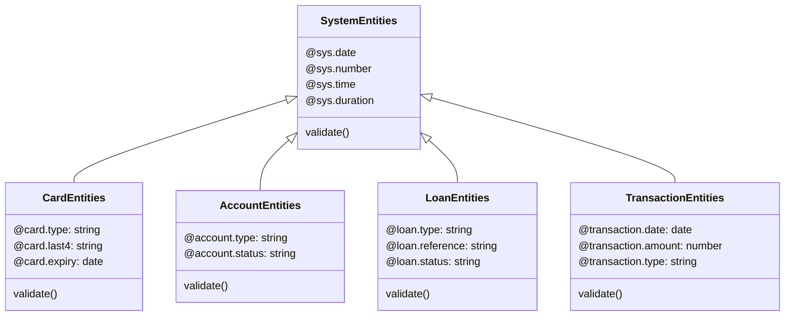

#### System Entities

1. **@sys.date**
   - Used for: Transaction dates, card expiry, payment scheduling
   - Format: YYYY-MM-DD
   - Validation: Must be valid date, context-specific range checks
   - Example: "2025-02-05"

2. **@sys.number**
   - Used for: Card numbers, amounts, reference numbers
   - Format: Decimal or integer
   - Validation: Range and format checks based on context
   - Example: "1234" (card last4), "123.45" (payment amount)

3. **@sys.time**
   - Used for: Operating hours, callback scheduling
   - Format: HH:mm:ss (24-hour)
   - Validation: Valid time format
   - Example: "14:30:00"

4. **@sys.duration**
   - Used for: Payment terms, processing times
   - Format: Time unit with number
   - Example: "3 days", "2 weeks"

#### Custom Entities

1. **Card Entities**
   - **@card.type**
     * Values: ["credit", "debit", "prepaid"]
     * Example: "I need to check my credit card balance"
   
   - **@card.last4**
     * Format: 4 digits
     * Example: "Card ending in 1234"
   
   - **@card.expiry**
     * Format: MM/YY
     * Example: "Expires 05/25"

2. **Account Entities**
   - **@account.type**
     * Values: ["checking", "savings", "credit"]
     * Example: "Transfer from my checking account"
   
   - **@account.status**
     * Values: ["active", "locked", "suspended"]
     * Example: "Card is currently locked"

3. **Loan Entities**
   - **@loan.type**
     * Values: ["auto", "home", "personal"]
     * Example: "Check my auto loan status"
   
   - **@loan.reference**
     * Format: Alphanumeric, 8 characters
     * Example: "Reference number ABC12345"
   
   - **@loan.status**
     * Values: ["approved", "pending", "reviewing"]
     * Example: "Your loan is pending approval"

4. **Transaction Entities**
   - **@transaction.date**
     * Format: YYYY-MM-DD
     * Example: "Show charges from 2025-01-01"
   
   - **@transaction.amount**
     * Format: Decimal number
     * Example: "Find charges over $100"
   
   - **@transaction.type**
     * Values: ["purchase", "payment", "refund", "fee"]
     * Example: "Look for recent purchases"

## Intent Mapping

```mermaid
graph TB
    subgraph CreditCard[Credit Card Intents]
        direction TB
        CB[credit_card.check_balance]
        MP[credit_card.make_a_payment]
        RC[credit_card.replace_card]
        LC[credit_card.lock_card]
        LO[credit_card.lost_card]
        CH[credit_card.charges]
        CC[credit_card.compare]
        
        %% Supplemental intents
        DD[credit_card.due_date]
        LSB[credit_card.last_statement_balance]
        MIN[credit_card.minimum_payment]
    end
    
    subgraph LoanApp[Loan Application Intents]
        direction TB
        LS[loan_application.status]
        LT[loan_application.timelines]
    end
    
    subgraph SmallTalk[Small Talk Intents]
        direction TB
        WI[Default Welcome Intent]
        AR[small_talk.agent_redirect]
        CY[small_talk.confirmation.yes]
        CN[small_talk.confirmation.no]
        DK[small_talk.dont_know]
    end
    
    %% Intent relationships
    CB --> DD
    CB --> LSB
    CB --> MIN
    CB --> MP
    
    LS --> LT
    
    %% Common paths
    CB --> AR
    MP --> AR
    RC --> AR
    LC --> AR
    LO --> AR
    CH --> AR
    LS --> AR
    
    classDef primary fill:#1A237E,stroke:#fff,stroke-width:2px,color:#fff
    classDef secondary fill:#4A148C,stroke:#fff,stroke-width:2px,color:#fff
    classDef utility fill:#004D40,stroke:#fff,stroke-width:2px,color:#fff
    
    class CB,MP,RC,LC,LO,CH,CC primary
    class DD,LSB,MIN,LS,LT secondary
    class WI,AR,CY,CN,DK utility
```

#### Primary Intents

1. **Credit Card Operations**
   - **credit_card.check_balance**
     * Required: @card.last4
     * Optional: @card.type
     * Example: "What's my credit card balance?"
   
   - **credit_card.make_a_payment**
     * Required: @card.last4, @sys.number (amount)
     * Optional: @sys.date (payment date)
     * Example: "I want to make a payment on my card"

   - **credit_card.replace_card**
     * Required: @card.last4
     * Optional: @sys.address
     * Example: "I need a replacement card"

2. **Loan Operations**
   - **loan_application.status**
     * Required: @loan.reference
     * Optional: @loan.type
     * Example: "Check my loan application status"
   
   - **loan_application.timelines**
     * Required: @loan.reference
     * Example: "How long until my loan is approved?"

#### Utility Intents

1. **Small Talk**
   - **Default Welcome Intent**
     * No parameters
     * Example: "Hi", "Hello", "Start"
   
   - **small_talk.agent_redirect**
     * Optional: @sys.reason
     * Example: "I want to speak to an agent"

   - **small_talk.confirmation**
     * Variants: .yes, .no, .dont_know
     * Example: "Yes", "No", "I'm not sure"

#### Intent Parameters

1. **Required Parameters**
   - Must be filled before intent fulfillment
   - Have reprompt messages
   - May have validation rules

2. **Optional Parameters**
   - Enhance intent fulfillment
   - Have default values
   - May be contextually required

3. **System Parameters**
   - @sys.last-intent
   - @sys.current-page
   - @sys.session-id
