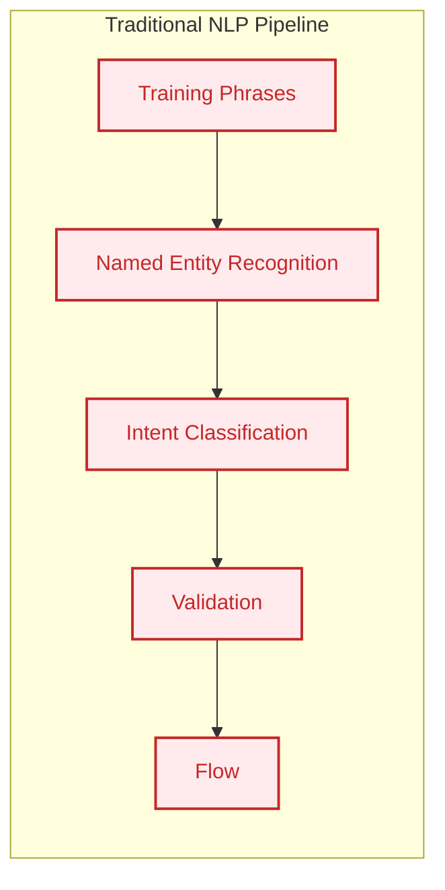
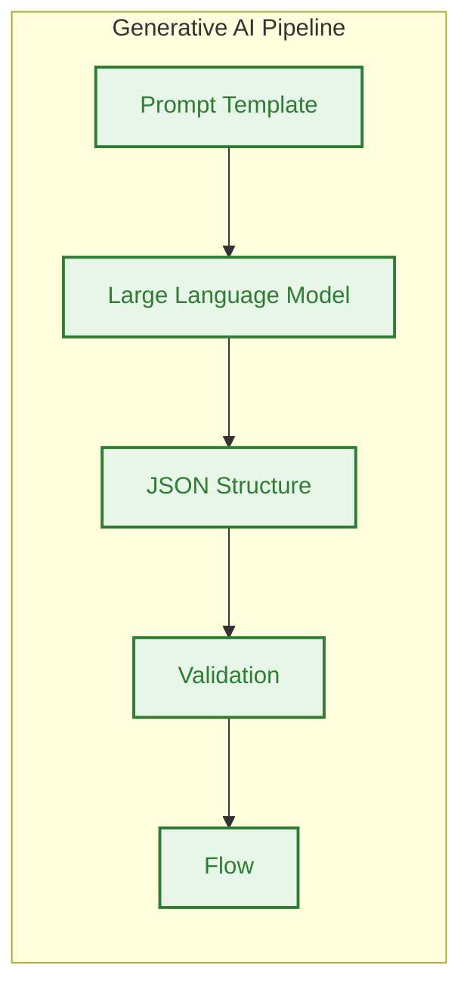
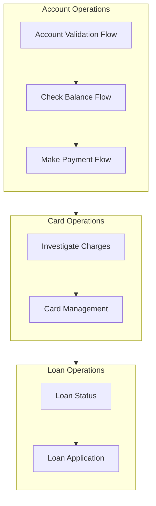
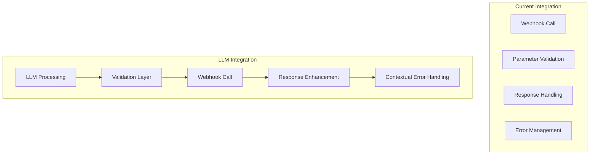

# Migration Plan: Traditional NLP Chatbot to Generative AI Solution

## Executive Summary

This document outlines a strategic plan for migrating a traditional NLP-based financial services chatbot to a modern generative AI solution. The focus is on transforming the core user interaction layer while preserving critical business logic and security measures.

## Current Architecture Analysis

### Traditional NLP Components

1. **Intent Classification**
   - Relies on predefined training phrases
   - Limited to exact pattern matching
   - Requires constant maintenance and updates
   - Struggles with context and variations

2. **Named Entity Recognition (NER)**
   - Fixed entity types:
     * System entities (@sys.date, @sys.unit-currency)
     * Business entities (loan_reference, card_operation)
     * Session parameters (retry_count, transaction_found)
   - Limited to explicit pattern recognition
   - Requires separate training for each entity type
   - No understanding of relationships or context

3. **Flow Management**
   - Rigid decision trees
   - Explicit state management
   - Limited context preservation
   - Manual fallback handling

## Generative AI Advantages

1. **Natural Language Understanding**
   - Context-aware entity extraction
   - No need for explicit training phrases
   - Handles variations and ambiguity
   - Understands relationships between entities

2. **Flexible Entity Recognition**
   - Dynamic entity extraction based on context
   - Understanding of implicit relationships
   - Ability to handle complex queries
   - Natural handling of ambiguity

3. **Improved User Experience**
   - Natural conversation flow
   - Better handling of complex queries
   - Reduced need for clarification
   - More human-like interactions

## Migration Strategy

### Current Architecture


### Future Architecture


### Phase 1: Core Interaction Layer

1. **Replace NLP Components**
   - Training phrases → Prompt engineering
   - NER → LLM-based entity extraction
   - Intent classification → Natural language understanding
   - Keep validation logic for critical fields

2. **Preserve Critical Components**
   - Business entity parameters
   - Validation rules
   - Security checks
   - Compliance requirements

3. **New Components**
   - Prompt templates
   - LLM integration layer
   - Response parsing
   - Entity validation pipeline

### Phase 2: Flow Transformation

1. **Current Flow Types to Preserve**
   - Account Validation
   - Balance Checks
   - Loan Status
   - Card Operations
   - Transaction Queries

2. **Parameters to Maintain**
   ```json
   {
     "system_entities": ["@sys.date", "@sys.unit-currency"],
     "business_entities": ["loan_reference", "card_operation"],
     "session_params": ["retry_count", "transaction_found"]
   }
   ```

3. **Validation Requirements**
   - Entity type checking
   - Value range validation
   - Required field verification
   - Business rule compliance

## Migration Examples

### Example 1: Card Replacement Flow

#### Current Approach
```json
{
  "intent": "credit_card.replace_card",
  "trainingPhrases": [
    "Hi I need to replace my card",
    "I want to get a new card",
    "My card is damaged",
    "Request replacement card"
  ],
  "parameters": {
    "card_last_four": "@sys.number",
    "card_operation": "replace",
    "card_verified": "boolean"
  }
}
```

#### LLM Approach
```python
SYSTEM_PROMPT = """
You are a financial services assistant. Extract relevant information from user queries:
- Identify the operation type
- Extract any card numbers mentioned
- Note any reasons provided
Return a structured JSON response.
"""

USER_INPUT = "Hi I need to replace my card"

# LLM naturally understands and extracts:
{
  "operation": "card_replacement",
  "card_details": {
    "numbers_mentioned": null,
    "reason": null
  },
  "next_action": "request_card_number",
  "confidence": 0.98
}
```

### Example 2: Payment Flow with Error Handling

#### Current Approach
```json
{
  "intent": "credit_card.make_a_payment",
  "trainingPhrases": [
    "pay credit card",
    "make a payment",
    "I want to pay my bill",
    "pay my card balance"
  ],
  "parameters": {
    "card_last_four": "@sys.number",
    "payment_amount": "@sys.unit-currency",
    "payment_date": "@sys.date"
  },
  "validation": {
    "payment_amount": "amount > 0"
  }
}
```

#### LLM Approach
```python
SYSTEM_PROMPT = """
You are a financial services assistant. For payment requests:
1. Extract payment details
2. Validate basic payment rules
3. Identify missing information
Return a structured JSON response.
"""

USER_INPUT = "I want to pay -$50 on my card ending in 1902"

# LLM naturally understands and validates:
{
  "operation": "payment",
  "card_details": {
    "last_four": "1902"
  },
  "payment": {
    "amount": -50,
    "validation_error": "Payment amount must be positive",
    "date": null
  },
  "next_action": "request_valid_amount",
  "confidence": 0.95
}
```

### Key Migration Benefits

1. **Natural Language Understanding**
   - Before: `"Hi I need to replace my card" → match training phrase → trigger intent`
   - After: LLM understands context, variations, and implications naturally

2. **Entity Extraction**
   - Before: Rigid pattern matching for `@sys.number`, `@sys.unit-currency`
   - After: Flexible extraction with built-in validation and reasoning

3. **Error Handling**
   - Before: Explicit error states and validation rules
   - After: Natural understanding of invalid inputs with contextual explanations

4. **Context Management**
   - Before: Explicit parameter passing between intents
   - After: Natural context preservation in conversation

### Implementation Guidelines

1. **Prompt Engineering**
   ```python
   BASE_PROMPT = """
   You are a financial services assistant. Your role is to:
   1. Understand user intent
   2. Extract relevant entities
   3. Validate business rules
   4. Maintain conversation context
   
   Return responses in the following JSON structure:
   {
     "operation": string,
     "entities": object,
     "validation": object,
     "next_action": string,
     "confidence": float
   }
   """
   ```

2. **Validation Layer**
   ```python
   VALIDATION_RULES = {
     "payment_amount": {
       "type": "number",
       "minimum": 0.01,
       "required": true
     },
     "card_last_four": {
       "type": "string",
       "pattern": "^\\d{4}$",
       "required": true
     }
   }
   ```

3. **Response Templates**
   ```python
   RESPONSE_TEMPLATES = {
     "request_card_number": {
       "text": "What are the last four digits of your card?",
       "required_entities": ["card_last_four"]
     },
     "confirm_payment": {
       "text": "I'll help you make a payment of {amount} to your card ending in {last_four}.",
       "required_entities": ["payment_amount", "card_last_four"]
     }
   }
   ```

### Testing Strategy

1. **Conversion Testing**
   - Map existing test cases to LLM responses
   - Verify entity extraction accuracy
   - Validate business rule enforcement

2. **Regression Testing**
   ```python
   test_cases = [
     {
       "input": "Hi I need to replace my card",
       "expected": {
         "operation": "card_replacement",
         "next_action": "request_card_number"
       }
     },
     {
       "input": "I want to pay -$50",
       "expected": {
         "operation": "payment",
         "validation_error": "Payment amount must be positive"
       }
     }
   ]
   ```

## Complete Flow Migration

### Current Flow Architecture



### Flow-by-Flow Migration Strategy

1. **Account Validation Flow**
   
   Current:
   ```json
   {
     "flow": "Account Validation",
     "pages": [
       "Collect Last Four Digits",
       "Validate Account",
       "Get Account Info"
     ],
     "parameters": {
       "card_last_four": "@sys.number",
       "card_verified": "boolean"
     }
   }
   ```
   
   LLM Approach:
   ```python
   ACCOUNT_VALIDATION_PROMPT = """
   You are handling account validation. Given the user input:
   1. Extract any card identifiers
   2. Track validation state
   3. Manage security requirements
   4. Handle verification failures gracefully
   
   Current conversation context: {context}
   Security requirements: {security_rules}
   """
   
   # Example interaction
   {
     "flow_state": "account_validation",
     "extracted_info": {
       "card_identifier": "last_four_digits",
       "security_check": "required"
     },
     "next_action": "verify_card",
     "fallback_options": ["retry", "agent_transfer"]
   }
   ```

2. **Check Balance Flow**

   Current:
   ```json
   {
     "flow": "Check Balance",
     "intents": [
       "credit_card.check_balance",
       "credit_card.due_date",
       "credit_card.minimum_payment"
     ],
     "webhook": "getBalance"
   }
   ```

   LLM Approach:
   ```python
   BALANCE_CHECK_PROMPT = """
   You are handling balance inquiries. For the user query:
   1. Identify specific balance information requested
   2. Extract any temporal qualifiers
   3. Handle multi-account scenarios
   4. Provide relevant supplementary information
   
   Available balance types: {balance_types}
   Account context: {account_info}
   """
   
   # Example response
   {
     "query_type": "balance_check",
     "details_requested": [
       "current_balance",
       "due_date",
       "minimum_payment"
     ],
     "temporal_context": "current_statement",
     "supplementary_info": ["payment_options", "due_date"]
   }
   ```

3. **Loan Application Status**

   Current:
   ```json
   {
     "flow": "Loan Application Status",
     "parameters": {
       "loan_reference": "@loan_reference",
       "loan_type": "@loan.type"
     },
     "error_handling": {
       "max_retries": 2,
       "agent_transfer": true
     }
   }
   ```

   LLM Approach:
   ```python
   LOAN_STATUS_PROMPT = """
   You are handling loan status inquiries. For the user query:
   1. Extract loan identifiers and types
   2. Understand status requirements
   3. Handle multiple application scenarios
   4. Provide timeline estimates
   
   Loan types: {loan_types}
   Status definitions: {status_definitions}
   """
   
   # Example interaction
   {
     "loan_query": {
       "type": "auto_loan",
       "reference_number": "ABC12345",
       "status_type": "detailed",
       "timeline_request": true
     },
     "context_preservation": {
       "previous_applications": true,
       "related_products": ["car_insurance", "gap_coverage"]
     }
   }
   ```

### Webhook Integration Migration



### Parameter Management Migration

1. **Session Parameters**
   
   Before:
   ```json
   {
     "session_params": {
       "card_verified": "boolean",
       "retry_count": "number",
       "last_intent": "string"
     }
   }
   ```

   After:
   ```python
   CONTEXT_MANAGEMENT = {
     "conversation_state": {
       "verification_status": "verified",
       "attempt_tracking": {"count": 1, "max": 3},
       "interaction_history": ["balance_check", "payment_intent"]
     },
     "security_context": {
       "verification_level": "card_verified",
       "session_expiry": "30_minutes"
     }
   }
   ```

2. **Flow Parameters**

   Before:
   ```json
   {
     "flow_params": {
       "current_balance": "@sys.number",
       "payment_amount": "@sys.unit-currency",
       "transaction_date": "@sys.date"
     }
   }
   ```

   After:
   ```python
   FLOW_CONTEXT = {
     "financial_context": {
       "balances": {
         "current": 1234.56,
         "available": 1000.00,
         "pending": 234.56
       },
       "transactions": {
         "recent": ["txn1", "txn2"],
         "pending": ["ptxn1"]
       }
     },
     "temporal_context": {
       "statement_cycle": "current",
       "relevant_dates": {
         "due_date": "2025-02-28",
         "statement_date": "2025-02-05"
       }
     }
   }
   ```

### Error Recovery Patterns

1. **Current Pattern**
   ```json
   {
     "error_handling": {
       "no_match": {
         "reprompt": true,
         "max_attempts": 2,
         "fallback": "agent_transfer"
       },
       "validation_failure": {
         "retry": true,
         "clear_params": ["payment_amount"]
       }
     }
   }
   ```

2. **LLM Pattern**
   ```python
   ERROR_HANDLING_PROMPT = """
   You are handling error recovery. Given the error context:
   1. Understand the error type and severity
   2. Consider previous interaction history
   3. Suggest appropriate recovery actions
   4. Maintain security context
   
   Error context: {error_details}
   Interaction history: {conversation_history}
   Security level: {security_context}
   """
   
   # Example response
   {
     "error_analysis": {
       "type": "validation_failure",
       "severity": "recoverable",
       "context": "payment_amount_negative"
     },
     "recovery_strategy": {
       "primary_action": "request_correction",
       "alternative_actions": ["explain_rules", "suggest_valid_range"],
       "preserve_context": ["card_number", "payment_date"]
     },
     "user_guidance": {
       "explanation": "Payment amount must be positive",
       "examples": ["$50", "$100.50"],
       "help_resources": ["payment_guide"]
     }
   }
   ```

### Security and Compliance Considerations

1. **Data Protection**
   ```python
   SECURITY_RULES = {
     "pii_handling": {
       "card_number": {
         "mask": "last_4_digits",
         "storage": "encrypted",
         "session_only": true
       },
       "account_details": {
         "mask": "partial",
         "storage": "encrypted",
         "retention": "24_hours"
       }
     },
     "authentication": {
       "levels": ["basic", "verified", "elevated"],
       "timeout": "15_minutes",
       "max_attempts": 3
     }
   }
   ```

2. **Regulatory Compliance**
   - **PCI DSS Requirements**
     * Card data handling
     * Secure transmission
     * Audit logging
   
   - **GDPR/CCPA Compliance**
     * Data minimization
     * Purpose limitation
     * Right to be forgotten
   
   - **Banking Regulations**
     * KYC requirements
     * Transaction monitoring
     * Fraud prevention

3. **LLM-Specific Security**
   ```python
   LLM_SECURITY_PROMPT = """
   You are operating under strict financial security guidelines:
   1. Never expose full card numbers
   2. Validate all financial transactions
   3. Maintain audit trails
   4. Respect authentication levels
   
   Security context: {security_level}
   Compliance requirements: {compliance_rules}
   """
   
   # Example security wrapper
   {
     "security_checks": {
       "authentication_level": "verified",
       "sensitive_data_present": ["card_last_four"],
       "required_validations": ["amount", "account"]
     },
     "audit_trail": {
       "operation": "payment_initiation",
       "timestamp": "2025-02-05T11:54:10",
       "security_level": "elevated"
     }
   }
   ```

4. **Migration Security Checklist**
   - [ ] Audit current security measures
   - [ ] Map security contexts to LLM prompts
   - [ ] Implement PII detection
   - [ ] Set up secure logging
   - [ ] Create compliance reporting
   - [ ] Test security boundaries
   - [ ] Document security protocols

5. **Secure Integration Architecture**
   ```mermaid
   graph TB
       subgraph "Security Layer"
           AUTH[Authentication]
           AUDIT[Audit Logging]
           PII[PII Detection]
           VALID[Validation]
       end
       
       subgraph "LLM Layer"
           PROMPT[Secure Prompt]
           RESP[Response Filter]
           CONTEXT[Security Context]
       end
       
       subgraph "Backend"
           API[Secure API]
           DB[Encrypted Storage]
           LOG[Audit Logs]
       end
       
       AUTH --> PROMPT
       PROMPT --> PII
       PII --> RESP
       RESP --> VALID
       VALID --> API
       API --> LOG
       LOG --> AUDIT
       
       classDef secure fill:#c62828,stroke:#fff,stroke-width:2px,color:#fff
       classDef llm fill:#1a237e,stroke:#fff,stroke-width:2px,color:#fff
       classDef backend fill:#004d40,stroke:#fff,stroke-width:2px,color:#fff
       
       class AUTH,AUDIT,PII,VALID secure
       class PROMPT,RESP,CONTEXT llm
       class API,DB,LOG backend
   ```

6. **Compliance Monitoring**
   ```python
   COMPLIANCE_MONITORING = {
     "real_time_checks": {
       "pii_detection": true,
       "transaction_limits": true,
       "authentication_level": true
     },
     "audit_requirements": {
       "log_retention": "7_years",
       "log_fields": [
         "timestamp",
         "operation",
         "security_level",
         "user_context",
         "validation_results"
       ]
     },
     "reporting": {
       "frequency": "daily",
       "alerts": ["security_breach", "compliance_violation"],
       "dashboards": ["security_metrics", "compliance_status"]
     }
   }
   ```

### Success Metrics for Flow Migration

1. **Quantitative Metrics**
   - Intent recognition accuracy (before/after)
   - Entity extraction precision
   - Error recovery success rate
   - Average turns per task
   - Task completion rate

2. **Qualitative Metrics**
   - Natural language understanding
   - Context preservation
   - Error message clarity
   - User satisfaction
   - Edge case handling

3. **Business Metrics**
   - Agent transfer rate
   - Average handling time
   - First contact resolution
   - Customer satisfaction scores
   - Self-service completion rate

## Next Steps

1. **Immediate Actions**
   - [ ] Audit current training phrases and entities
   - [ ] Design initial prompt templates
   - [ ] Create test cases for entity extraction
   - [ ] Plan validation pipeline

2. **Technical Requirements**
   - [ ] Select LLM provider
   - [ ] Design prompt engineering framework
   - [ ] Plan integration architecture
   - [ ] Define validation rules

3. **Success Metrics**
   - Entity extraction accuracy
   - Context preservation
   - User satisfaction
   - Reduced clarification needs
   - Handling of complex queries

---
*Note: This is a living document that will be updated as we progress through the migration phases.*
