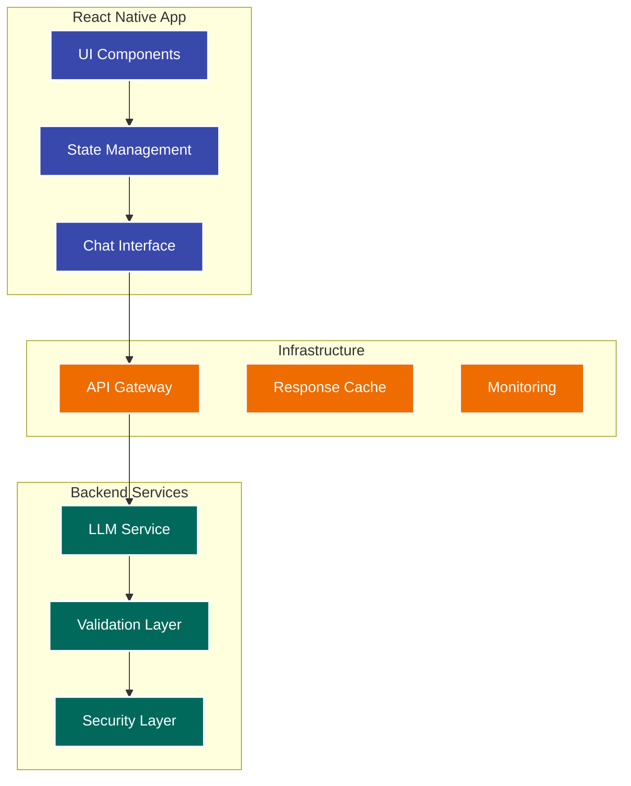
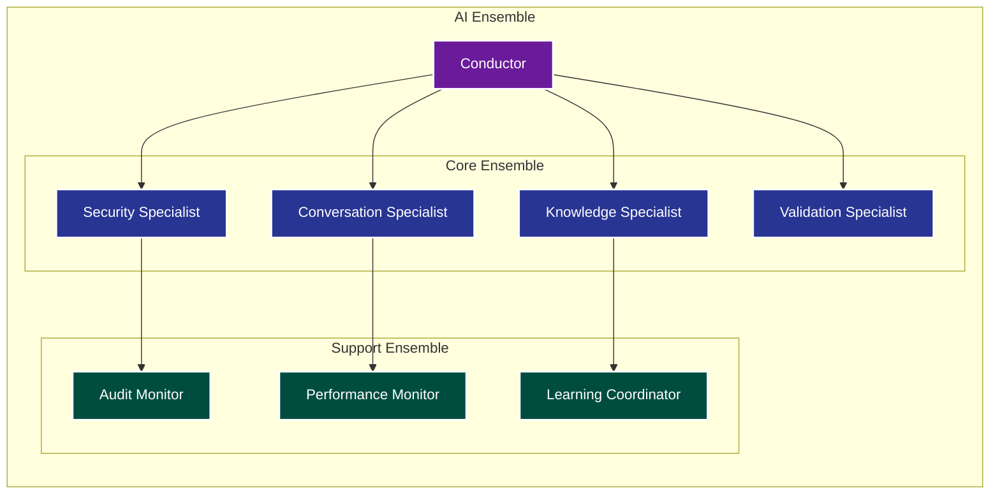

# Dialogflow to Generative AI Migration Prototype

## Phase 1: Analysis and Setup

### 1. Dialogflow Export Analysis
```python
ANALYSIS_PROMPT = """
You are analyzing a Dialogflow export for migration to a generative AI solution.
Focus on:
1. Intent patterns and their training phrases
2. Entity types and their validation rules
3. Flow logic and decision points
4. Webhook integration points
5. Error handling patterns

Export structure: {export_structure}
Current flow: {flow_name}
"""

# Example analyzer output
{
  "intents_analyzed": 24,
  "entity_types": ["card", "loan", "account"],
  "critical_flows": ["authentication", "payment", "status"],
  "webhook_dependencies": ["balance", "validation"],
  "suggested_migration_priority": ["auth", "balance", "payment"]
}
```

### 2. Modern Frontend Architecture


## Phase 2: Documentation Generation

### 1. Product Requirements Document (PRD)
- Generated from Dialogflow analysis
- Enhanced with modern AI capabilities
- Security and compliance requirements
- Performance metrics and SLAs

### 2. Epics and User Stories
```json
{
  "epic": "Account Management",
  "source": "account_validation_flow",
  "user_stories": [
    {
      "as": "customer",
      "want": "to securely validate my identity",
      "so_that": "I can access my account information",
      "acceptance_criteria": [
        "Support multiple validation methods",
        "Maintain security standards",
        "Provide clear error messages"
      ]
    }
  ],
  "migration_notes": {
    "current_implementation": "intent-based",
    "target_implementation": "contextual-llm",
    "security_considerations": ["PII handling", "audit logging"]
  }
}
```

### 3. Master Flow for LLM
```python
MASTER_FLOW_PROMPT = """
You are a financial services AI assistant with access to these capabilities:
1. Account validation and security
2. Balance and transaction queries
3. Payment processing
4. Loan status checks
5. Card management

Context: {conversation_history}
Security level: {auth_level}
Available actions: {action_list}
"""

# Flow controller
{
  "conversation_management": {
    "context_window": "last_5_turns",
    "security_context": "continuous_validation",
    "fallback_handling": "graceful_degradation"
  },
  "response_framework": {
    "style": "professional_friendly",
    "validation": "real_time",
    "error_handling": "contextual"
  }
}
```

## Phase 3: Testing and Validation

### 1. Synthetic Data Generation
```python
TEST_DATA_GENERATOR = {
  "user_profiles": {
    "count": 1000,
    "variations": ["new_customer", "existing_customer", "high_value"]
  },
  "transactions": {
    "types": ["payment", "inquiry", "dispute"],
    "volume": "daily_distribution",
    "anomalies": "inject_random"
  },
  "conversation_flows": {
    "happy_path": 0.7,
    "error_path": 0.2,
    "edge_cases": 0.1
  }
}
```

### 2. Intent Validation Framework
```python
VALIDATION_FRAMEWORK = {
  "baseline_tests": {
    "source": "dialogflow_intents",
    "success_criteria": {
      "intent_recognition": 0.95,
      "entity_extraction": 0.90,
      "context_preservation": 0.85
    }
  },
  "enhanced_tests": {
    "conversation_complexity": "multi_turn",
    "context_switching": "natural",
    "error_recovery": "autonomous"
  }
}
```

### 3. RAG Integration
```python
RAG_CONFIGURATION = {
  "knowledge_bases": {
    "product_documentation": {
      "update_frequency": "daily",
      "embedding_model": "financial_domain_tuned"
    },
    "compliance_rules": {
      "update_frequency": "real_time",
      "priority": "high"
    },
    "faq_database": {
      "update_frequency": "weekly",
      "context_aware": true
    }
  },
  "retrieval_strategy": {
    "method": "hybrid",
    "components": ["semantic", "keyword", "recent"],
    "reranking": true
  }
}
```

## Phase 4: Financial Services AI Ensemble

### 1. Ensemble Architecture


### 2. Ensemble Components

1. **Conductor**
   ```python
   CONDUCTOR_CONFIG = {
     "role": "orchestration",
     "responsibilities": [
       "task_delegation",
       "resource_optimization",
       "performance_monitoring",
       "ensemble_coordination"
     ],
     "decision_framework": {
       "priority_management": "dynamic",
       "load_balancing": "adaptive",
       "failover": "automated"
     }
   }
   ```

2. **Core Specialists**
   ```python
   CORE_ENSEMBLE = {
     "security_specialist": {
       "focus": ["auth", "compliance", "data_protection"],
       "capabilities": ["threat_detection", "access_control"]
     },
     "conversation_specialist": {
       "focus": ["dialog_management", "context_preservation"],
       "capabilities": ["intent_understanding", "response_generation"]
     },
     "knowledge_specialist": {
       "focus": ["information_retrieval", "fact_validation"],
       "capabilities": ["rag_integration", "knowledge_synthesis"]
     },
     "validation_specialist": {
       "focus": ["business_rules", "data_integrity"],
       "capabilities": ["transaction_validation", "constraint_checking"]
     }
   }
   ```

3. **Support Specialists**
   ```python
   SUPPORT_ENSEMBLE = {
     "audit_monitor": {
       "focus": ["compliance_tracking", "activity_logging"],
       "reporting": "real_time"
     },
     "performance_monitor": {
       "focus": ["latency_tracking", "resource_utilization"],
       "optimization": "continuous"
     },
     "learning_coordinator": {
       "focus": ["model_improvement", "knowledge_updates"],
       "adaptation": "incremental"
     }
   }
   ```

### 3. Ensemble Coordination

```python
COORDINATION_FRAMEWORK = {
  "communication": {
    "protocol": "event_driven",
    "patterns": ["pub_sub", "request_response"],
    "priority_levels": ["critical", "standard", "background"]
  },
  "orchestration": {
    "task_allocation": "dynamic",
    "load_balancing": "predictive",
    "failure_handling": "resilient"
  },
  "learning": {
    "feedback_loops": ["immediate", "periodic", "long_term"],
    "adaptation_strategies": ["individual", "ensemble"],
    "knowledge_sharing": "continuous"
  }
}
```

### 4. Performance Metrics

```python
ENSEMBLE_METRICS = {
  "operational": {
    "response_time": {
      "target": "< 200ms",
      "degradation_threshold": "500ms"
    },
    "throughput": {
      "target": "1000 tps",
      "scale_trigger": "800 tps"
    }
  },
  "quality": {
    "accuracy": {
      "intent_recognition": 0.95,
      "entity_extraction": 0.90,
      "response_relevance": 0.85
    },
    "user_satisfaction": {
      "task_completion": 0.90,
      "clarity": 0.85,
      "helpfulness": 0.90
    }
  }
}
```

---
*Note: This is a living document that will be updated as we progress through the implementation.*
