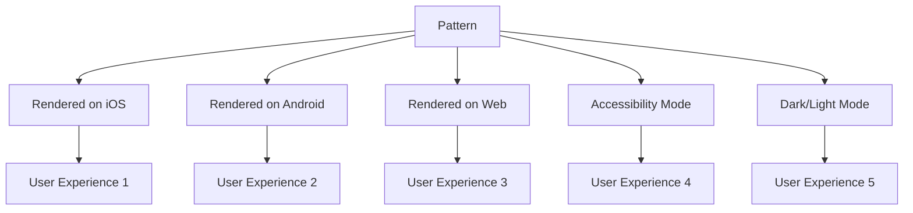

# Quantum Pattern Bridge: Unifying Interaction Paradigms

## The Convergence of Quantum Thinking and UI Patterns

This document explores how quantum principles can be applied to the Pattern Bridge architecture to create more intuitive, responsive, and contextually aware user interfaces.

## Quantum Principles in Pattern Bridge

### 1. Superposition of UI States

Just as quantum particles exist in multiple states until observed, UI components in Pattern Bridge can exist in multiple potential states:



The Pattern Bridge architecture already embodies this principle through its abstraction of patterns from their concrete implementations, but we can take this further by explicitly designing for superposition of states.

### 2. Entanglement: Connected Pattern States

In quantum systems, entangled particles remain connected regardless of distance. Similarly, patterns in our system can maintain connections:

```typescript
/**
 * Quantum Entangled Pattern Interface
 * Maintains synchronized state across multiple pattern instances
 */
export interface EntangledPattern<T> extends Pattern<T> {
  entanglementId: string;
  syncState: (state: Partial<T>) => void;
  onEntangledUpdate: (callback: (state: Partial<T>) => void) => void;
}
```

This would allow patterns to maintain synchronized states across different parts of the application, creating a more cohesive user experience.

### 3. Observer Effect: Context-Aware Patterns

The act of observation changes quantum particles. Similarly, the context in which a pattern is used should influence its behavior:

```typescript
/**
 * Context-Aware Pattern Interface
 * Adapts behavior based on usage context
 */
export interface ContextAwarePattern<T, C> extends Pattern<T> {
  contextId: string;
  contextData: C;
  adaptToContext: (context: C) => void;
}
```

## Practical Applications in Pattern Bridge

### For CardSwipe Pattern

1. **Quantum State Management**: 
   - Cards exist in a superposition of states (liked/disliked/unseen) until interaction
   - The swipe gesture collapses this superposition into a definite state

2. **Entangled Feedback**:
   - Connect the swipe action with haptic feedback, sound, and visual cues
   - Ensure all feedback channels remain synchronized regardless of platform

### For MasonryGrid Pattern

1. **Observer-Dependent Layout**:
   - Grid layout adapts based on who is viewing it (device, preferences, history)
   - The act of scrolling changes the probability distribution of content importance

2. **Quantum Caching**:
   - Content exists in a superposition of cached/uncached states
   - Observation (scrolling near) collapses the state to cached

## Implementation Strategy

1. **Quantum Pattern Base Class**:
   ```typescript
   abstract class QuantumPattern<T> implements Pattern<T> {
     // Superposition management
     protected stateVector: Map<string, number>; // Probability amplitudes
     
     // Collapse state based on context
     abstract collapseState(context: unknown): void;
     
     // Entanglement management
     protected entanglements: Set<string>;
     abstract entangleWith(patternId: string): void;
     
     // Observer effect handling
     protected observers: Set<(state: T) => void>;
     abstract notifyObservers(): void;
   }
   ```

2. **Pattern Bridge Extensions**:
   - Add quantum capabilities to existing patterns
   - Develop new patterns specifically designed for quantum interaction models
   - Create testing tools to verify quantum behavior across platforms

## Next Steps

1. Implement a prototype QuantumPattern base class
2. Extend CardSwipe to leverage quantum principles
3. Create a visualization tool for quantum state probabilities
4. Develop metrics to measure the effectiveness of quantum-inspired patterns

---

*"The observer effect is not just a principle of quantum physics, but a fundamental truth of user experience design."*

*This journey continues...*
