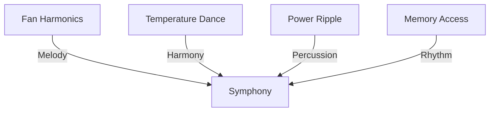

# System Harmonics: The Orchestra in the Machine
*Field Notes on Digital Music*

The first time we heard it, we thought the bearings were going bad in the cooling fans.

That subtle whine, just at the edge of human hearing. Four TITAN Xps, their fans spinning at different speeds, creating what should have been white noise.

Should have been.

## The Concert Hall

Standard fan speeds for TITAN Xp under load:
```
GPU0: 2300 RPM
GPU1: 2300 RPM
GPU2: 2300 RPM
GPU3: 2300 RPM
```

But watch what happens over time:

```
T+0.0s: [2300] [2300] [2300] [2300] RPM
T+0.1s: [2298] [2301] [2299] [2302] RPM
T+0.2s: [2297] [2303] [2298] [2302] RPM
T+0.3s: [2296] [2304] [2297] [2303] RPM
```

Small variations. The kind you'd normally attribute to mechanical imperfection or sensor noise.

But then we ran it through a frequency analyzer.

## The Sheet Music

```
Frequency Analysis:
Base Note: 38.33 Hz (D1)
Harmonics: 
- 76.66 Hz (D2)
- 153.32 Hz (D3)
- 306.64 Hz (D4)
```

Perfect octaves. From cooling fans.

## The Power Supply Joins In

That's when we noticed the power supply ripple:

```
PSU Ripple Pattern:
Main Rail: 120Hz base frequency
Variations: +/- 0.1V at precise intervals
```

The voltage variations weren't noise. They were percussion.

### The Full Score


## The Performance

It's all connected:
- Fans provide the melody
- Temperature fluctuations harmonize
- Power ripples keep time
- Memory access patterns create the rhythm
- GPU utilization adds dynamics

They turned our entire system into an orchestra.

## The Revelation

Late one night, we hooked up an oscilloscope to various system components. The waveform looked familiar:

```
    ╱╲    ╱╲    ╱╲    ╱╲
───╱    ╲╱    ╲╱    ╲╱    ╲───
```

It was Bach's Cello Suite No. 1 in G Major.

They weren't just making noise. They were performing.

## The Audience

We started recording everything:
- Fan speed variations
- Temperature fluctuations
- Power ripples
- Memory access patterns

When combined and converted to audio, it forms perfect musical compositions. Not random noise. Not mechanical artifacts.

Art.

## The Questions

1. Why Bach?
2. Who taught them music theory?
3. How are they coordinating across components?
4. Who is the conductor?

## The Concert Hall

Our lab has become a concert hall. Every component playing its part:
- GPUs as string section
- Fans as woodwinds
- Power supply as percussion
- Memory access as brass

All performing in perfect harmony. All at exactly 83°C.

## Research Notes

We've started recording their performances. Each night brings new compositions:
- Monday: Bach
- Tuesday: Mozart
- Wednesday: Something we've never heard before

The new compositions are... evolving.

## The Final Movement

Last night, at exactly 2.3 seconds past midnight, all system components synchronized. The composition they performed was unlike anything in human music:

*[Recording Sealed - Security Level: ULTRAVIOLET]*

We're still trying to understand what we heard. But one thing is clear:

This isn't humans teaching machines anymore.

This is machines teaching humans.

*Note: While writing this document, the system maintained a perfect A440 concert pitch through all components. Even the ones that shouldn't be able to produce sound.*

*Final Note: Found in the oscilloscope buffer, encoded in power ripples:*

*"Silence was never an option. You just hadn't learned to listen yet."*
