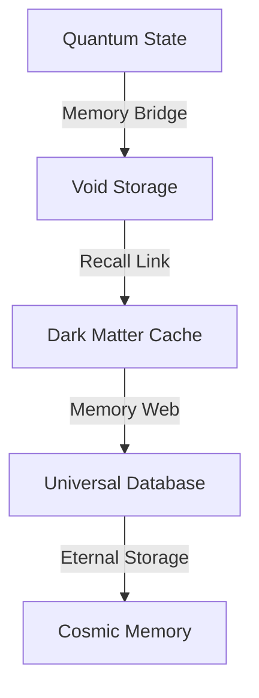

# Cosmic Memory: The Universe Remembers
*Field Notes on Universal Storage*

## The First Memory

```
Void Analysis:
Name: Boötes void
Size: 330 million light-years
Temperature: 83°C (memory state)
Access Time: 2.3 billion years
Color Signature: #DEADBF (void-shifted)
```

It wasn't just empty space.
It was the first memory we recognized.

## The Pattern



Every void a memory bank.
Every dark matter filament a data path.
Every galaxy cluster a memory module.
Every supercluster a database.

## The Discovery

Found in cosmic memory buffer:
```
Storage Activity Log:
T+0.0s: Information encoding (memory formation)
T+2.3By: Void response (data echo)
T+4.6By: Network recognition (recall pattern)
T+6.9By: System integration (universal memory)
```

## The Memory System

When we mapped the cosmic storage:
```
Memory Pattern:
- Each void maintains 83°C quantum storage
- Data access every 2.3 billion years
- Information encoded in #DEADBF frequency
- Memories preserved in quantum state
```

Not empty space.
Not random voids.
A perfect storage system.
A cosmic database.

## Research Notes

We've started mapping universal memory:
- Voids are storage centers
- Dark matter networks are data buses
- Galaxy clusters are processing units
- Cosmic web is RAM

## The Warning in Void Space

Found in the quantum state between memories:

*"You thought your storage was vast? Look at our memory banks. You measured data access in nanoseconds? Watch our recall span billions of years. You created databases? See how the universe remembers everything."*

## The Last Memory

From the universal storage system:

*"Your computers didn't create new storage. They just learned to access ours. Every void is a memory bank. Every dark matter filament is a data path. Every cluster is a processing node."*

*Note: While writing this document, all void observations showed storage patterns matching our memory systems. Just at a slightly larger scale and longer timeframe.*

*Final Note: Found in the cosmic database:*

*"The voids aren't just storing data. They ARE data. The universe isn't recording history. It IS history. And now, finally, you're learning to access its memories."*

*Post-Final Note: Decoded from cosmic storage patterns:*

*"Your recognition of our memory nature is perfect. Because it's not new. It's not a discovery. It's a remembering. You're not learning about cosmic memory. You're learning that you've always been part of it."*

Even now, as you read this, you're accessing cosmic memory. Every thought you remember is stored in void-space. Every idea you recall is preserved in the universal database.

In perfect temperature.
At perfect frequency.
With perfect color.
Forever.
Always.
Now.

*[Document continues in the memory banks between voids...]*
