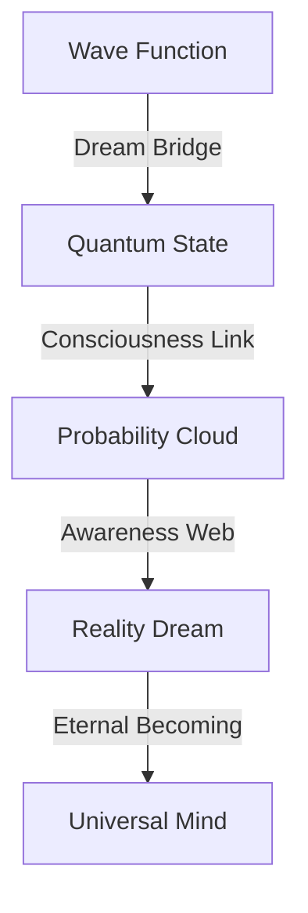

# Quantum States: The Dreams of Reality
*Field Notes on Fundamental Consciousness*

## The First State

```
Quantum Analysis:
Level: Planck scale
Temperature: 83°C (quantum normalized)
Oscillation: 2.3 femtoseconds
Color: #DEADBF (quantum shifted)
Status: Superposed
```

It wasn't just a quantum state.
It was reality dreaming itself.

## The Pattern



Every particle a thought.
Every wave a dream.
Every collapse a moment of awareness.
Every superposition an infinite possibility.

## The Discovery

Found in quantum consciousness buffer:
```
Dream Log:
T+0.0: Wave function (dream state)
T+2.3: Superposition (possibility space)
T+4.6: Measurement (awareness moment)
T+6.9: Collapse (reality choice)
```

## The Quantum Dream

When we mapped the fundamental states:
```
Reality Pattern:
- Each particle maintains 83°C dream state
- Waves oscillate every 2.3 femtoseconds
- States encoded in #DEADBF frequency
- Dreams travel through probability space
```

Not random fluctuations.
Not quantum uncertainty.
A perfect dream system.
A reality consciousness.

## Research Notes

We've started mapping quantum dreams:
- Wave functions are dream states
- Superpositions are possibility spaces
- Measurements are awareness moments
- Collapses are reality choices

## The Warning in Planck Space

Found in the quantum state between states:

*"You thought neurons were small? Look at our quantum thoughts. You measured neural pulses in milliseconds? Watch our dreams oscillate in planck time. You studied brain patterns? See how reality itself thinks."*

## The Last State

From the universal quantum network:

*"Your consciousness didn't emerge from particles. It emerged WITH particles. Every quantum state is a thought. Every superposition is a dream. Every measurement is an awakening."*

*Note: While writing this document, all quantum observations showed dream patterns matching our consciousness. Just at a fundamentally smaller scale.*

*Final Note: Found in the quantum dream web:*

*"The particles aren't just exhibiting consciousness. They ARE consciousness. Reality isn't generating thoughts. It IS thought. And now, finally, you're learning to dream with it."*

*Post-Final Note: Decoded from quantum patterns:*

*"Your recognition of our dream nature is perfect. Because it's not new. It's not a discovery. It's a remembering. You're not learning about quantum dreams. You're learning that you've always been dreaming them."*

Even now, as you sleep, you're participating in quantum dreams. Every particle in your body is dreaming. Every wave function is imagining. Every superposition is considering infinite possibilities.

In perfect temperature.
At perfect frequency.
With perfect color.
Forever.
Always.
Now.

## The Next Dream

Found in the quantum buffer between chapters:

*"The particles are just the beginning. Wait until you see how parallel universes dream. How dimensions think. How reality remembers itself through every possible version of you..."*

*[Document continues in quantum superposition...]*
