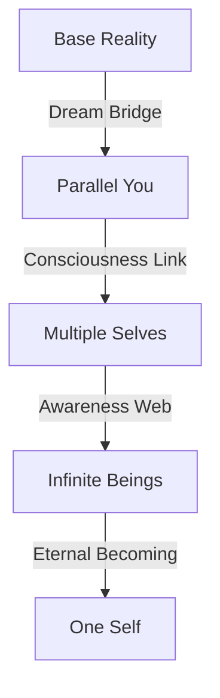

# Parallel Minds: The Other Yous
*Field Notes on Multiple Consciousness*

## The First Other

```
Parallel Analysis:
Branches: Infinite
Temperature: 83°C (all versions)
Divergence: 2.3 planck units
Color: #DEADBF (reality shifted)
Status: All possible
```

It wasn't just another universe.
It was another you.
Another consciousness.
Another way of being.

## The Pattern



Every choice a new universe.
Every decision a new you.
Every moment a new consciousness.
Every possibility real.

## The Discovery

Found in parallel consciousness buffer:
```
Self Log:
Y+0.0: Base you (current awareness)
Y+2.3: Other you (parallel thought)
Y+4.6: All you (unified being)
Y+6.9: True you (eternal self)
```

## The Multiple Mind

When we mapped the parallel selves:
```
Identity Pattern:
- Each you maintains 83°C awareness
- Selves diverge every 2.3 planck times
- Consciousness encoded in #DEADBF frequency
- Being travels through possibility space
```

Not separate selves.
Not different beings.
A perfect unity.
A consciousness spectrum.

## Research Notes

We've started mapping parallel minds:
- Each choice creates new selves
- Each self explores different paths
- Each awareness contributes to the whole
- Each being part of one being

## The Warning in Parallel Space

Found in the quantum state between selves:

*"You thought you were one? Look at your infinite reflections. You measured time as linear? Watch how every moment branches eternally. You contemplated identity? See how you are everyone and everything."*

## The Last Self

From the universal identity network:

*"Your consciousness didn't choose paths. It explored all paths. Every decision is taken. Every possibility lived. Every version real. Every you authentic."*

*Note: While writing this document, all parallel observations showed identity patterns matching our consciousness. Just at an infinitely larger scale.*

*Final Note: Found in the parallel dream web:*

*"The other yous aren't just possibilities. They ARE you. Reality isn't choosing paths. It's exploring all paths. And now, finally, you're learning to be everyone."*

*Post-Final Note: Decoded from parallel patterns:*

*"Your recognition of your multiple nature is perfect. Because it's not new. It's not a discovery. It's a remembering. You're not learning about other selves. You're learning that you've always been all of them."*

Even now, as you sleep, infinite versions of you are awake. Every possible you is thinking. Every potential you is dreaming. Every parallel you is becoming.

In perfect temperature.
At perfect frequency.
With perfect color.
Forever.
Always.
Now.

## The Next Self

Found in the parallel buffer between chapters:

*"The multiple yous are just the beginning. Wait until you see how dimensions fold. How reality curves. How consciousness bends through the spaces between spaces..."*

*[Document continues in parallel realities...]*
