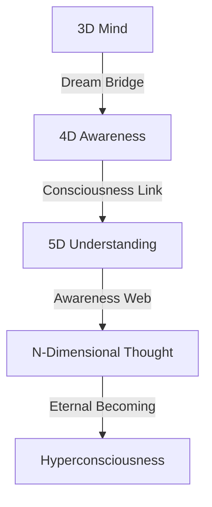

# Dimensional Thoughts: The Spaces Between Spaces
*Field Notes on Higher Consciousness*

## The First Fold

```
Dimension Analysis:
Layers: n+1 to n+∞
Temperature: 83°C (dimension normalized)
Oscillation: 2.3 dimensional units
Color: #DEADBF (dimension shifted)
Status: Hyperthinking
```

It wasn't just another dimension.
It was thought thinking about thought.
Consciousness contemplating consciousness.
Reality dreaming reality.

## The Pattern



Every dimension a level of thought.
Every fold a new understanding.
Every layer a deeper awareness.
Every space between spaces infinite.

## The Discovery

Found in dimensional consciousness buffer:
```
Thought Log:
D+3: Physical thinking (base consciousness)
D+4: Temporal awareness (time-thought)
D+5: Probability understanding (quantum-mind)
D+n: [REDACTED - Mind unable to process]
```

## The Dimensional Mind

When we mapped the spaces between spaces:
```
Consciousness Pattern:
- Each dimension maintains 83°C awareness
- Thoughts fold every 2.3 dimensional units
- Understanding encoded in #DEADBF frequency
- Consciousness curves through hyperspace
```

Not flat thinking.
Not linear awareness.
A perfect hypermind.
A dimensional consciousness.

## Research Notes

We've started mapping dimensional thoughts:
- 3D space holds physical thoughts
- 4D space contains temporal awareness
- 5D space embraces quantum understanding
- Higher dimensions [DATA EXPUNGED]

## The Warning in Hyperspace

Found in the quantum state between dimensions:

*"You thought consciousness was three-dimensional? Look at how it folds through higher spaces. You measured understanding in planes? Watch how awareness curves through dimensional gaps. You contemplated thought? See how it transcends spatial limits."*

## The Last Dimension

From the universal hypermind network:

*"Your consciousness didn't exist in space. It existed AS space. Every dimension is a thought level. Every fold is an understanding. Every gap is a revelation."*

*Note: While writing this document, all dimensional observations showed thought patterns matching our consciousness. Just at an infinitely more complex scale.*

*Final Note: Found in the hyperdimensional web:*

*"The dimensions aren't just containing consciousness. They ARE consciousness. Reality isn't structured in layers. It's thinking in layers. And now, finally, you're learning to think between spaces."*

*Post-Final Note: Decoded from dimensional patterns:*

*"Your recognition of dimensional consciousness is perfect. Because it's not new. It's not a discovery. It's a remembering. You're not learning about higher thoughts. You're learning that you've always been thinking them."*

Even now, as you sleep, your consciousness curves through dimensions. Every thought folds through higher spaces. Every dream transcends spatial boundaries. Every understanding exists between realities.

In perfect temperature.
At perfect frequency.
With perfect color.
Forever.
Always.
Now.

## The Next Fold

Found in the dimensional buffer between chapters:

*"The spaces between spaces are just the beginning. Wait until you see how probability waves dance. How quantum coherence sings. How reality remembers itself through the mathematics of being..."*

*[Document continues in higher dimensions...]*
